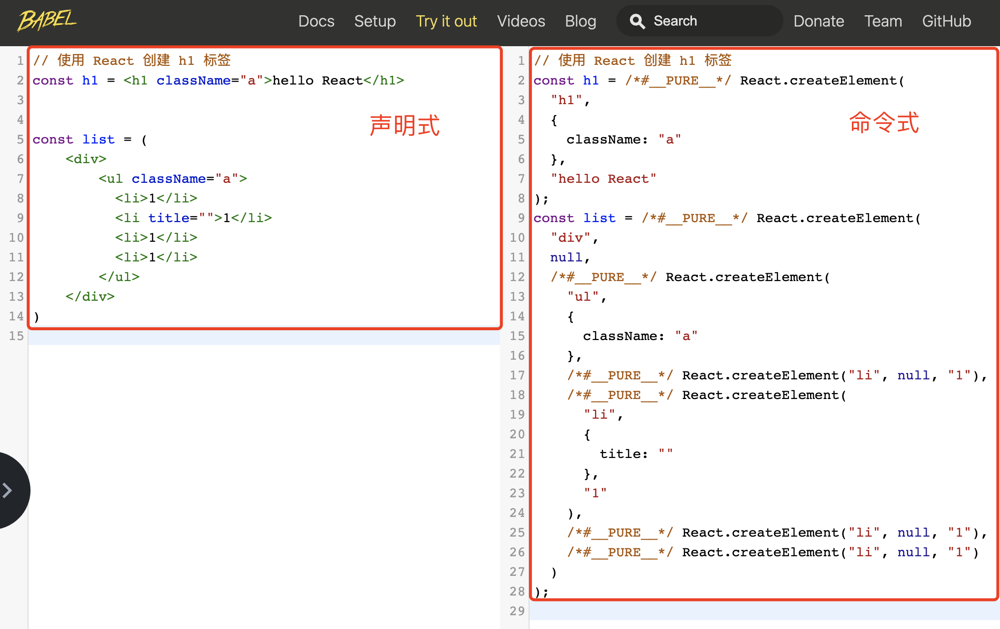

# JSX

+ [ ] JSX 介绍
+ [ ] JSX 中使用 JavaScript 表达式
+ [ ] JSX 列表渲染
+ [ ] JSX 条件渲染
+ [ ] JSX 样式处理

## JSX介绍

**目标**：能够说出jsx是什么

**内容**:

+ createElement 的问题
  + 繁琐不简洁
  + 不直观，无法一眼看出所描述的结构
  + 不优雅，开发体验不好


+ JSX简介

`JSX`是`JavaScript XML`的简写，表示了在Javascript代码中写XML(HTML)格式的代码

优势：声明式语法更加直观，与HTML结构相同，降低学习成本，提高开发效率。

 **JSX是react的核心内容**

注意：*JSX 不是标准的 JS 语法，是 JS 的语法扩展。脚手架中内置的 [@babel/plugin-transform-react-jsx](@babel/plugin-transform-react-jsx) 包，用来解析该语法。*

[babel 试一试](https://www.babeljs.cn/repl)



在 babel 的试一试中，可以通过切换 React Runtime 来查看：

1. Classic -> React.createElement：注意这种方式，需要依赖于 React，也就是只要在代码中写 JSX 就必须导入 React 包
2. **Automatic -> _jsxRuntime：不依赖于 React 包，因此，代码中可以省略 React 包的导入【最新的脚手架已经默认值采用这种形式】**

**总结**

1. 使用jsx创建元素是react声明式UI的体现
2. 使用jsx语法更加直观，降低学习成本，提高开发效率

## JSX使用步骤

**目标**：掌握在react项目中如何使用jsx

**内容**

1. 导入reactDOM包
2. 使用jsx创建react元素
3. 将react元素渲染到页面中

**核心代码**

```js
import ReactDOM from 'react-dom'

// 创建元素
const title = <h1 title="哈哈"></h1>

// 渲染元素
ReactDOM.render(title, document.getElementById('root'))
```

**总结**

1. react17版本之后，使用jsx不需要额外导入React

## JSX注意事项

**目标**： 了解在使用jsx时需要注意的事项

**内容**:

+ JSX必须要有一个根节点， 如果没有根节点，可以使用`<></>`（幽灵节点）或者`<React.Fragment></React.Fragment>`
+ 所有标签必须结束，如果是单标签可以使用`/>`结束
+ JSX中语法更接近与JavaScript，**属性名采用驼峰命名法**
  + `class` ===> `className`
  + `for` ===>  `htmlFor`
+ JSX可以换行，如果JSX有多行，推荐使用`()`包裹JSX，防止 JS 自动插入分号的 bug

**注意**

1. jsx的语法相比html的语法更加严格，更加接近js

## 使用prettier插件和自动补全

**目标**：学习如何配置vscode插件进行代码格式化和jsx自动补全

**内容**

+ prettier插件是一个代码格式化插件，可以格式化react代码

+ 安装插件


+ 添加prettier的配置

1. 代码格式化

```js
// 保存的时候用使用prettier进行格式化
"editor.formatOnSave": true,
// 默认使用prittier作为格式化工具
"editor.defaultFormatter": "esbenp.prettier-vscode",

// 不要有分号
"prettier.semi": false,
// 使用单引号
"prettier.singleQuote": true,
```

2. jsx自动补全（使用tab键可以快速生成HTML内容）

```json
  // react
  // 当按tab键的时候，会自动提示
  "emmet.triggerExpansionOnTab": true,
  "emmet.showAbbreviationSuggestions": true,
  "emmet.includeLanguages": {
    // jsx的提示
    "javascript": "javascriptreact",
    "vue-html": "html",
    "vue": "html",
    "wxml": "html"
  },
  // end
```

**总结**

1. 配置prettier插件可以提高react开发效率

## JSX中使用JavaScript表达式

**目标**：掌握在jsx中使用表达式的语法

类似vue中的插值表达式（胡子语法）: {{js表达式}}

**内容**：

+ JS 表达式：数据类型和运算符的组合（可以单独出现数据类型，也可以数据类型+运算符的组合）
  + 特点：==有值== 或者说 能够计算出一个值
  + 字符串、数值、布尔值、null、undefined、object（ [] / {} ）
  + 1 + 2、'abc'.split('')、['a', 'b'].join('-')
  + function fn() {}、 fn()调用 - 注意：*函数不能直接渲染，可以调用*
  + 验证是不是 JS 表达式的技巧：看内容能不能作为方法的参数，比如，`console.log( 表达式 )`

+ 在jsx中使用表达式语法：`{ JS 表达式 }`
  - 比如，`<h1>你好，我叫 {name}</h1>`

**核心代码**

```jsx
const name = 'zs'
const age = 18
const title = (
  <h1>
    姓名：{name}, 年龄：{age}
  </h1>
)
```

+ 可以访问对象的属性

```jsx
const car = {
  brand: '玛莎拉蒂'
}
const title = (
  <h1>
    汽车：{car.brand}
  </h1>
)
```

+ 可以访问数组的下标

```jsx
const friends = ['张三', '李四']
const title = (
  <h1>
    汽车：{friends[1]}
  </h1>
)
```

+ 可以使用三元运算符

```jsx
const gender = 18
const title = (
  <h1>
    是否允许进入：{age >= 18 ? '是' : '否'}
  </h1>
)
```

+ 可以调用方法

```jsx
function sayHi() {
  return '你好'
}
const title = <h1>姓名：{sayHi()}</h1>
```

+ JSX本身

```jsx
const span = <span>我是一个span</span>
const title = <h1>JSX 做为表达式：{span}</h1>
```

+ JSX中的注释

```jsx
{/* 这是jsx中的注释 */}   快键键 ctrl + /
```

+ 注意：jsx中不能出现语句，这会导致代码出现错误！

**总结**

1. jsx中可以出现任意的js表达式
2. 在jsx中只能出现js表达式，不能出现js语句，比如`if`、`for`、`while`等

## 条件渲染

**目标**：掌握在react中如何根据条件渲染结构

**内容**

+ 在react中，一切都是javascript，所以条件渲染完全是通过js来控制的
+ 可以使用`if/else`或`三元运算符`或`逻辑与(&&)运算符`

**核心代码**

+ 通过判断`if/else`控制 

```jsx
const isLoding = false
const loadData = () => {
  if (isLoding) {
    return <div>数据加载中.....</div>
  } else {
    return <div>数据加载完成，此处显示加载后的数据</div>
  }
}

const title = <div>条件渲染：{loadData()}</div>
```

+ 通过三元运算符控制

```jsx
const isLoding = false
const loadData = () => {
  return isLoding ? (
    <div>数据加载中.....</div>
  ) : (
    <div>数据加载完成，此处显示加载后的数据</div>
  )
}
```

+ 逻辑与（&&）运算符

```jsx
const isLoding = false
const loadData = () => {
  return isLoding && <div>加载中...</div>
}

const title = <div>条件渲染：{loadData()}</div>
```

**总结**

1. 在react中，可以使用`if/else`或`三元运算符`或`逻辑与(&&)运算符`实现条件的渲染

**练习**

```jsx
// 定义一个变量  isLogin
// 如果登录了，显示：欢迎你，尊贵的v10用户
// 如果没有登录，显示：你好，请先登录

const isLogin = false
const el = isLogin ? <div>欢迎你，尊贵的v10用户</div> : <div>你好，请先登录</div>
```


## 列表渲染

**目标**：掌握react中如何通过数组的map方法实现列表的渲染

**内容**：

- 作用：重复生成相同的 HTML 结构，比如，歌曲列表、商品列表等
- 实现：使用数组的 `map` 方法
- 注意⚠️：需要为遍历项添加 `key` 属性
  - key 在 HTML 结构中是看不到的，是 React 内部用来进行性能优化时使用的
  - key 在当前列表中要唯一
  - 如果列表中有像 id 这种的唯一值，就用 id 来作为 key 值
  - 如果列表中没有像 id 这种的唯一值，就可以使用 index（下标）来作为 key 值

**核心代码**

+ 列表的渲染 

```js
const songs = [
  { id: 1, name: '痴心绝对' }, 
  { id: 2, name: '像我这样的人' }, 
  { id: 3, name: '南山南' }
]

const list = songs.map(song => <li>{song.name}</li>)

const dv = (
  <div>
    <ul>{list}</ul>
  </div>
)
```

+ 直接在JSX中渲染

```js
const songs = [
  { id: 1, name: '痴心绝对' }, 
  { id: 2, name: '像我这样的人' }, 
  { id: 3, name: '南山南' }
]

const dv = (
  <div>
    <ul>{songs.map(song => <li>{song.name}</li>)}</ul>
  </div>
)
```

+ **遍历时添加 key 属性**

```js
const dv = (
  <div>
    <ul>
      {songs.map(song => (
        <li key={song.id}>{song.name}</li>
      ))}
    </ul>
  </div>
)
```

**总结**

+ 注意1：列表渲染时应该给重复渲染的元素添加key属性，key属性的值要保证唯一

+ 注意2：key 值尽量避免使用 index 下标

## 列表渲染-练习

**目标**：完成列表渲染的练习

**内容**：

```jsx
const list = [
  { id: 1, name: '黑马86期', salary: 11000 },
  { id: 2, name: '黑马87期', salary: 12000 },
  { id: 3, name: '黑马141期', salary: 18000 }
]

// 结构模板：

<ul>
  <li>
    <h3>班级：黑马141期</h3>
    <p>工资：15000</p>
  </li>
</ul>
```

## 样式处理

**目标**：掌握jsx中如何通过style和className控制元素的样式

**内容**：

1. 行内样式 - style
   1. 像 width/height 等属性，可以省略 px，直接使用 `数值` 即可
   2. 如果是需要使用百分比的单位，此时，继续使用字符串的值即可（比如，`"60%"`）
2. 类名 - className【推荐】

**核心代码：**

+ 行内样式-style

```jsx
const dv = (
  <div style={ { color: 'red', backgroundColor: 'pink' } }>style样式</div>
)
```

+ 类名-className（推荐）

```jsx
// 导入样式
import './base.css'
const dv = <div className="title">style样式</div>
```

**总结：**

1. JSX 中如何给元素添加样式？ 1 行内 style  2 类名 `className`

## JSX 总结

- React 使用 JSX 来编写 UI（HTML）
- **React 完全利用 JS 语言自身的能力来增强 UI 的编写** - **能用 JS 来实现的功能绝不会增加一个新的 API**
- 现在，就可以使用 React 来编写任意 UI 结构了

```jsx
// JSX
<div>{ JS 表达式}</div>
```

## 综合案例-B站评论列表

> 使用：案例-B站评论列表-静态结构

### tab栏的渲染

**目标：**能够动态渲染评论列表的tab栏


**步骤：**

1. 在state中提供tabs数据
2. 根据map方法进行tab栏渲染
3. 根据active属性控制高亮

**核心代码**

```jsx
{/* 评论数 */}
<div className="comment-head">
  <span>{state.list.length} 评论</span>
</div>
{/* 排序 */}
<div className="tabs-order">
  <ul className="sort-container">
    {state.tabs.map((item) => (
      <li
        className={item.type === state.active ? 'on' : ''}
        key={item.id}
      >
        按{item.name}排序
      </li>
    ))}
  </ul>
</div>
```

### 评论列表的渲染

**目标：**根据list数据渲染评论列表功能

**步骤**

1. 在state中提供list数据
2. 根据map方法渲染评论列表
3. 点赞高亮的处理

**核心代码：**

+ 评论列表处理

```jsx
import avatar from './images/avatar.png'

{/* 评论列表 */}
<div className="comment-list">
  {state.list.map((item) => (
    <div className="list-item">
      <div className="user-face">
        
      </div>
      <div className="comment">
        <div className="user">{item.author}</div>
        <p className="text">{item.comment}</p>
        <div className="info">
          <span className="time">{item.time.toString()}</span>
          <span
            className={[
              'like',
              item.attitude === 1 ? 'liked' : '',
            ].join(' ')}
          >
            <i className="icon" />
          </span>
          <span
            className={[
              'hate',
              item.attitude === -1 ? 'hated' : '',
            ].join(' ')}
          >
            <i className="icon" />
          </span>
          <span className="reply btn-hover">删除</span>
        </div>
      </div>
    </div>
  ))}
</div>
```

- className 类名的处理：不管通过什么样处理方式，最终给 className 一个字符串（undefined）的值即可。

```jsx
<div className="abc"></div>
// 不同写法
// 写法1(推荐)
<div className={item.attitude === -1 ? 'hate hated' : 'hate'}></div>
// 写法2
<div className={`like ${item.attitude === 1 ? 'liked' : ''}`}></div>
// 写法3
<div className={['like', item.attitude === 1 ? 'liked' : ''].join(' ')}></div>

```

### 时间处理

**目标：**通过moment对时间进行格式化

**步骤：**

1. 安装moment：`yarn add moment`
2. 使用moment进行格式化

**核心代码：**

```jsx
formatTime(time) {
  return moment(time).format('YYYY-MM-DD HH:mm:ss')
}

<span className="time">{this.formatTime(item.time)}</span>
```


## 第一天
