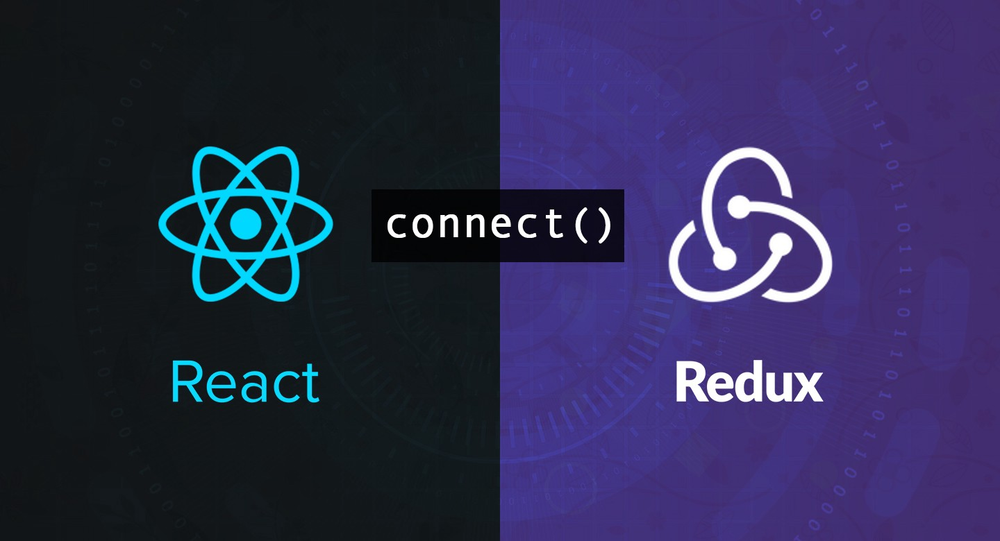

# Redux基础

+ [ ] redux基本介绍
+ [ ] redux核心概念
+ [ ] redux的执行过程
+ [ ] react-redux的使用

## 为什么要用 Redux


**目标：**能够说出为什么需要使用redux

**内容：**

[redux 中文文档](http://cn.redux.js.org/)

[redux 英文文档](https://redux.js.org/)

> Redux 是 React 中最常用的状态管理工具（状态容器）

React 只是 DOM 的一个抽象层（UI 库），并不是 Web 应用的完整解决方案。因此 React 在涉及到数据的处理以及组件之间的通信时会比较复杂

对于大型的复杂应用来说，这两方面恰恰是最关键的。因此，只用 React，写大型应用比较吃力。

背景介绍：

- 2014 年 Facebook 提出了 Flux 架构的概念（前端状态管理的概念），引发了很多的实现
- 2015 年，Redux 出现，将 Flux 与*函数式编程*结合一起，很短时间内就成为了最热门的前端架构
- Flux 是最早的前端的状态管理工具，它提供了状态管理的思想，也提供对应的实现
- 除了 Flux、Redux 之外，还有：Mobx 等状态管理工具

问题：为什么要用 Redux?


- 主要的区别：**组件之间的通讯问题**
- 不使用 Redux (图左边) ：
  - 只能使用父子组件通讯、状态提升等 React 自带机制 
  - 处理远房亲戚(非父子)关系的组件通讯时乏力
  - 组件之间的数据流混乱，出现 Bug 时难定位
- 使用 Redux (图右边)：
  - **集中式存储和管理应用的状态**
  - 处理组件通讯问题时，**无视组件之间的层级关系** 
  - 简化大型复杂应用中组件之间的通讯问题
  - 数据流清晰，易于定位 Bug

## Redux 开发环境准备

**目标：**能够在react项目中准备redux开发环境

**内容：**

使用 React CLI 来创建项目，并安装 Redux 包即可：

1. 创建 React 项目：`npx create-react-app redux-basic`
2. 启动项目：`yarn start`
3. 安装 Redux 包：`yarn add redux`

## Redux 核心概念-概述  

**目标：**能够理解redux三个核心概念的职责

> **vuex全局状态共享**：1. state 定义共享数据   2. mutations 定义修改数据数据的方法(同步)   3. actions 定义获取后台数据方法（异步）

**内容：**

为了让**代码各部分职责清晰、明确**，Redux 代码被分为三个核心概念：action/reducer/store

- action -> reducer -> store
- **action**（动作）：描述要做的事情=》**指定要修改什么数据**
- **reducer**（函数）：更新状态=》**根据action修改数据**
- **store**（仓库）：整合 action 和 reducer=》**存数据**

类比生活中的例子来理解三个核心概念：

- action：相当于公司中要做的事情，比如软件开发、测试，打扫卫生等
- reducer：相当于公司的员工，负责干活的
- store：相当于公司的老板
- 流程：老板(store)分配公司中要做的事情(action)给员工(reducer)，员工干完活把结果交给老板

## Redux核心概念-action

**目标**：能够定义一个最基本的action

**内容：**

action 行动（名词）、动作

action：描述要做的事情，项目中的每一个功能都是一个 action。比如，
- 计数器案例：计数器加1、减1
- 购物车案例：获取购物车数据、切换商品选中状态
- 项目：登录，退出等

特点：
- 只描述做什么
- JS 对象，必须带有 `type` 属性，用于区分动作的类型
- 根据功能的不同，可以携带额外的数据（比如，`payload` 有效载荷，也就是附带的额外的数据），配合该数据来完成相应功能

```js
// action

// 计数器案例
{ type： 'increment' } // +1
{ type： 'decrement' } // -1

{ type： 'increment', payload: 10 } // +10
{ type： 'decrement', payload: 10 } // -10

// 购物车案例
{ type: 'getGoodsList' }
{ type: 'changeGoodsState', payload: { id: 1, goodsState: true } }

// todos
// 添加任务
{ type: 'addTodo', payload: '吃饭' }
// 删除任务
{ type: 'delTodo', payload: 1 }
```

## Redux核心概念-action creator

**目标**：能够使用函数去创建一个action

**内容**：

- `Action Creator` 指的是：使用函数创建 action 对象
- 目的：简化多次使用 action 时，重复创建 action 对象

**核心代码**：

```js
// 加/减
// 命令:动作
const ADD = 'ADD', SUB = 'SUB'

// 修改state状态会使用
export function addAction (payload) {
  return {
    type: ADD,
    payload
  }
}

export function subAction (payload) {
  return {
    type: SUB,
    payload
  }
}
```

## Redux核心概念-reducer

**目标：**能够掌握reducer的基本写法

**内容：**

- reducer 单词的意思：减速器
- 这个名字是参考了 JS 数组中的 `reduce` 这个方法  
  - 数组中的 `reduce` 方法，可以来实现累计（比如，累加或者累减）
- reducer：函数，**用来处理 action 并更新状态，是 Redux 状态更新的地方**
- 特点：
  - 函数签名为：`(prevState, action) => newState`
  - 接收上一次的状态和 action 作为参数，根据 action 的类型，执行不同操作，最终返回新的状态
  - 注意：**该函数一定要有返回值**，即使状态没有改变也要返回上一次的状态
  - 约定：reducer 是一个**纯函数**，并且不能包含 side effect 副作用(比如，不能修改函数参数、不能修改函数外部数据、不能进行异步操作等)
  - 纯函数：**相同的输入总是得到相同的输出**
  - 对于 reducer 来说，为了保证 reducer 是一个纯函数，不要：
    1. 不要直接修改参数 state 的值（也就是：不要直接修改当前状态，而是根据当前状态值创建新的状态值）
    2. 不要使用 Math.random() / new Date() / Date.now() / ajax 请求等不纯的操作
    3. 不要让 reducer 执行副作用（side effect）

**核心代码**：

```jsx
// 干活：reducer创建store使用
// 初始值
const initialState = {
  num: 0
}
export function numReducer (state = initialState, action) {
  let newState = { ...state }
  switch (action.type) {
    case ADD:
      newState.num++
      return newState
    case SUB:
      newState.num--
      return newState
    default:
      return state
  }
}
```

## 纯函数的介绍

**目标：**了解纯函数的特点

**内容：**

- 纯函数是*函数式编程*中的概念，对于纯函数来说，**相同的输入总是得到相同的输出**
- 函数式编程，是一种编程范式。主要思想是：把运算过程尽量写成一系列嵌套的函数调用
- 参考资料：[函数式编程初探](https://www.ruanyifeng.com/blog/2012/04/functional_programming.html)

纯函数的演示：

- 对于纯函数来说，不要执行**不纯**的操作，比如：不能使用 Date.now()、Math.random()、异步请求等操作，因为每次会得到不一样的结果

```jsx
// 纯函数：
const add = () => {
  return 123
}
add() // 123
add() // 123

const add = (num1, num2) => {
  return num1 + num2
}
add(1, 2) // 3
add(1, 2) // 3

// ---

// 符合纯函数的概念
// 带有副作用，因为直接修改了变量的值，对外部的数据产生了影响
const add = (obj) => {
	obj.num = 123
  return obj
}

add({ a: '1' }) // { a: '1', num: 123 }
add({ a: '1' }) // { a: '1', num: 123 }

// ---

// 不是纯函数：
const add = () => {
  return Math.random()
}

add() // 0.12311293827497123
add() // 0.82239841238741814
```

副作用的演示：

- 如果一个函数或其他操作修改了其局部环境之外的状态变量值，那么它就被称为有副作用

```js
// 无副作用
const add = (num1, num2) => {
  return num1 + num2
}
add(1, 3)

// ---

// 有副作用：
let c = 0
const add = (num1, num2) => {
  // 函数外部的环境产生了影响，所以是有副作用的
  c = 1
  return num1 + num2
}
add(1, 3)

// 有副作用
const add = (num1, num2) => {
  // 因为该操作，会让浏览器控制额外的打印一些内容
  console.log('add')
  return num1 + num2
}
add(1, 3)
```

## Redux核心概念-store

**目标：**通过store关联action和reducer

**内容：**

- store：仓库，Redux 的核心，整合 action 和 reducer

- 特点：
  - **一个应用只有一个 store**
  - 维护应用的状态，获取状态：`store.getState()`
  - 发起状态更新时，需要分发 action：`store.dispatch(action)`
  - 创建 store 时**接收 reducer 作为参数**：`const store = createStore(reducer)`
- 其他 API，
  - 订阅(监听)状态变化：`const unSubscribe = store.subscribe(() => {}) `
  - 取消订阅状态变化： `unSubscribe()`

**核心代码**

```js
// 创建 store
// 参数为：reducer 函数
const store = createStore(numReducer)

// 监听状态变化
const unSubscribe = store.subscribe(() => {
  // 状态改变时，执行相应操作
  // 比如，记录 redux 状态
  console.log(1, store.getState())
})

// 取消监听状态变化
// unSubscribe()

// 发布命令（action），执行reducer干活
store.dispatch(addAction())
store.dispatch(addAction())
store.dispatch(addAction())
```

---

## Redux代码执行流程

**目标**：能够说出 redux 代码的执行流程

> vuex流程：dispatch调用**actions**(获取后台数据) =》通过**mutations**修改数据=》存到**state**
>
> redux流程：dispatch调用**actions**(获取后台数据)=> 通过**reducer**修改数据=》存到**store**

**内容**：

1. 创建 store 时，Redux 就会先调用一次 reducer，来获取到默认状态
2. 分发动作 `store.dispatch(action) `更新状态
3. Redux store 调用 reducer 传入：上一次的状态（当前示例中就是：`10`）和 action（`{ type: 'ADD' }`），计算出新的状态并返回
4. reducer 执行完毕后，将最新的状态交给 store，store 用最新的状态替换旧状态，状态更新完毕

```js
import { createStore } from 'redux'

// 初始值
const initialState = {
  num: 10
}

// 2. 干活：reducer创建store使用
export function numReducer (state = initialState, action) {
  let newState = { ...state }
  // console.log('默认执行一次：', newState)
  switch (action.type) {
    case ADD:
      newState.num++
      return newState
    case SUB:
      newState.num -= action.params
      return newState
    default:
      return state
  }
}

// 3. 创建 store
// 参数为：reducer 函数
const store = createStore(numReducer)

console.log('状态值为：', store.getState()) // 10

// 发起更新状态：
// 参数： action 对象
store.dispatch({ type: 'ADD' })
// 相当于： reducer(10, { type: 'increment' })

console.log('更新后：', store.getState()) // 11
```

---

## React-Redux介绍（预习）

**目标：**能够说出为什么需要使用react-redux

**内容：**

- 问题：为什么要使用 React-Redux 绑定库?
- 回答：React 和 Redux 是两个独立的库，两者之间职责独立。因此，为了实现在 React 中使用 Redux 进行状态管理 ，就需要一种机制，将这两个独立的库关联在一起。这时候就用到 React-Redux 这个绑定库了。
- 作用：**为 React 接入 Redux，实现在 React 中使用 Redux 进行状态管理**。 
- react-redux 库是 Redux 官方提供的 React 绑定库。



## React-Redux-基本使用

**目标**：使用react-redux库在react中使用redux管理状态

**内容**：

[react-redux 文档](https://react-redux.js.org/introduction/getting-started)

react-redux 的使用分为两大步：1 全局配置（只需要配置一次） 2 组件接入（获取状态或修改状态）

先看全局配置：

**步骤**：

1. 安装 react-redux：`yarn add react-redux`
2. 从 react-redux 中导入 Provider 组件
3. 导入创建好的 redux 仓库
4. 使用 Provider 包裹整个应用
5. 将导入的 store 设置为 Provider 的 store 属性值

**核心代码**：

src/index.js 中：

```js
// 导入 Provider 组件
import { Provider } from 'react-redux'
// 导入创建好的 store
import store from './store'

ReactDOM.render(
  <Provider store={store}>
    <App />
  </Provider>,
  document.querySelector('#root')
)
```

## React-Redux-获取状态useSelector

**目标**：能够使用 useSelector hook 获取redux中共享的状态

**内容**：

- `useSelector`：获取 Redux 提供的状态数据
- 参数：selector 函数，用于从 Redux 状态中筛选出需要的状态数据并返回
- 返回值：筛选出的状态

```js
import { useSelector } from 'react-redux'

// 计数器案例中，Redux 中的状态是数值，所以，可以直接返回 state 本身
const count = useSelector(state => state)

// 比如，Redux 中的状态是个对象，就可以：
const list = useSelector(state => state.list)
```

**核心代码**：

App.js 中：

```jsx
import { useSelector } from 'react-redux'

const App = () => {
  const count = useSelector(state => state)
  
  return (
  	<div>
    	<h1>计数器：{count}</h1>
      <button>数值增加</button>
			<button>数值减少</button>
    </div>
  )
}
```

## React-Redux-分发动作useDispatch

**目标**：能够使用 useDispatch hook 修改redux中共享的状态

**内容**：

- `useDispatch`：拿到 dispatch 函数，分发 action，修改 redux 中的状态数据
- 语法：

```js
import { useDispatch } from 'react-redux'

// 调用 useDispatch hook，拿到 dispatch 函数
const dispatch = useDispatch()

// 调用 dispatch 传入 action，来分发动作
dispatch( action )
```

**核心代码**

App.js 中：

```jsx
import { useDispatch } from 'react-redux'

const App = () => {
  const dispatch = useDispatch()
  
  return (
  	<div>
    	<h1>计数器：{count}</h1>
      {/* 调用 dispatch 分发 action */}
      <button onClick={() => dispatch(increment(2))}>数值增加</button>
			<button onClick={() => dispatch(decrement(5))}>数值减少</button>
    </div>
  )
}
```

## 理解 Redux 数据流

**目标**：能够说出redux数据流动过程

**内容**：


**总结**：

- 任何一个组件都可以直接接入 Redux，也就是可以直接：1 修改 Redux 状态 2 接收 Redux 状态
- 并且，只要 Redux 中的状态改变了，所有接收该状态的组件都会收到通知，也就是可以获取到最新的 Redux 状态
- 这样的话，两个组件不管隔得多远，都可以**直接通讯**了

## Redux应用-代码结构

**目标**：能够组织redux的代码结构

**内容**：

在使用 Redux 进行项目开发时，不会将 action/reducer/store 都放在同一个文件中，而是会进行拆分

可以按照以下结构，来组织 Redux 的代码：

```html
/store        --- 在 src 目录中创建，用于存放 Redux 相关的代码
  /actions    --- 存放所有的 action
  /reducers   --- 存放所有的 reducer
  index.js    --- redux 的入口文件，用来创建 store
```
## Redux应用-ActionType的使用

**目标**：能够知道为什么要抽离 action type

**内容**：

- Action Type 指的是：action 对象中 type 属性的值
- Redux 项目中会多次使用 action type，比如，action 对象、reducer 函数、dispatch(action) 等
- 目标：**集中处理 action type，保持项目中 action type 的一致性**
- action type 的值采用：`'domain/action'(功能/动作)形式`，进行分类处理，比如，
  - 计数器：`'counter/increment'` 表示 Counter 功能中的 increment 动作
  - 登录：`'login/getCode'` 表示登录获取验证码的动作
  - 个人资料：`'profile/get'` 表示获取个人资料

**步骤**：

1. 在 store 目录中创建 `actionTypes` 目录或者 `constants` 目录，集中处理
2. 创建**常量**来存储 action type，并导出
4. 将项目中用到 action type 的地方替换为这些常量，从而保持项目中 action type 的一致性和可维护性

```js
// actionTypes 或 constants 目录：

const add = 'counter/increment'
const sub = 'counter/decrement'

export { add, sub }

// --

// 使用：
// actions/index.js
import * as types from '../acitonTypes'

// reducers/index.js
import * as types from '../acitonTypes'
const reducer = (state, action) => {
  switch (action.type) {
    case types.add:
      return state + 1
    case types.sub:
      return state - action.payload
    default:
      return state
  }
}
```

- *注：额外添加 Action Type 会让项目结构变复杂，此操作可省略。但，`domain/action` 命名方式强烈推荐！*

## Redux应用-Reducer的分离与合并

**目标**：能够合并redux的多个reducer为一个根reducer

**内容**：

- 随着项目功能变得越来越复杂，需要 Redux 管理的状态也会越来越多
- 此时，有两种方式来处理状态的更新：
  1. 使用一个 reducer：处理项目中所有状态的更新
  2. 使用多个 reducer：按照项目功能划分，每个功能使用一个 reducer 来处理该功能的状态更新
- 推荐：**使用多个 reducer（第二种方案）**，每个 reducer 处理的状态更单一，职责更明确
- 此时，项目中会有多个 reducer，但是 **store 只能接收一个 reducer**，因此，需要将多个 reducer 合并为一根 reducer，才能传递给 store
- 合并方式：使用 Redux 中的 `combineReducers` 函数
- 注意：**合并后，Redux 的状态会变为一个对象，对象的结构与 combineReducers 函数的参数结构相同**
  - 比如，此时 Redux 状态为：`{ a： aReducer 处理的状态, b： bReducer 处理的状态 }`

```js
import { combineReducers } from 'redux'

// 计数器案例，状态默认值为：0
const aReducer = (state = 0, action) => {}
// Todos 案例，状态默认值为：[]
const bReducer = (state = [], action) => {}

// 合并多个 reducer 为一个 根reducer
const rootReducer = combineReducers({
  a: aReducer,
  b: bReducer
})

// 创建 store 时，传入 根reducer
const store = createStore(rootReducer)

// 此时，合并后的 redux 状态： { a: 0, b: [] }
```

- 注意：虽然在使用 `combineReducers` 以后，整个 Redux 应用的状态变为了`对象`，但是，对于每个 reducer 来说，每个 reducer 只负责整个状态中的某一个值
  - 也就是：**每个reducer只负责自己要处理的状态**
  - 举例：
    - 登录功能：`loginReducer` 处理的状态只应该是跟登录相关的状态
    - 个人资料：`profileReducer` 处理的状态只应该是跟个人资料相关的状态
- 合并 reducer 后，redux 处理方式：只要合并了 reducer，不管分发什么 action，所有的 reducer 都会执行一次。各个 reducer 在执行的时候，能处理这个 action 就处理，处理不了就直接返回上一次的状态。所以，我们分发的某一个 action 就只能被某一个 reducer 来处理，也就是最终只会修改这个 reducer 要处理的状态，最终的表现就是：分发了 action，只修改了 redux 中这个 action 对应的状态！

## Redux应用-redux管理哪些状态

**目标**：能够知道什么状态可以放在redux中管理

**内容**：

不同状态的处理方式：

1. 将所有的状态全部放到 redux 中，由 redux 管理
2. 只将某些状态数据(**需要全局共享数据**)放在 redux 中，其他数据可以放在组件中（useState），比如：
   - 如果一个状态，只在某个组件中使用（比如，表单项的值），推荐：放在组件中
   - 需要放到 redux 中的状态：
     1. 在多个组件中都要使用的数据【涉及组件通讯】
     2. 通过 ajax 请求获取到的接口数据【涉及到请求相关逻辑代码放在哪的问题】

## 综合案例-todomvc

### 1. 案例结构搭建

**目标**：能够根据模板搭建案例结构

**内容**：使用准备好的模板内容，搭建项目，并分析案例的中组件的层级结构

```html
App
	TodoHeader
	TodoMain
		TodoItem
	TodoFooter
```

### 2. 配置Redux基本结构

**目标**：能够在todomvc案例中配置Redux

**步骤**：

1. 安装 redux：`yarn add redux`
2. 在 src 目录中创建 store 文件夹
3. 在 store 目录中创建 actions、reducers 目录以及 index.js 文件
4. 在 reducers 目录中新建 todos.js 和 index.js 文件
5. 在 todos.js 中创建一个基本的 reducer 并导出
6. 在 reducers/index.js 中创建根 reducer 并导出
7. 在 store/index.js 中，导入根 reducer 并创建 store 然后导出

**核心代码**：

store/reducers/todos.js 中：

```js
// 默认值：
const initialState = [
  { id: 1, text: '吃饭', done: true },
  { id: 2, text: '学习', done: false },
  { id: 3, text: '睡觉', done: true }
]

export const todos = (state = initialState, action) => {
  return state
}
```

store/reducers/index.js 中：

```js
import { combineReducers } from 'redux'

import { todos } from './todos'

const rootReducer = combineReducers({
  todos
})

export default rootReducer
```

store/index.js 中：

```js
import { createStore } from 'redux'
import rootReducer from './reducers'

const store = createStore(rootReducer)

export default store
```

### 3. 配置React-Redux

**目标**：能够在 todomvc 案例中配置 react-redux

**步骤**：

1. 安装 react-redux：`yarn add react-redux`
2. 在 src/index.js 中，导入 Provider 组件
3. 在 src/index.js 中，导入创建好的 store
4. 使用 Provider 包裹 App 组件，并设置其 store 属性

**核心代码**：

src/index.js 中：

```js
import { Provider } from 'react-redux'
import store from './store'
import App from './App'

ReactDOM.render(
  <Provider store={store}>
    <App />
  </Provider>,
  document.querySelector('#root')
)
```

### 4. 渲染任务列表

**目标**：能够渲染任务列表

**步骤**：

1. 在 TodoMain 组件中导入 useSelector hook
2. 调用 useSelector 拿到 todos 状态，也就是任务列表数据
3. 遍历任务列表数据，将每个任务项数据传递给 TodoItem 组件
4. 在 TodoItem 组件中，拿到数据并渲染（暂时不考虑选中问题）

**核心代码**：

TodoMain.js 中：

```jsx
import { useSelector } from 'react-redux'

export const TodoMain = () => {
  const list = useSelector(state => state.todos)

  return (
    // ...
      <ul className="todo-list">
        {list.map((item) => (
          <li key={item.id} className={item.done ? 'completed' : ''}>
            <div className="view">
              <input className="toggle" type="checkbox" />
              <label>{item.text}</label>
              <button className="destroy"></button>
            </div>
          </li>
        ))}
      </ul>
  )
}
```

### 5. 渲染未完成任务数量

**目标**：能够渲染未完成任务数量

**分析说明**：

问题：实现该功能，是添加一个新的状态，还是用当前已有的状态？

回答：看一下要用到的这个数据，能不能直接根据现有的状态得到，如果能直接用现有的数据即可；否则，就要创建新的状态了

比如，现在要用的未完成任务数量，可以直接从 todos 任务列表数据中过滤得到，所以，直接用当前数据即可

**步骤**：

1. 在 TodoFooter 组件中导入 useSelector hook
2. 调用 useSelector 拿到 todos 状态，也就是任务列表数据
3. 根据任务列表数据，过滤出未完成任务并拿到其长度，然后渲染

**核心代码**：

TodoFooter.js 中：

```jsx
import { useSelector } from 'react-redux'

export const TodoFooter = () => {
	const leftCount = useSelector(
    state => state.todos.filter(item => !item.done).length
  )

  return (
		// ...
    <span className="todo-count">
      <strong>{leftCount}</strong> item left
    </span>
  )
}
```

### 6. 删除任务（预习）

**目标**：能够实现删除任务功能

**步骤**：

1. 给删除按钮绑定点击事件
2. 在点击事件中分发删除任务的 action
3. 创建 actionTypes/todos.js 文件，导出删除任务的 action type
4. 创建 actions/todos.js 文件，创建删除任务的 action
5. 在 reducers/todos.js 中，根据 action 类型删除任务

**核心代码**：

TodoMain.js 中：

```jsx
import { useDispatch } from 'react-redux'
import { delTodo } from '../store/actions/todos'

export const TodoMain = () => {
  const dispatch = useDispatch()

  return (
    // ...
		<button className="destroy" onClick={() => dispatch(delTodo(id))}></button>
  )
}
```

actionTypes/todos.js 中：

```js
// 删除任务
export const DEL_TODO = 'todos/del'
```

actions/todos.js 中：

```js
// 导入创建好的 action type
import * as types from '../actionTypes/todos'

// 删除任务
export const delTodo = id => ({
  type: types.DEL_TODO,
  payload: id
})
```

reducers/todos.js 中：

```js
import * as types from '../actionTypes/todos'

export const todos = (state = initialState, action) => {
  switch (action.type) {
    // 处理删除任务
    case types.DEL_TODO:
      return state.filter(item => item.id !== action.payload)
    default:
      return state
  }
}
```

### 7. 切换任务完成状态

**目标**：能够实现切换任务完成状态

**步骤**：

1. 为 TodoMain 组件中的 checkbox 添加 checked 值为：props.done 并为其绑定 change 事件
2. 在 change 事件中分发切换任务完成状态的 action
3. 在 actionTypes/todos.js 中，创建切换任务的 action type 并导出
4. 在 actions/todos.js 文件，创建切换任务的 action 并导出
5. 在 reducers/todos.js 中，根据 action 类型切换任务完成状态

**核心代码**：

TodoMain.js 中：

```jsx
import { toggleTodo } from '../store/actions/todos'

export const TodoMain = () => {
  return (
    // ...
    <input
      className="toggle"
      type="checkbox"
      checked={item.done}
      onChange={() => dispatch(toggleTodo(item.id))}
      />
  )
}
```

actionTypes/todos.js 中：

```js
// 切换任务
export const TOGGLE_TODO = 'todos/toggle'
```

actions/todos.js 中：

```js
export const toggleTodo = id => ({
  type: types.TOGGLE_TODO,
  payload: id
})
```

reducers/todos.js 中：

```js
export const todos = (state = initialState, action) => {
  switch (action.type) {
    // ...
    case types.TOGGLE_TODO:
      return state.map(item => {
        if (item.id === action.payload) {
          return {
            ...item,
            done: !item.done
          }
        }
        return item
      })
  }
}

```

### 8. 添加任务

**目标**：能够实现添加任务

**分析说明**：

问题：控制文本框的状态，应该放在 redux 中，还是放在组件中？

回答：组件中

**步骤**：

1. 在 TodoHeader 组件中通过受控组件获取文本框的值
2. 给 input 绑定 keyDown 事件，在事件处理程序中判断按键是不是回车
3. 如果不是，直接 return 不执行添加操作
4. 如果是，分发添加任务的 action
5. 分别添加添加任务的 action type 和 action
6. 在 todos 的 reducer 中，完成添加任务的状态更新
7. 对添加任务功能进行非空校验和清空文本框的操作

**核心代码**：

TodoHeader.js 中：

```jsx
import { useState } from 'react'
import { useDispatch } from 'react-redux'
import { addTodo } from '../store/actions/todos'

export const TodoHeader = () => {
  const dispatch = useDispatch()
  const [text, setText] = useState('')

  const onAddTodo = e => {
    if (e.keyCode !== 13) return
    if (text.trim() === '') return

    dispatch(addTodo(text))

    setText('')
  }

  return (
    <header className="header">
      <h1>todos</h1>
      <input
        className="new-todo"
        placeholder="What needs to be done?"
        autoFocus
        value={text}
        onChange={e => setText(e.target.value)}
        onKeyDown={onAddTodo}
      />
    </header>
  )
}
```

actionTypes/todos.js 中：

```js
// 添加任务
export const ADD_TODO = 'todos/add'
```

actions/todos.js 中：

```js
export const addTodo = text => ({
  type: types.ADD_TODO,
  payload: text
})
```

reducers/todos.js 中：

```js
export const todos = (state = initialState, action) => {
  switch (action.type) {
    // 添加
    case types.ADD_TODO:
      const id = state.length === 0 ? 1 : state[state.length - 1].id + 1
      return [
        ...state,
        {
          id,
          text: action.payload,
          done: false
        }
      ]
  }
}
```

### 9. 全选和反选

**目标**：能够实现全选功能

**分析说明**：

此处的全选功能，类似于前面 购物车案例 中的全选功能。购物车案例是通过*添加一个新的状态*（checkAll）来实现全选功能。但是，此处我们来进行一些优化：

问题：实现一个功能的时候，如何判断要不要添加一个新的状态？

回答：看该功能能不能直接通过现有的状态来实现，如果能就直接根据现有状态派生出一个数据，通过该数据来完成功能即可；否则，就得添加新状态了

比如，处理的全选按钮的选中状态可以直接从 todos 任务列表数据中得到：

```js
// 根据 todos 数据来得到全选按钮是否选中：
const checkAll = todos.every(item => item.done)
```

**步骤**：

1. 在 TodoMain 组件中，根据任务列表数据得到全选按钮是否选中的状态数据 checkAll
2. 将 checkAll 设置为全选复选框的 checked 属性值
3. 为复选框绑定 change 事件，在事件处理程序中分发全选的 action
4. 分别添加全选的 action type 和 action
5. 在 todos 的 reducer 中，根据全选按钮的选中状态切换每个任务项的选中状态

**核心代码**：

TodoMain.js 中：

```diff
import { useDispatch } from 'react-redux'
+ import { toggleAll } from '../store/actions/todos'

export const TodoMain = () => {
  const list = useSelector(state => state.todos)
+  const checkAll = list.every(item => item.done)
  const dispatch = useDispatch()

  return (
		// ...
    <input
      id="toggle-all"
      className="toggle-all"
      type="checkbox"
+      checked={checkAll}
+      onChange={e => dispatch(toggleAll(e.target.checked))}
    />
  )
}
```

actionTypes/todos.js 中：

```js
// 全选
export const TOGGLE_ALL = 'todos/toggleAll'
```

actions/todos.js 中：

```js
export const toggleAll = checked => ({
  type: types.TOGGLE_ALL,
  payload: checked
})
```

reducers/todos.js 中：

```js
export const todos = (state = initialState, action) => {
  switch (action.type) {
    // ...
    case types.TOGGLE_ALL:
      return state.map(item => ({ ...item, done: action.payload }))
  }
}
```

### 10. 清空已完成任务

**目标**：能够实现清空已完成的任务

**步骤**：

1. 在 TodoFooter 组件中，给清除已完成任务的按钮绑定点击事件
2. 在点击事件中分发清空已完成任务的 action
3. 在 actionTypes/todos.js 文件中，创建并导出清空已完成任务的 action type
4. 在 actions/todos.js 文件中，创建清空已完成任务的 action
5. 在 reducers/todos.js 中，根据 action 类型清空已完成任务

**核心代码**：

TodoFooter.js 中：

```jsx
import { useDispatch } from 'react-redux'
import { clearDone } from '../store/actions/todos'

export const TodoFooter = () => {
  const dispatch = useDispatch()

  return (
    // ...
    <button className="clear-completed" onClick={() => dispatch(clearDone())}>
    	Clear completed
    </button>
  )
}
```

actionTypes/todos.js 中：

```js
// 清空已完成
export const CLEAR_DONE = 'todos/clearDone'
```

actions/todos.js 中：

```js
export const clearDone = () => ({
  type: types.CLEAR_DONE
})
```

reducers/todos.js 中：

```js
export const todos = (state = initialState, action) => {
  switch (action.type) {
    // 清空已完成
    case types.CLEAR_DONE:
      return state.filter(item => !item.done)
  }
}
```

### 11. 展示不同状态的任务列表-准备filter状态

**目标**：能够展示不同状态的任务列表

**分析说明**：

任务列表的展示有 3 种情况：1 展示所有任务 2 展示已完成任务 3 展示未完成任务

操作方式：点击底部 All、Active、Completed 按钮时，展示对应状态的任务列表

因为切换展示不同状态时，页面中的内容会发生改变，而我们知道：**只有状态更新后，页面才会改变（重新渲染）**

问题：能不能直接修改 redux 中存储的任务列表状态？比如，点击 Active 时，将任务列表数据修改为只包含未完成的任务列表数据

回答：**不能**，因为这样操作后，再想展示已完成任务列表数据就无法展示了（因为数据中已经没有已完成的数据了）

因为不能直接修改任务列表状态，所以，就必须要添加一个新的状态，来实现展示不同状态的任务列表

所以，在 Redux 中添加一个新的状态：filter 表示当前要展示什么状态的任务列表

```js
filter 的值可以是：'all' | 'active' | 'completed'
```

**步骤**：

1. 创建 reducers/filter.js 文件，用来处理展示不同状态的任务列表
2. 为 filter reducer 指定默认值为：'all' 表示默认展示所有任务列表数据
3. 将 filter reducer 合并到根 redcuer
4. 在 TodoFooter 组件中获取到 filter 状态
5. 根据 filter 状态来控制底部三个按钮的选中

**核心代码**：

reducers/filter.js 中：

```js
export const filter = (state = 'all', action) => {
  return state
}
```

reducers/index.js 中：

```js
import { filter } from './filter'

export const rootReducer = combineReducers({
  todos,
  filter
})
```

TodoFooter.js 中：

```jsx
import { useSelector } from 'react-redux'

const TodoFooter = () => {
  const filter = useSelector(state => state.filter)
  
  return (
    // ...
      <ul className="filters">
        <li>
          <a className={filter === 'all' ? 'selected' : ''} href="#/">
            所有
          </a>
        </li>
        <li>
          <a className={filter === 'active' ? 'selected' : ''} href="#/active">
            未完成
          </a>
        </li>
        <li>
          <a
            className={filter === 'completed' ? 'selected' : ''}
            href="#/completed">
            已完成
          </a>
        </li>
      </ul>
  )
}
```

### 12. 展示不同状态的任务列表-切换filter状态

**目标**：能够在点击底部按钮时切换filter的高亮状态

**步骤**：

1. 在 TodoFooter 组件中，给 3 个按钮绑定点击事件
2. 在点击事件分发切换 filter 状态的 action，并把自己当前的状态值传递给 action
3. 创建 actionTypes/filter.js 文件，创建切换filter状态的 action type 并导出
4. 创建 actions/filter.js 文件，创建切换filter状态的 action 并导出
5. 在 filter 的 reducer 中，处理切换 filter 状态的 action

**核心代码**：

TodoFooter.js 中：

```jsx
import { changeFilter } from '../store/actions/filter'

export const TodoFooter = () => {
  return (
    // ...
    <ul className="filters">
      <li>
        <a
          onClick={() => dispatch(changeFilter('all'))}
          href="#/"
        >
          All
        </a>
      </li>
      <li>
        <a
          onClick={() => dispatch(changeFilter('active'))}
          href="#/"
        >
          Active
        </a>
      </li>
      <li>
        <a
          onClick={() => dispatch(changeFilter('completed'))}
        href="#/"
          >
          Completed
        </a>
      </li>
    </ul>
  )
}
```

actionTypes/filter.js 中：

```js
// 切换 filter 状态
export const CHANGE_FILTER = 'filter/changeFilter'
```

actions/filter.js 中：

```js
import * as types from '../actionTypes/filter'

export const changeFilter = filter => ({
  type: types.CHANGE_FILTER,
  payload: filter
})
```

reducers/filter.js 中：

```js
import * as types from '../actionTypes/filter'

export const filter = (state = 'all', action) => {
  switch (action.type) {
    case types.CHANGE_FILTER:
      return action.payload
    default:
      return state
  }
}
```

### 13. 展示不同状态的任务列表-筛选数据

**目标**：能够从任务列表数据中筛选出对应状态的数据

**步骤**：

1. 在 TodoMain 组件中，根据 filter 状态来筛选数据

**核心代码**：

TodoMain.js 中：

```jsx
export const TodoMain = () => {
  // const list = useSelector((state) => state.todos)
  const list = useSelector(state => {
    // 根据任务状态，筛选出对应的任务列表数据
    if (state.filter === 'active') {
      return state.todos.filter(item => !item.done)
    } else if (state.filter === 'completed') {
      return state.todos.filter(item => item.done)
    } else {
      return state.todos
    }
  })
  
  // ...
}
```

## 第六天


