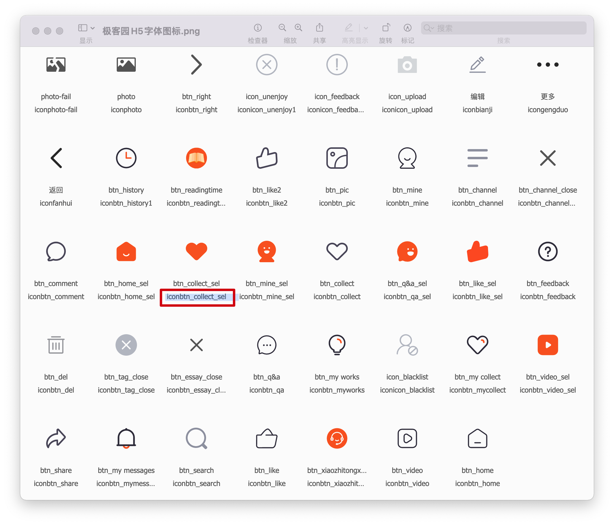

# 极客园H5项目【项目准备】

> 开发资料

​	H5 端项目演示：http://toutiao.itheima.net/

​	H5 端项目接口文档：http://toutiao.itheima.net/api.html

> 主要业务：项目搭建、git管理代码、引入ant-mobile组件库、原生css变量和组件库主题定制、配置@别名、移动端适配、1px边框问题、redux类型文件准备、登录功能类型准备、工具函数准备

## 01-项目介绍

**目标**：了解项目定位和功能

**内容**：

极客园 H5 端项目：个人自媒体前台

>「极客园」对标`CSDN`、`博客园`等竞品，致力成为更加贴近年轻 IT 从业者（学员）的科技资讯类应用 
> 产品关键词：IT、极客、活力、科技、技术分享、前沿动态、内容社交 
> 用户特点：年轻有活力，对IT领域前言科技信息充满探索欲和学习热情

- 项目功能和演示，包括
  - 短信登录、退出
  - 首页-频道管理，文章列表，更多操作
  - 文章详情-文章详情，文章评论，评论回复，点赞，收藏，关注
  - 个人中心-个人资料展示，个人资料编辑，小智聊天

- 技术栈：
  - 项目搭建：React 官方脚手架 `create-react-app`
  - react hooks
  - 状态管理：redux
  - UI 组件库：`antd-mobile` v5
  - ajax请求库：`axios`
  - 路由：`react-router-dom` 以及 `history`
  - CSS 预编译器：`sass`
  - CSS Modules 避免组件之间的样式冲突
  - **TypeScript**
  - 工具库：lodash
  - hooks 库：ahooks
  - websocket 即时通讯

## 02-项目搭建

**目标**：能够基于脚手架搭建支持TypeScript的项目
**步骤**：

1. 使用 React CLI 搭建项目：`npx create-react-app geek-app --template typescript`
2. 进入项目根目录：`cd 项目名称`
3. 启动项目：`yarn start`
4. 调整项目目录结构：

```tree
/src
  /assets         项目资源文件，比如，图片 等
  /components     通用组件
  /pages          页面
  /styles         全局公共样式
  /store          Redux 状态仓库
  /types          TS 类型，包括：后台接口、redux等类型
  /utils          工具，比如，token、axios 的封装等
  App.scss        根组件样式文件
  App.tsx         根组件
  index.scss      全局样式
  index.tsx       项目入口
```

**核心代码**：

src/index.tsx 中：

```tsx
import ReactDOM from 'react-dom'
import './index.scss'
import App from './App'

ReactDOM.render(<App />, document.getElementById('root'))
```

src/index.scss 中：

```scss
html,
body {
  margin: 0;
  padding: 0;
}

html,
body,
#root {
  height: 100%;
}

p,
h2,
h3 {
  margin: 0;
}

* {
  box-sizing: border-box;
}
```

src/App.tsx 中：

```tsx
import './App.scss'

function App() {
  return <div className="app"></div>
}

export default App
```

src/App.scss 中：

```scss
.app {
  height: 100%;
}
```

*注：为了统一操作，直接删除 src 下的所有文件后，再调整*

## 03-使用SASS

**目标**：能够在 CRA 中使用 sass 写样式
**步骤**：

1. 安装解析 sass 的包：`yarn add sass`

## 04-使用git/gitee管理项目

**目标**：能够将项目推送到 gitee 远程仓库
**步骤**：

1. 在项目根目录打开终端，并初始化 git 仓库（如果已经有了 git 仓库，无需重复该步），命令：`git init`
2. 添加项目内容到暂存区：`git add .`
3. 提交项目内容到仓库区：`git commit -m 项目初始化`
4. 添加 remote 仓库地址：`git remote add origin [gitee 仓库地址]`
5. 将项目内容推送到 gitee：`git push origin master -u`
  - 以后只需要：`git push origin` 即可

## 05-配置基础路由

**目标**：能够配置登录页面的路由并显示在页面中
**步骤**：

1. 安装路由：`yarn add react-router-dom@5.3.0` 和路由的类型声明文件 `yarn add @types/react-router-dom -D`
2. 在 pages 目录中创建两个文件夹：Login、Layout
3. 分别在两个目录中创建 index.tsx 文件，并创建一个简单的组件后导出
4. 在 App 组件中，导入路由组件以及两个页面组件
5. 配置 Login 和 Layout 的路由规则

**核心代码**：

pages/Login/index.tsx 中：

```tsx
const Login = () => {
  return <div>登录页面</div>
}
export default Login
```

App.tsx 中：

```tsx
// 导入路由
import { BrowserRouter as Router, Route, Switch } from 'react-router-dom'

// 导入页面组件
import Login from './pages/Login'
import Layout from './pages/Layout'

// 配置路由规则
function App() {
  return (
		<Router>
      <div className="app">
        <Switch>
          <Route path="/home" component={Layout} />
          <Route path="/login" component={Login} />
        </Switch>
      </div>
    </Router>
  )
}

export default App
```

## 06-默认展示首页内容

**目标**：能够在打开页面时就展示首页内容

**分析说明**：

匹配默认路由，进行重定向
- [Route render prop](https://reactrouter.com/web/api/Route/render-func)
- Route 的 `render` 属性：用来内联渲染任意内容

**步骤**：

1. 在 App.tsx 中添加一个新的 Route，用来匹配默认路由
2. 为 Route 组件添加 `render` 属性，用来渲染自定义内容
3. 在 render 中，渲染 Redirect 实现路由重定向

**核心代码**：

App.tsx 中：

```tsx
import { Redirect } from 'react-router-dom'
// 写法1
<Route exact path="/" render={() => <Redirect to="/home" />} />
// 写法2
<Redirect exact from="/" to="/home" />
```

**总结**：

1. Route 通过哪个属性来渲染自定义内容？
2. 通过哪个组件来实现路由重定向？

## 07-antd-mobile组件库

**目标**：能够使用 antd-mobile 的 Button 组件渲染按钮

**内容**：

> **`antd-mobile` 是 Ant Design 的移动规范的 React 实现**，服务于蚂蚁及口碑无线业务。
> **开箱即用**

[antd-mobile 文档](https://mobile.ant.design/)

**步骤**：

1. 安装 antd 组件库：`npm i antd-mobile`
2. 导入 Button 组件
3. 在 Login 页面渲染 Button 组件

**核心代码**：

pages/Login/index.tsx 中：

```tsx
import { Button } from 'antd-mobile'

const Login = () => (
  <div>
    <Button color="primary">Button</Button>
  </div>
)
```

## 08-原生CSS变量

**目标**：能够使用原始CSS变量

**内容**：

- [MDN - CSS变量（自定义属性）](https://developer.mozilla.org/zh-CN/docs/Web/CSS/Using_CSS_custom_properties)

语法：

1. 在样式块中，声明自定义属性名需要以两个减号（`--`）开始，属性值则可以是任何有效的CSS值
2. 使用自定义属性时用 [`var()`](https://developer.mozilla.org/zh-CN/docs/Web/CSS/var()) 函数包裹获取变量值

CSS 自定义属性，通常称为 `CSS 变量`。类似于 JS 中声明的变量，可以**复用** CSS 属性值。比如：

```css
/* 
  比如，项目中多次使用某一个颜色值，原来需要重复写多次
*/
.list-item-active {
  color: #fc6627;
}

.tabs-item-active {
  color: #fc6627;
}

/* 
  使用 CSS 变量来实现复用
*/

/* 1 创建全局 CSS 变量 --geek-color-primary*/
:root {
  --geek-color-primary: #fc6627;
}
/* 2 复用 */
.list-item-active {
  color: var(--geek-color-primary);
}

.tabs-item-active {
  color: var(--geek-color-primary);
}
```

- 特点：
  1. 可复用
  2. 语义化，`--geek-color-primary` 比 #fc6627 更容易让人理解

- 根据 CSS 变量的作用域，分为两种：
  1. 全局 CSS 变量：全局有效
  2. 局部 CSS 变量：只在某个作用域内（比如，某个类名中）有效

```css
/*
  全局 CSS 变量
  1. 使用 :root 这个 CSS 伪类匹配文档树的根元素 html。可以在CSS文件的任意位置使用该变量
     相当于 JS 变量中的全局
  2. CSS 变量通过两个减号（--）开头，多个单词之间推荐使用 - 链接。CSS 变量名可以是任意变量名
*/
:root {
  --geek-color-primary: #fc6627;
}
/* 使用 */
.tabs-item-active {
  color: var(--geek-color-primary);
}
.list-item-active {
  color: var(--geek-color-primary);
}

/* 
  局部 CSS 变量
*/
.list {
  --active-color: #1677ff;

  /* 在该 类 内部使用改变量 */
  color: var(--active-color);
}
.test {
  color: var(--active-color); /* 错误演示：无效！效果与不使用该变量时一致*/
}
```

## 09-组件库antd-mobile主题定制

**目标**：能够使用原生CSS变量来定制极客园项目的主题

**内容**：[antd-mobile 主题](https://mobile.ant.design/zh/guide/theming)

**核心代码**：

src/index.scss 中：

```scss
:root:root {
  --adm-color-primary: #fc6627;
  --adm-font-family: 'PingFangSC-Regular'; 
  --font-size: 16px;
}
```

注：为什么要写两个重复的 `:root`？

由于 antd-mobile 中的主题变量也是在 `:root` 下声明的，所以在有些情况下会由于优先级的问题无法成功覆盖。通过 `:root:root` 可以显式地让你所写内容的优先级更高一些，从而确保主题变量的成功覆盖。

## 10-配置路径别名

**目标**：能够配置@路径别名简化路径处理

**内容**：

[自定义 CRA 的默认配置](https://ant.design/docs/react/use-with-create-react-app-cn#%E9%AB%98%E7%BA%A7%E9%85%8D%E7%BD%AE)
[craco 配置文档](https://github.com/gsoft-inc/craco/blob/master/packages/craco/README.md#configuration)

**步骤**：

1. 安装修改 CRA 配置的包：`yarn add -D @craco/craco`
2. 在项目根目录中创建 craco 的配置文件：`craco.config.js`，并在配置文件中配置路径别名
3. 修改 `package.json` 中的脚本命令
4. 在代码中，就可以通过 `@` 来表示 src 目录的绝对路径
5. 重启项目，让配置生效

**核心代码**：

/craco.config.js 中：

```js
const path = require('path')

module.exports = {
  // webpack 配置
  webpack: {
    // 配置别名
    alias: {
      // 约定：使用 @ 表示 src 文件所在路径
      '@': path.resolve(__dirname, 'src'),
      // 约定：使用 @scss 表示全局 SASS 样式所在路径
      // 在 SASS 中使用
      '@scss': path.resolve(__dirname, 'src/styles')
    }
  }
}
```

package.json 中：

```json
// 将 start/build/test 三个命令修改为 craco 方式

"scripts": {
  "start": "craco start",
  "build": "craco build",
  "test": "craco test",
  "eject": "react-scripts eject"
},
```

## 11-@别名路径提示

**目标**：能够让vscode识别@路径并给出路径提示

**分析说明**：

因为项目使用了 TS，而 TS 带有配置文件 tsconfig.json。因此，不需要再使用 jsconfig.json（实际上，jsconfig.json 是参考 tsconfig.json 的）

VSCode 会自动读取 `tsconfig.json` 中的配置，让 vscode 知道 @ 就是 src 目录

**步骤**：

1. 创建 `path.tsconfig.json` 配置文件
2. 在该配置文件中添加以下配置
3. 在 `tsconfig.json` 中导入该配置文件，让配置生效
4. 重启 VSCode

**核心代码**：

/path.tsconfig.json 中：

```json
{
  "compilerOptions": {
    "baseUrl": "./",
    "paths": {
      "@/*": ["src/*"],
      "@scss/*": ["src/styles/*"]
    }
  }
}
```

/tsconfig.json 中：

```json
{
  // 导入配置文件
  "extends": "./path.tsconfig.json",
}
```

## 12-移动端适配

**目标**：能跟通过配置实现自动适配移动端项目

**分析说明**：

适配概述

- 为什么要适配？
  - 为了让我们开发的移动端项目页面，在不同尺寸大小的移动端设备（手机）中，保持相同的比例
- 适配原理
  - 选择某个手机的尺寸大小作为基准，其他手机进行**等比例缩放**
  - 一般选择 `iPhone 6`（2 倍屏幕），屏幕宽度为：`375px`
- 适配方式
  - rem：需要手动修改 `html` 元素的 `font-size`；额外设置 `body` 元素的字体大小为正常值
  - vw： 1 `vw` 等于屏幕宽度的 `1%`

```js
// rem 适配（10栅格）
// iphone6       html ==> font-size: 37.5px
// iphone6 plus  html ==> font-size: 41.4px
// == 1rem = html的font-size大小 ==
// 
// iPhone 6 下宽高为 100px：
// 100 / 37.5 ≈ 2.667
// height: 2.667rem; width: 2.667rem;

// vw 适配（100栅格）
// == 1vw = 3.75px ==
// iPhone 6 下宽高为 100px：
// 100 / (375 / 100) = 100 / 3.75 ≈ 26.7vw
// height: 26.667vw; width: 26.667vw;
```

- 如果每次设置宽高都需要手动计算一次，太繁琐了！因此，需要借助工具来解决！

**步骤**：

- [postcss-px-to-viewport 文档](https://github.com/evrone/postcss-px-to-viewport)
1. 安装 px 转 vw 的包：`yarn add -D postcss-px-to-viewport`
   - 包的作用：将 `px` 转化为 `vw`，所以有了该工具，只需要在代码中写 `px` 即可
2. 在 `craco.config.js` 添加相应配置
3. 重启项目，让配置生效

**核心代码**：

/craco.config.js 中：

```js
const pxToViewport = require('postcss-px-to-viewport')
const vw = pxToViewport({
  // 视口宽度，一般就是 375（ 设计稿一般采用二倍稿，宽度为 375 ）
  viewportWidth: 375
})

module.exports = {
  // 此处省略 webpack 配置
  webpack: {},
  // ...
  // 适配
  // style: {
  //   postcss: {
  //     plugins: [vw]
  //   }
  // }
  style: {
    postcss: {
      mode: 'extends',
      loaderOptions: {
        postcssOptions: {
          ident: 'postcss',
          plugins: [vw]
        }
      }
    }
  }
  // ...
}
```

关于设计稿的说明：

1. 摹客 - 设计稿、原型图
2. 蓝湖 - 设计稿、原型图

- 设计稿，一般使用 2 倍设计稿，也就是 iPhone 6 对应的尺寸大小
  - iPhone 6 屏幕宽度：375px（css单位，逻辑像素），因为是2倍屏幕，所以，实际上有 750 个物理像素(设备分辨率)，因此 1px = 2个物理像素
- 在 摹客 中，可以通过自定义来修改设计稿的宽度，一般就修改为：设计稿宽度 375px。这样设计稿中的内容多宽多高，在代码中就写多少

扩展阅读：https://blog.csdn.net/qq_34115899/article/details/105566707

## 13-移动端 1px 像素边框

**目标**：能够展示1px像素的边框

**分析说明**：

[参考 antd-mobile 的实现](https://github.com/ant-design/ant-design-mobile/blob/v2/components/style/mixins/hairline.less)

实现原理：**伪元素 + transform 缩放**
- 伪元素`::after`或`::before`独立于当前元素，可以单独对其缩放而不影响元素本身的缩放

**核心代码**：

```scss
// src/assets/styles/hairline.scss

@mixin scale-hairline-common($color, $top, $right, $bottom, $left) {
  content: '';
  position: absolute;
  display: block;
  z-index: 1;
  top: $top;
  right: $right;
  bottom: $bottom;
  left: $left;
  background-color: $color;
}

// 添加边框
/* 
  用法：

  // 导入
  @import '@/styles/hairline.scss';

  // 在类中使用
  .a {
	  position: relative;
    @include hairline(bottom, #f0f0f0);
  }
*/
@mixin hairline($direction, $color: #000, $radius: 0) {
  @if $direction == top {
    border-top: 1px solid $color;

    // min-resolution 用来检测设备的最小像素密度
    @media (min-resolution: 2dppx), (-webkit-min-device-pixel-ratio: 2) {
      border-top: none;

      &::before {
        @include scale-hairline-common($color, 0, auto, auto, 0);
        width: 100%;
        height: 1px;
        transform-origin: 50% 50%;
        transform: scaleY(0.5);

        @media (min-resolution: 3dppx), (-webkit-min-device-pixel-ratio: 3)  {
          transform: scaleY(0.33);
        }
      }
    }
  } @else if $direction == right {
    border-right: 1px solid $color;

    @media (min-resolution: 2dppx), (-webkit-min-device-pixel-ratio: 2)  {
      border-right: none;

      &::after {
        @include scale-hairline-common($color, 0, 0, auto, auto);
        width: 1px;
        height: 100%;
        background: $color;
        transform-origin: 100% 50%;
        transform: scaleX(0.5);

        @media (min-resolution: 3dppx), (-webkit-min-device-pixel-ratio: 3)  {
          transform: scaleX(0.33);
        }
      }
    }
  } @else if $direction == bottom {
    border-bottom: 1px solid $color;

    @media (min-resolution: 2dppx), (-webkit-min-device-pixel-ratio: 2)  {
      border-bottom: none;

      &::after {
        @include scale-hairline-common($color, auto, auto, 0, 0);
        width: 100%;
        height: 1px;
        transform-origin: 50% 100%;
        transform: scaleY(0.5);

        @media (min-resolution: 3dppx), (-webkit-min-device-pixel-ratio: 3)  {
          transform: scaleY(0.33);
        }
      }
    }
  } @else if $direction == left {
    border-left: 1px solid $color;

    @media (min-resolution: 2dppx), (-webkit-min-device-pixel-ratio: 2)  {
      border-left: none;

      &::before {
        @include scale-hairline-common($color, 0, auto, auto, 0);
        width: 1px;
        height: 100%;
        transform-origin: 100% 50%;
        transform: scaleX(0.5);

        @media (min-resolution: 3dppx), (-webkit-min-device-pixel-ratio: 3)  {
          transform: scaleX(0.33);
        }
      }
    }
  } @else if $direction == all {
    border: 1px solid $color;
    border-radius: $radius;

    @media (min-resolution: 2dppx), (-webkit-min-device-pixel-ratio: 2)  {
      position: relative;
      border: none;

      &::before {
        content: '';
        position: absolute;
        left: 0;
        top: 0;
        width: 200%;
        height: 200%;
        border: 1px solid $color;
        border-radius: $radius * 2;
        transform-origin: 0 0;
        transform: scale(0.5);
        box-sizing: border-box;
        pointer-events: none;
      }
    }
  }
}

// 移除边框
@mixin hairline-remove($position: all) {
  @if $position == left {
    border-left: 0;
    &::before {
      display: none !important;
    }
  } @else if $position == right {
    border-right: 0;
    &::after {
      display: none !important;
    }
  } @else if $position == top {
    border-top: 0;
    &::before {
      display: none !important;
    }
  } @else if $position == bottom {
    border-bottom: 0;
    &::after {
      display: none !important;
    }
  } @else if $position == all {
    border: 0;
    &::before {
      display: none !important;
    }
    &::after {
      display: none !important;
    }
  }
}
```

## 14-字体图标

**目标**：能够在项目中使用字体图标

**内容**：

> 使用说明：拷贝图标名称到use元素的xlinkHref属性中：#+图标名称



1. 在 public 下 index.html body 中引入该文件

```html
<!-- 字体图标地址： -->
<script src="//at.alicdn.com/t/font_2503709_i408x28a4zp.js"></script>
```

2. 在 `index.scss` 中添加通过 css 代码

```scss
.icon {
  width: 1em; height: 1em;
  vertical-align: -0.15em;
  fill: currentColor;
  overflow: hidden;
}
```

3. 在组件中，使用：

```tsx
<svg className="icon" aria-hidden="true">
  {/* 使用时，只需要将此处的 iconbtn_like_sel 替换为 icon 的名称即可*/}
  <use xlinkHref="#iconbtn_like_sel"></use>
</svg>
```

## 15-封装Icon组件

**目标**：能够封装 Icon 图片通用组件

**步骤**：

1. 在 components 目录中，创建 Icon/index.tsx 文件
2. 创建 Icon 组件，并指定 props 类型
3. 安装 classnames 包（yarn add classnames），处理类名

**核心代码**：

components/Icon/index.tsx 中：

```tsx
import classnames from 'classnames'

// 组件 props 的类型
type Props = {
  // icon 的类型
  type: string
  // icon 的自定义样式
  className?: string
  // 点击事件
  onClick?: () => void
}

const Icon = ({ type, className, onClick }: Props) => {
  return (
    <svg
      className={classnames('icon', className)}
      aria-hidden="true"
      onClick={onClick}
    >
      <use xlinkHref={`#${type}`}></use>
    </svg>
  )
}

export default Icon
```

## 16-配置Redux

**目标**：能够完成Redux的基础配置

**分析说明**：

Redux 相关的类型比较多且复杂，可以暂时先用 unknown，后面会专门处理其类型

**步骤**：

1. 安装 redux 相关的包：
   - `yarn add redux react-redux redux-thunk@2.3.0 redux-devtools-extension axios`
2. 在 store 目录中分别创建：actions 和 reducers 文件夹、index.ts 文件
3. 在 store/index.ts 中，创建 store 并导出
4. 创建 reducers/index.ts 文件，创建 rootReducer 并导出
5. 创建 reducers/login.ts 文件，创建基础 login reducer 并导出
6. 在 src/index.tsx 中为 React 组件接入 Redux

**核心代码**：

store 目录结构：

```html
/store
  /actions
  /reducers
    index.ts
  index.ts
```

store/index.ts 中：

```ts
import { createStore, applyMiddleware } from 'redux'
import thunk from 'redux-thunk'
import { composeWithDevTools } from 'redux-devtools-extension'
import rootReducer from './reducers'

const middlewares = composeWithDevTools(applyMiddleware(thunk))
const store = createStore(rootReducer, middlewares)

export default store
```

store/reducers/index.ts 中：

```ts
import { combineReducers } from 'redux'

import { login } from './login'

const rootReducer = combineReducers({
  login
})

export default rootReducer
```

store/reducers/login.ts 中：

```ts
// 注意：该项目中，在 redux 中存储的 token 是个对象，包含两个 token：1 token（登录成功的令牌）  2 refresh_token（刷新token，token过期时换取新的token）

const initialState = {}
export const login = (state = initialState, action: unknown) => {
  return state
}
```

src/index.tsx 中：

```tsx
import { Provider } from 'react-redux'
import store from './store'

ReactDOM.render(
  <Provider store={store}>
    <App />
  </Provider>,
  document.querySelector('#root')
)
```

## 17-配置Redux的相关类型

**目标**：能够配置Redux的基础类型

**步骤**：

1. 在 types 目录中创建两个类型声明文件：`store.d.ts` 和 `data.d.ts`
  - store.d.ts：用来存放跟 Redux 相关类型，比如，action 的类型等
  - data.d.ts：用来存放跟数据接口相关类型
2. 在 store.d.ts 中添加 Redux 相关类型

**核心代码**：

types/store.d.ts 中：

```ts
import { ThunkAction } from 'redux-thunk'
import store from '../store'

// Redux 应用的状态
export type RootState = ReturnType<typeof store.getState>

// 使用 thunk 中间件后的 Redux dispatch 类型
// ReturnType：thunk action 的返回类型
// State: Redux 的状态  RootState
// ExtraThunkArg: 额外的参数，没有用到，可以指定为 unknown
// BasicAction: 非 thunk action，即对象形式的 action
export type RootThunkAction = ThunkAction<
	void,
  RootState,
  unknown,
  RootAction
>

// 项目中所有 action 的类型
type RootAction = unknown

// -------------------- Redux 对象形式的 action 的类型 ---------------------------

// 登录相关的 action 类型
// 文章相关的 action 类型
// 等等
```

## 18-准备登录功能的类型

**目标**：能够根据接口文档准备好登录的类型

**步骤**：

1. 打开[登录接口文档](http://geek.itheima.net/api.html#u7528u6237u8ba4u8bc1uff08u767bu5f55u6ce8u518cuff090a3ca20id3du7528u6237u8ba4u8bc1uff08u767bu5f55u6ce8u518cuff093e203ca3e)
2. 查看登录接口的返回数据
3. 在 data.d.ts 中，创建登录接口返回数据的类型 Token
4. 根据登录接口返回数据的类型 Token，创建登录 action 类型
5. 将登录 action 类型添加到 RootAction 类型中（ 目的：dispatch action 时有类型提示 ）

**核心代码**：

types/data.d.ts 中：

```ts
// 登录接口返回数据类型
export type Token = {
  token: string
  refresh_token: string
}
```

types/store.d.ts 中：

```ts
import { Token } from './data'

// 将登录 action 添加到该类型中
type RootAction = LoginAction

// 登录 action 类型
export type LoginAction = {
  type: 'login/token'
  payload: Token
}
```

store/reducers/login.ts 中：

```ts
import { Token } from "@/types/data"

const initialState: Token = {
  token: '',
  refresh_token: ''
}

export const login = (state = initialState, action: unknown): Token => {
  return state
}
```

## 19-工具函数

**目标**：能够复用极客园PC端项目创建好的工具函数

**步骤**：

1. 安装history：`yarn add history@4.10.1`
2. 拷贝极客园PC端项目中的工具函数(token.js、history.js、request.js)到该项目中
3. 将原来的 .js 文件，修改为 .ts 文件
4. 解决工具函数的类型错误
5. 在 App.tsx 中，配置自定义的 history

**核心代码**：

utils/token.ts 中：

```diff
+ import { Token } from '@/types/data.d'
+ const TOKEN_KEY: string = 'geek-app-token'

// 获取token
const getToken = () =>
+  JSON.parse(localStorage.getItem(TOKEN_KEY) ?? '{}') as Token
// 存储token
const setToken = (token: Token): void =>
+  localStorage.setItem(TOKEN_KEY, JSON.stringify(token))
// 清除token
const clearToken = () => localStorage.removeItem(TOKEN_KEY)
// 是否已登录
+ const isAuth = () => !!getToken().token

export { isAuth, getToken, setToken, clearToken }

```

utils/request.ts 中：

```diff
// 封装 axios
import axios from 'axios'
import store from '@/store'
+ import { Toast } from 'antd-mobile'
import { customHistory } from './history'
// import { logout } from '@/store/actions'

const http = axios.create({
  baseURL: 'http://toutiao.itheima.net/v1_0',
  timeout: 5000
})

// 将来可以继续进行 拦截器 的处理

// 请求拦截器
http.interceptors.request.use(config => {
  // 获取token
-  // 注意：极客园h5项目中，login 存储的是一个对象，对象中的 token 属性，才是登录身份令牌
  const {
+   login: { token }
  } = store.getState()

  // 除了登录请求外，其他请求统一添加 token
  if (!config.url?.startsWith('/authorizations')) {
-    // 此处，需要使用 非空断言 来去掉 headers 类型中的 undefined 类型
+    config.headers!.Authorization = `Bearer ${token}`
  }

  return config
})

// 响应拦截器
http.interceptors.response.use(undefined, error => {
  // 响应失败时，会执行此处的回调函数
  if (!error.response) {
    // 网路超时
    Toast.show({
      content: '网络繁忙，请稍后再试',
      duration: 1000
    })
    return Promise.reject(error)
  }

  if (error.response.status === 401) {
    // token 过期，登录超时
+    Toast.show({
      content: '登录超时，请重新登录',
      duration: 1000,
      afterClose: () => {
        customHistory.push('/login', {
          from: customHistory.location.pathname
        })
        // 触发退出 action，将 token 等清除
        // store.dispatch(logout())
      }
+    })
  }

  return Promise.reject(error)
})

export { http }
```

App.tsx 中：

```tsx
// 注意：此处需要导入 Router
import { Router } from 'react-router-dom'
import { customHistory } from './utils/history'

const App = () => {
  return (
    <Router history={customHistory}>
    	<div className="app">
     	 ...
      </div>  
    </Router>
  )
}
```
# 第一天