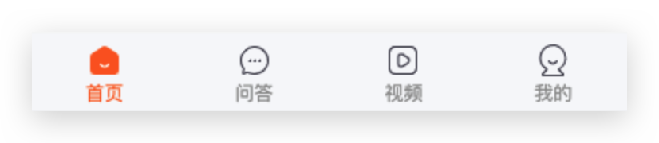

# 极客园H5项目【布局页面】

>主要业务：layout公共布局、子路由配置切换、获取登录人数据渲染、获取待修改登录人数据回填

## 01-布局页面结构

**目标**：能够使用准备好的模板搭建布局页面结构



**分析说明**：

根据TabBar 组件基本用法，了解组件使用

**步骤**：

1. 将模板拷贝到项目中
2. 在 Layout 组件中配置底部 TabBar 对应的路由
3. 使用 antd-mobile 的 TabBar 组件创建底部标签栏

**核心代码**：

Layout/index.tsx 中：

```tsx
import { Route } from 'react-router-dom'
import { TabBar } from 'antd-mobile'
import styles from './index.module.scss'

import Icon from '@/components/Icon'

// 导入页面组件，配置路由
import Home from '../Home'
import Question from '../Question'
import Video from '../Video'
import Profile from '../Profile'

const tabs = [
  { path: '/home/index', icon: 'iconbtn_home', text: '首页' },
  { path: '/home/question', icon: 'iconbtn_qa', text: '问答' },
  { path: '/home/video', icon: 'iconbtn_video', text: '视频' },
  { path: '/home/profile', icon: 'iconbtn_mine', text: '我的' }
]

const Layout = () => {
  return (
    <div className={styles.root}>
      <Route exact path="/home/index">
        <Home></Home>
      </Route>
      <Route path="/home/question">
        <Question></Question>
      </Route>
      <Route path="/home/video">
        <Video></Video>
      </Route>
      <Route path="/home/profile">
        <Profile></Profile>
      </Route>

      <TabBar className="tab-bar">
        {tabs.map(item => (
          <TabBar.Item
            key={item.path}
            icon={active => (
              <Icon
                type={active ? `${item.icon}_sel` : item.icon}
                className="tab-bar-item-icon"
              />
            )}
            title={item.text}
          />
        ))}
      </TabBar>
    </div>
  )
}

export default Layout
```

```scss
@import '@scss/hairline.scss';

.root {
  height: 100%;

  :global {
    // 底部 tabbar 的样式
    .tab-bar {
      position: fixed;
      z-index: 1;
      bottom: 0;
      width: 100%;
      height: 50px;
      background-color: #f7f8fa;
      @include hairline(top, #f0f0f0);

      .icon {
        color: #fc6627;
      }
    }
  }
}
```


## 02-TabBar 配合路由使用

**目标**：能够实现tab切换路由和高亮

**分析说明**：

TabBar 高亮的两种情况：

1. 点击哪个 tab，哪个 tab 高亮
2. 刷新页面时，根据当前路由让对应 tab 高亮

因为 tab 高亮与路由相关，因此，可以直接使用路由地址（location.path）作为高亮key值即可

**步骤**：

1. 导入路由的 history 和 location 对应的 hook
2. 将当前路由地址作为 TabBar 的高亮key值
3. 在 TabBar 的 change 事件中，根据当前key切换路由

**核心代码**：

```tsx
import { useHistory, useLocation } from 'react-router-dom'

const Layout = () => {
  const history = useHistory()
  const location = useLocation()

  const changeRoute = (path: string) => {
    history.push(path)
  }

  return (
    // ...

    <TabBar
      className="tab-bar"
      activeKey={location.pathname}
      onChange={key => changeRoute(key)}
    >
    </TabBar>
  )
}

export default Layout
```
