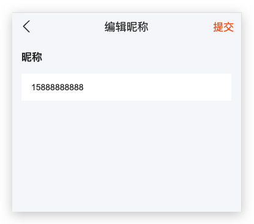

# 极客园H5项目【4个人中心】

## 01-页面结构

**目标**：能够根据模板搭建个人中心页面结构


**步骤**：

 使用资源目录的开发模板 Profile 修改页面结构

## 02-获取用户信息并展示

该功能分为以下几步来实现：

1. 发送请求获取用户信息
2. 页面分发获取用户信息的action
3. 将用户信息存储到redux中
4. 获取用户信息并展示

## 03-用户信息-发送请求获取数据

**目标**：能够发送请求获取用户信息

**步骤**：

1. 根据接口准备所需类型
2. 创建 actions/profile.ts 文件
3. 创建获取用户信息的 action

**核心代码**：

types/data.d.ts 中：

```ts
// 我的 - 个人信息
export type User = {
  id: string
  name: string
  photo: string
  art_count: number
  follow_count: number
  fans_count: number
  like_count: number
}
```

actions/profile.ts 中：

```ts
import { http } from '@/utils'
import type { RootThunkAction } from '@/types/store'
import type { User } from '@/types/data'

type UserResponse = {
  message: string
  data: User
}

// 我的页面 - 获取个人信息
export const getUser = (): RootThunkAction => {
  return async dispatch => {
    const res:UserResponse = await http.get('/user')
    console.log(res)
  }
}
```

## 04-用户信息-组件分发action

**目标**：能够在我的页面中分发获取用户信息的action

**核心代码**：

Profile/index.tsx 中：

```tsx
import { useEffect } from 'react'
import { useDispatch } from 'react-redux'
import { getUser } from '@/store/actions'

const Profile = () => {
  const dispatch = useDispatch()

  useEffect(() => {
    dispatch(getUser())
  }, [dispatch])

  // ...
}
```

## 05-用户信息-存储到redux

**目标**：能够将用户信息保存到redux中

**步骤**：

1. 准备保存状态到redux的action类型
2. 在获取个人信息的 action 中将用户信息存储到redux中
3. 创建 reducers/profile.ts，并完成存储用户信息的功能
4. 在 reducers/index.ts 中，将 profile 合并到根 reducer 中

**核心代码**：

types/store.d.ts 中：

```ts
import type { User } from '../data'

// 将 ProfileAction 联合到 redux action 类型中
type RootAction = LoginAction | ProfileAction

export type ProfileAction = {
  type: 'profile/getUser'
  payload: User
}
```

actions/profile.ts 中：

```ts
export const getUser = (): RootThunkAction => {
  return async dispatch => {
    const res = await http.get<UserResponse>('/user')
    const { data, message } = res.data

    // 存储 redux 中
    // 因为已经有 TS 类型，所以，此处代码都是有提示的
    dispatch({ type: 'profile/getUser', payload: data })
  }
}
```

reducers/profile.ts 中：

```ts
import type { User } from '@/types/data'
import type { ProfileAction } from '@/types/store'
type ProfileState = {
  user: User
}

const initialState = {
  user: {}
} as ProfileState

const profile = (state = initialState, action: ProfileAction): ProfileState => {
  switch (action.type) {
    case 'profile/getUser':
      return {
        ...state,
        user: action.payload
      }
    default:
      return state
  }
}

export default profile
```

reducers/index.ts 中：

```ts
import profile from './profile'

const rootReducer = combineReducers({
  // ...
  profile
})
```

## 06-用户信息-展示用户信息

**目标**：能够展示用户信息

**分析说明**：

TS 支持索引查询类型（索引访问类型），用来查询属性的类型

```ts
type RootState = {
  name: string
}

// T1 的类型是：name 属性的类型 string
type T1 = RootState['name']
```

**步骤**：

1. 导入 useSelector
2. 调用 useSelector 获取 user 状态
3. 从 user 对象中解构出用户数据并展示在页面中

**核心代码**：

说明：RootState['profile']查询返回值类型

```tsx
import { useSelector } from 'react-redux'
import { RootState } from '@/types/store'

const Profile = () => {
  // const { user } = useSelector<RootState, RootState['profile']>(state => state.profile)
  const { user } = useSelector((state: RootState) => state.profile)

  const { photo, name, like_count, follow_count, fans_count, art_count } = user

  // ...
  // 在 JSX 中渲染从 redux 中拿到的状态数据即可
}
```

## 07-封装axios响应工具类型

**目标**：能够封装工具类型统一处理axios的响应类型

**分析说明**：

对于项目接口来说，任何一个接口返回的顶层数据格式都是一样的，都有：

1. 都有 message 属性，类型为 string （固定）
2. 都有 data 属性，但是具体是什么类型不确定（变化）

```ts
// 登录
type LoginResponse = {
  message: string
  data: Token
}
// 用户
type UserResponse = {
  message: string
  data: User
}
```

问题：TS 类型中，什么类型可以配合多种类型使用，并且可以在使用时指定明确类型？**泛型**

**步骤**：

1. 在 types/data.d.ts 中，创建泛型工具类型 ApiResponse
2. 通过该泛型工具类型，统一处理axios响应类型

**核心代码**：

types/data.d.ts 中：

```ts
// 泛型工具类型
type ApiResponse<Data> = {
  message: string
  data: Data
}

// 统一处理axios响应类型：
// 登录
export type LoginResponse = ApiResponse<Token>
// 用户
export type UserResponse = ApiResponse<User>
```

actions/login.ts 中：

```ts
import type { LoginResponse } from '@/types/data'
```

actions/profile.ts 中：

```ts
import type { UserResponse } from '@/types/data'
```

## 08-个人信息-修改页面结构

**目标**：能够根据模板展示个人信息页面


**步骤**：

1. 将 Edit 模板拷贝到 Profile 目录中
2. 在 App.tsx 中配置个人信息页面的路由

**核心代码**：

App.tsx 中：

```tsx
import ProfileEdit from './pages/Profile/Edit'

const App = () => {
  return (
    // ...
    <Route path="/profile/edit">
      <ProfileEdit />
    </Route>
  )
}
```

## 09-个人信息-获取并展示个人信息

**目标**：能够获取并展示编辑时的个人信息

**步骤**：

1. 在 types/data.d.ts 中，根据接口准备好返回数据类型
3. 在 actions/profile.ts 中，创建获取编辑时个人信息的 action
4. 在 types/store.d.ts 中，创建相应的 redux action 类型
5. 在 actions 中分发修改 redux 状态的 action
6. 在 reducers 中处理该 action，并将状态存储到 redux 中

**核心代码**：

types/data.d.ts 中：

```ts
export type UserProfile = {
  id: string
  photo: string
  name: string
  mobile: string
  gender: number
  birthday: string
  intro: string
}
export type UserProfileResponse = ApiResponse<UserProfile>
```

actions/profile.ts 中：

```ts
import type { UserProfileResponse } from '@/types/data'

export const getUserProfile = (): RootThunkAction => {
  return async dispatch => {
    const res:UserProfileResponse = await http.get('/user/profile')
    dispatch({ type: 'profile/getUserProfile', payload: res.data.data })
  }
}
```

types/store/d.ts 中：

```ts
import type { UserProfile } from './data'
export type ProfileAction =
  // ...
  | {
      type: 'profile/getUserProfile'
      payload: UserProfile
    }
```

reducers/profile.ts 中：

```ts
// 注意：以下代码为简化代码

import type { UserProfile } from '@/types/data'

type ProfileState = {
  // ...
  userProfile: UserProfile
}

const initialState = {
  // ...
  userProfile: {}
} as ProfileState

const profile = (state = initialState, action: ProfileAction): ProfileState => {
  switch (action.type) {
    // ...
    case 'profile/getUserProfile':
      return {
        ...state,
        userProfile: action.payload
      }
  }
}
```

Profile/Edit/index.tsx 中：

```tsx
import { useEffect } from 'react'
import { useDispatch, useSelector } from 'react-redux'
import { getUserProfile } from '@/store/actions'
import type { RootState } from '@/types/store'

const ProfileEdit = () => {
  const dispatch = useDispatch()
  const { userProfile } = useSelector((state: RootState) => state.profile)

  useEffect(() => {
    dispatch(getUserProfile())
  }, [dispatch])

  const { photo, name, intro, gender, birthday } = userProfile

  // JSX 中展示用户信息
  return (
    // ...
    <Item
      arrow
      extra={
        <span className={classNames('intro', intro && 'normal')}>{intro}</span>
      }
    >
      {intro || '未填写'}
    </Item>
    
    <Item arrow extra={gender === 0 ? '男' : '女'}>
      性别
    </Item>
    <Item arrow extra={birthday}>
      生日
    </Item>
  )
}
```

## 10-自定义hooks

**目标**：能够知道什么是自定义hooks

**分析说明**：

除了使用 React 提供的 hooks 之外，开发者还可以创建自己的 hooks，也就是自定义 hooks

>问题：为什么要创建自定义 hooks？

回答：**实现状态逻辑复用**，也就是将与状态相关的逻辑代码封装到一个函数中，哪个地方用到了，哪个地方调用即可

>封装自定义 hook 与封装普通函数的区别：**是否包含了状态逻辑**，如果需要包含 React 状态逻辑，那么，就得用自定义 hook；而如果封装的内容不涉及状态，此时，就用普通的函数封装即可。

如何理解状态逻辑？**可以简单的理解为代码中是否包含 React hooks，比如，useState、useEffect、useRef 等，那么就得使用自定义 hook 来封装**

自定义 hooks 的特点：

1. 名称必须以 `use` 开头
2. 和内置的 React Hooks 一样，自定义 hook 也是一个函数

- React Hooks（不管是内置的还是自定义的）只能在函数组件或其他自定义 hook 内使用

```ts
// 创建自定义 hooks 函数
const useXxx = (params) => {
  // ...
  // 需要复用的状态逻辑代码
  // ...

  return xxx
}

// 使用自定义 hooks 函数
const Hello = () => {
  const xxx = useXxx(...)
}
```

- 说明：自定义 hooks 就是一个函数，可以完全按照对函数的理解，来理解自定义 hooks
  - 比如：参数和返回值都可以可选的，可以提供也可以不提供，根据实际的需求来实现即可

**总结**：

1. 自定义 hooks 是函数吗？ 是
2. 自定义 hooks 的名称有什么约束？必须以 `use` 开头
3. 自定义 hooks 可以没有参数或返回值吗？可以

## 11-自定义hooks-分析要封装的代码逻辑

**目标**：能够分析要封装的代码逻辑找到相同点和不同点

**分析说明**：

>函数封装的基本思想：
>
>1. 将相同的逻辑直接拷贝到函数中
>2. 不同的数据或逻辑通过函数参数传入
>3. 需要返回数据，就通过函数返回值返回

* 分析以上【我的页面】和【个人信息页面】中获取数据的逻辑，有两个不同点：

1. 分发的 action 函数不同
2. 获取的状态不同

所以，只需要把这两点作为自定义 hooks 的**参数**即可

而这两个功能最终的目的，都是为了拿到相应的应用状态。因此，把拿到的应用状态，作为自定义 hooks 的**返回值**即可

```js
// 1. 将不同的内容，作为函数参数传入
const useInitialState = (action, stateName) => {
  
  // 需要复用的状态逻辑代码（ 相同的逻辑代码 ）

  // 最终，该操作需要什么数据，最终就通过 返回值 来返回
  return state
}
```

```tsx
// 2. 使用自定义 hooks：
const { userProfile } = useInitialState(getUserProfile, 'profile')
const { photo, name, intro, gender, birthday } = userProfile

const { user } = useInitialState(getUser, 'profile')
const { photo, name, like_count, follow_count, fans_count, art_count } = user
```


## 12-自定义hooks-实现自定义hooks-不考虑类型

**目标**：能够通过JS代码实现自定义hooks

**步骤**：

1. 创建 utils/use-initial-state.ts 文件
2. 创建 useInitialState 函数（自定义 hook）
3. 导入用到的包
4. 将相同的逻辑，直接封装到 useInitialState 函数中
5. 将不同的地方，作为 useInitialState 函数的参数
6. 将拿到的状态作为 useInitialState 函数的返回值

**核心代码**：

utils/use-initial-state.ts 中：

```ts
// 导入用到的包
import { useEffect } from 'react'
import { useDispatch, useSelector } from 'react-redux'
import type { RootState } from '@/types/store'

// 创建 useInitialState 函数（自定义 hook）
const useInitialState = (action: any, stateName: any) => {
  const dispatch = useDispatch()
	const state = useSelector((state: RootState) => state[stateName])

  useEffect(() => {
    dispatch(action())
  }, [dispatch, action])

  return state
}

export { useInitialState }
```

Profile/Edit.tsx 中：

```tsx
import { useInitialState } from '@/utils/use-initial-state'

const ProfileEdti = () => {
  const { userProfile } = useInitialState(getUserProfile, 'profile')
  // ...
}
```

## 13-自定义hooks-为实现的自定义hooks添加类型

**目标**：能够为实现的自定义hooks添加类型

**分析说明**：

> 对于 useInitialState 这个自定义 hook 来说，只需要为参数指定类型即可

1. 参数 action：就是一个函数，所以，直接指定为最简单的函数类型即可
2. 参数 stateName：
   - stateName 表示从 Redux 状态中取出的状态名称，比如，`'profile'` 或 `'login'`
   - 所以，stateName 应该是 RootState 中的所有状态名称中的任意一个
   - 但是，具体是哪一个不确定，只有在使用该函数时才能确定下来
   - 问题：如果一个类型不确定，应该是什么 TS 中的什么类型来实现？**泛型**

```ts
// 在调用该函数时，最终得到的返回值类型：是某一个状态的类型，这个类型由我们传入的 stateName 类决定
// 比如，useInitialState(getUser, 'profile') 返回值类型，就是 profile 这个键对应的类型：ProfileState
const useInitialState = <StateName extends keyof RootState>(action: () => void, stateName: StateName) {}

// 调用：
useInitialState(getUser, 'login')
useInitialState(getUser, 'profile')
useInitialState(getUser, 'a')

// 原来讲过的泛型基础：
function id<Type>(value: Type): Type {
  return value
}

id<number>(10)
// 省略类型不写：
id(10)
```

**核心代码**：

utils/use-initial-state.ts 中：

```ts
// StateName 是泛型类型变量的名称
// extends 表示要遵循的泛型约束
// keyof RootState 用来获取 Redux 状态中所有的 key，即：所有状态名称中的任意一个
// 将类型变量作为参数 stateName 的类型
// 解释：约束参数 stateName 只能是 RootState 所有状态名称中的任意一个
const useInitialState = <StateName extends keyof RootState>(
  action: () => void,
  stateName: StateName
) => {
  const state = useSelector((state: RootState) => state[stateName])
  // ...
}
```

- 完整代码如下：

```ts
// 导入用到的包
import { useEffect } from 'react'
import { useDispatch, useSelector } from 'react-redux'
import type { RootState } from '@/types/store'

// 创建 useInitialState 函数（自定义 hook）
const useInitialState = <StateName extends keyof RootState>(
	action: () => void,
  stateName: StateName
) => {
  const dispatch = useDispatch()
	const state = useSelector((state: RootState) => state[stateName])
	// const state = useSelector<RootState, RootState[StateName]>(
  //   state => state[stateName]
  // )

  useEffect(() => {
    dispatch(action())
  }, [dispatch, action])

  return state
}

export { useInitialState }
```

## 14-自定义hooks-改造个人信息

**目标**：能够使用封装好的自定义hook改造获取个人信息功能

**步骤**：

1. 导入自定义hook
2. 调用自定义hook，并传入相应的参数，验证是否有明确的类型提示
3. 通过返回值，拿到对应的状态

**核心代码**：

Profile/Edit/index.tsx 中：

```tsx
import { useInitialState } from '@/utils/use-initial-state'

const ProfileEdit = () => {
  const { userProfile } = useInitialState(getUserProfile, 'profile')

  // ...
}
```

## 15-修改昵称-渲染修改昵称组件

**目标**：能够根据模板渲染修改昵称组件

**步骤**：

1. 在 Edit 目录中创建 components 文件夹
2. 将准备好的修改昵称的模板（EditInput）拷贝到 components 目录中
3. 从 antd-mobile 中导入 Popup 组件
4. 导入修改昵称组件，在 Popup 组件中渲染

**核心代码**：

Edit/index.tsx 中：

```tsx
import { Popup } from 'antd-mobile'
import EditInput from './components/EditInput'

const ProfileEdit = () => {
  return (
    // ...
    <Popup visible={inputVisible} position="right">
      <EditInput />
    </Popup>
  )
}
```

## 16-修改昵称-展示修改昵称组件

**目标**：能够在点击修改昵称时展示弹出层



**步骤**：

1. 准备控制弹出层展示或隐藏的状态 inputVisible，默认值为 false
2. 使用状态 inputVisible 控制 Popup 组件的展示和隐藏
3. 给昵称绑定点击事件
4. 在点击事件中修改状态 inputVisible 为 true 来展示弹出层

**核心代码**：

Edit/index.tsx 中：

```tsx
import { useState } from 'react'

const ProfileEdit = () => {
  const [inputVisible, setInputVisible] = useState(false)

  const onInputShow = () => {
    setInputVisible(true)
  }

  return (
    // ...
    <Item onClick={onInputShow}>
      昵称
    </Item>

    <Popup visible={inputVisible}>
      <EditInput />
    </Popup>
  )
}
```

## 17-修改昵称-隐藏修改昵称组件（作业）

**目标**：能够在修改昵称组件点击返回时隐藏

**分析说明**：

Edit 组件和 EditInput 组件之间是父子组件的关系

目标是通过 EditInput 子组件来隐藏弹出层，也就是在子组件中修改父组件中的状态

**步骤**：

1. 在 Edit 组件中，创建一个控制弹出层隐藏的函数
2. 将该函数作为属性传递给子组件 EditInput
3. 在 EditInput 子组件中，通过 props 接收该属性
4. 为 EditInput 组件的 props 指定类型
5. 在点击导航栏返回按钮时，调用该关闭函数即可

**核心代码**：

Edit/index.tsx 中：

```tsx
const ProfileEdit = () => {
  const onInputHide = () => {
    setInputVisible(false)
  }

  return (
    // ...
    <EditInput onClose={onInputHide} />
  )
}
```

Edit/components/EditInput/index.tsx 中：

```tsx
type Props = {
  onClose: () => void
}
const EditInput = ({ onClose }: Props) => {
  return (
    <NavBar
      onBack={onClose}
    >
      编辑昵称
    </NavBar>
  )
}
```

## 18-修改昵称-弹出层显示昵称（作业）

**目标**：能够在弹出层文本框中展示昵称

**步骤**：

1. 为 EditInput 组件添加 value 属性，用于接收昵称
2. 在 Edit 组件中将昵称传递给 EditInput 组件
3. 在 EditInput 组件中创建一个状态，默认值为接收到的昵称
4. 为 Input 组件设置 value 来展示昵称
5. 为 Input 组件设置 onChange 来修改昵称

**核心代码**：

Edit/index.tsx 中：

```tsx
<EditInput value={name} onClose={onInputHide} />
```

Edit/components/EditInput/index.tsx 中：

```tsx
import { useState } from 'react'

type Props = {
  value: string
}
const EditInput = ({ value }: Props) => {
  const [inputValue, setInputValue] = useState(value)

  return (
    // ...
    <Input
      placeholder="请输入"
      value={inputValue}
      onChange={setInputValue}
    />
  )
}
```

## 第三天


> 主要业务：修改昵称、简介（复用昵称弹层）、修改性别、头像（复用性别弹层）、修改生日、退出登录、鉴权组件封装（作业）、登录处理回跳地址（作业）

## 19-修改昵称-提交时拿到昵称回传给父组件

**目标**：能够在点击提交时拿到昵称并回传给父组件

**分析说明**：

> 用户个人信息的状态是在 Edit 父组件中拿到的，所以，修改用户个人信息也应该由 Edit 父组件发起

因此，需要将修改后的昵称回传给 Edit 父组件

**步骤**：

1. 为 EditInput 组件添加 onUpdateName 函数属性
2. 在 Edit 组件中为 EditInput 组件传递 onUpdateName 属性
3. 为提交按钮绑定点击事件
4. 在点击事件中，调用父组件传递过来的 onUpdateName 函数，将昵称回传给父组件

**核心代码**：

Edit/index.tsx 中：

```tsx
const ProfileEdit = () => {
  const onUpdateName = (value: string) => {
    console.log('父组件拿到修改后的昵称：', value)

    onInputHide()
  }

  return (
    // ...
    <EditInput onUpdateName={onUpdateName} />
  )
}
```

Edit/components/EditInput/index.tsx 中：

```tsx
type Props = {
  // ...
  onUpdateName: (name: string) => void
}

const EditInput = ({ onUpdateName }: Props) => {
  // ...
  const onSave = () => {
    onUpdateName(inputValue)
  }

  return (
    // ...
    <NavBar
      right={
        <span className="commit-btn" onClick={onSave}>
          提交
        </span>
      }
    >
      编辑昵称
    </NavBar>
  )
}
```

## 20-修改昵称-发送请求

**目标**：能够修改用户昵称

**分析说明**：

1. 该接口没有返回值，所以，不需要额外定义接口返回数据的类型
2. 不管修改昵称还是简介，都是通过同一个接口来修改的，因此，可以通过传入不同的参数来复用该 action

**步骤**：

1. 创建 updateUserProfile action
2. 为该 action 指定参数，参数类型为要修改的用户信息
3. 发送请求修改用户数据

**核心代码**：

ProfileEdit.tsx 中：

```tsx
// 更新用户昵称
const onUpdateName = (name: string) => {
  // 修改昵称
  dispatch(updateUserProfile({ name }))
  // 修改简介
  // dispatch(updateUserProfile({ intro }))
}
```

actions/profile.ts 中：

```tsx
import type { UserProfile } from '@/types/data'

export const updateUserProfile = (
  // 参数为 UserProfile 中的任意属性，也就是调用该 action 时，可以传入任意的用户信息
  // 从而来实现该接口的复用
  userProfile: Partial<UserProfile>
): RootThunkAction => {
  return async dispatch => {
    await http.patch('/user/profile', userProfile)
  }
}
```

## 21-修改昵称-更新redux状态

**目标**：能够更新用户昵称状态

**步骤**：

1. 在 types/store.d.ts 中添加更新用户个人资料的 action 类型
2. 在 actions 中分发 action 以更新用户昵称状态
3. 在 reducers 中更新用户昵称

**核心代码**：

types/store.d.ts 中：

```ts
export type ProfileAction =
  // ...
  | {
      type: 'profile/update'
      payload: Partial<UserProfile>
    }
```

actions/profile.ts 中：

```diff
export const updateUserProfile = (
  userProfile: Partial<UserProfile>
): RootThunkAction => {
  return async dispatch => {
    await http.patch('/user/profile', userProfile)

-    // 分发 action 以更新用户昵称
+    dispatch({ type: 'profile/update', payload: userProfile })
  }
}
```

reducers/profile.ts 中：

```ts
const profile = (state = initialState, action: ProfileAction): ProfileState => {
    // ...
    case 'profile/update':
      return {
        ...state,
        userProfile: {
          ...state.userProfile,
          ...action.payload
        }
      }
  }
}
```

## 22-修改昵称-完成修改

**目标**：能够实现修改昵称并提示更新成功

**核心代码**：

Edit/index.tsx 中：

```tsx
import { useDispatch } from 'react-redux'
import { updateUserProfile } from '@/store/actions'

const ProfileEdit = () => {
  // ...
  const onUpdateName = async (value: string) => {
    await dispatch(updateUserProfile({ name: value }))
    Toast.show({
      content: '更新成功',
      duration: 1000
    })
    // 关闭弹出层
    onInputHide()
  }
}
```

## 23-修改简介-复用修改昵称弹出层

**目标**：能够复用修改昵称弹出层


**分析说明**：

修改简介弹出层有两种实现方式：

1. 创建一个新的弹出层，也就是参考修改昵称的弹出层重写一遍
2. 复用修改昵称的弹出层

此处，我们选择复用修改昵称的弹出层组件。

要复用同一个组件，就需要区分出点击的是昵称还是简介，此处，可以通过状态来区分，修改如下：

```ts
// 原来：
const [inputVisible, setInputVisible] = useState(false)

// 现在：
const [inputPopup, setInputPopup] = useState({
  // type 属性：用于告诉 EditInput 组件，当前修改的是昵称还是简介
  type: '', // 'name' or 'intro'
  // 当前值
  value: '',
  // 展示或隐藏状态
  visible: false
})

// 使用：
// 1 点击修改昵称
setInputPopup({
  type: 'name',
  value: name,
  visible: true
})
```

**步骤**：

1. 修改控制昵称弹出层状态的结构
2. 修改昵称弹出层的展示、隐藏操作
3. 修改控制弹出层的 visible 属性值
4. 修改传递给 EditInput 组件的 value 属性
5. 为 EditInput 组件添加 type 属性，来接收当前展示类型

**核心代码**：

Edit/index.tsx 中：

```tsx
type InputPopup = {
  type: '' | 'name' | 'intro'
  value: string
  visible: boolean
}
const ProfileEdit = () => {
  const [inputPopup, setInputPopup] = useState<InputPopup>({
    type: '',
    value: '',
    visible: false
  })

  const onInputShow = () => {
    setInputPopup({
      type: 'name',
      value: name,
      visible: true
    })
  }
  const onInputHide = () => {
    setInputPopup({
      type: '',
      value: '',
      visible: false
    })
  }

  return (
    // ...
    <Popup
      visible={inputPopup.visible}
    >
      <EditInput
        type={inputPopup.type}
        value={inputPopup.value}
      />
    </Popup>
  )
}
```

EditInput/index.tsx 中：

```diff
type Props = {
+  type: '' | 'name' | 'intro'
}

const EditInput = ({ type }: Props) => {
  // ...
}
```

## 24-修改简介-展示修改简介弹出层

**目标**：能够展示修改简介弹出层内容

**步骤**：

1. 给简介绑定点击事件
2. 在点击事件中，设置为简介的信息
3. 在 EditInput 组件中，根据 type 的类型来展示昵称或简介信息（比如，标题、文本框或富文本框等）

**核心代码**：

Edit/index.tsx 中：

```tsx
const ProfileEdit = () => {
  const onIntroShow = () => {
    setInputPopup({
      type: 'intro',
      value: intro,
      visible: true
    })
  }

  return (
    // ...
    <Item
      onClick={onIntroShow}
    >
      简介
    </Item>
  )
}
```

EditInput/index.tsx 中：

```diff
import { TextArea } from 'antd-mobile'

type Props = {
  type: '' | 'name' | 'intro'
}

const EditInput = ({ type }: Props) => {
+  const isName = type === 'name'

  return (
    // ...

    <div className={styles.root}>
      <NavBar>
+        编辑{isName ? '昵称' : '简介'}
      </NavBar>

      <div className="edit-input-content">
+      <h3>{isName ? '昵称' : '简介'}</h3>
+        {isName ? (
          <div className="input-wrap">
            <Input
              placeholder="请输入"
              value={inputValue}
              onChange={setInputValue}
            />
          </div>
        ) : (
+          <TextArea
            className="textarea"
            placeholder="请输入"
            // 展示：右下角的字数统计
            showCount
            // 指定内容最大长度
            maxLength={100}
            // 指定 文本域 展示内容的行数（文本域高度）
            rows={4}
            value={inputValue}
            onChange={setInputValue}
          />
+        )}
      </div>
    </div>
  )
}
```

## 25-修改简介-弹出层中展示简介内容

**目标**：能够在复用修改昵称弹出层后正确展示简介内容

**分析说明**：

>问题⚠️：弹出层中昵称和简介之间会相互影响
操作如下：

1. 先点击昵称，弹出层中展示昵称内容【正常】
2. 关闭弹出层后，再点击简介，此时，弹出层中展示的仍然是昵称内容【Bug】

问题分析：
默认情况下，antd-mobile 中的 Popup 组件在隐藏时，不会销毁所渲染的内容，而是隐藏（display: none）。

对于第一次点击昵称来说，会展示弹出层内容，并第一次执行 EditInput 组件中的代码。EditInput 组件通过 props 接收到 value，然后，交给内部的 `useState` hook，该 state 的默认值就是 props.value 的值，这一切都是正常的。

接下来，关闭弹出层，Popup 并没有销毁组件内容。所以，当我们再次点击简介时，因为给 EditInput 组件传递了新的属性值，所以，对于 EditInput 组件来说相当于进行了重新渲染。
但是，由于 **`useState` hook 默认值的特点只会在组件第一次渲染时生效**。因此，虽然，EditInput 接收到了简介的value值，但是对于 useState 来说，这次的 value 值会被忽略。因此，展示在富文本框中的仍然是昵称内容。

```ts
// useState 的默认值，只会在组件第一次渲染时生效
// 以后的每次组件更新后的重新渲染，拿到的就是最新的 count 值了
const [count, setCount] = useState(0)

setCount(count + 1)
```

解决方式：在每次展示 EditInput 组件，让 `useState` hook 都能正确使用 value 值即可。

1. 通过 useEffect 监听 props.value 变化

EditInput/index.tsx 中：

```ts
useEffect(() => {
  // value 为 null 或 undefined 时，设置为默认值为空字符串
  setInputValue(value ?? '')
}, [value])
```

2. 为 Popup 组件添加 destroyOnClose 属性

Edit/index.tsx 中：

```tsx
<Popup
  // 表示在关闭弹出层时，销毁组件内容
  destroyOnClose
>
```

3. 利用特殊的 key 属性
   - React 内部 diff 时，首先判断 key 是否相同，key 不同直接重新渲染该组件

Edit/index.tsx 中：

```tsx
<Popup>
  <EditInput
    key={inputPopup.type}
  />
</Popup>
```

## 25-修改简介-复用提交时的回传逻辑

**目标**：能够在点击提交时复用修改昵称的回传逻辑

**分析说明**：

复用时，只需额外的提供当前的 type 类型即可

```diff
type Props = {
-  onUpdateName: (name: string) => void
}

+type Props = {
+  onUpdateProfile: (type: 'name' | 'intro', value: string) => void
+}
```

**步骤**：

1. 修改 EditInput 组件回传数据的函数属性类型
2. 修改提交按钮中，调用回传数据函数的参数
3. 修改 Edit 组件中传递给 EditInput 的属性
4. 修改 Edit 组件中更新用户信息的函数参数
5. 关闭弹出层

**核心代码**：

EditInput/index.tsx 中：

```tsx
type Props = {
  onUpdateProfile: (type: 'name' | 'intro', value: string) => void
}

const EditInput = ({ onUpdateProfile }: Props) => {
  const onSave = () => {
    // 通过该判断，去掉 type 属性中的 '' 类型，解决类型不一致的问题
    if (type === '') return
    onUpdateProfile(type, inputValue)
  }

  // ...
}
```

Edit/index.tsx 中：

```tsx
const ProfileEdit = () => {
  const onUpdateProfile = async (type: 'name' | 'intro', value: string) => {
    await dispatch(updateUserProfile({ [type]: value }))
    onInputHide()
  }

  return (
    // ...
    <EditInput
      onUpdateProfile={onUpdateProfile}
    />
  )
}
```

## 26-修改性别-渲染修改性别弹出层

**目标**：能够显示修改性别弹出层


**步骤**：

1. 将准备好的修改性别的模板（EditList）拷贝到 components 目录中
2. 导入修改性别组件，在 Popup 组件中渲染

**核心代码**：

Edit/index.tsx 中：

```tsx
import EditList from './components/EditList'

const ProfileEdit = () => {
  return (
    // ...
    <Popup visible={true}>
      <EditList />
    </Popup>
  )
}
```

## 27-修改性别-修改性别弹出层的展示或隐藏

**目标**：能够控制修改性别弹出层的展示或隐藏

**分析说明**：

> 修改性别和修改头像的弹出层内容几乎是一样的，因此，也可以复用同一个弹出层组件

因此，接下来要从**复用**的角度，设计修改性别弹出层的逻辑（可以参考刚刚实现的修改昵称和简介）

**步骤**：

1. 准备用于控制修改性别弹出层的状态
2. 为性别添加点击事件，在点击事件中修改状态进行展示
3. 创建隐藏弹出层的控制函数，在点击遮罩时关闭弹出层，并传递给 EditList 组件
4. 为 EditList 组件添加 props 类型，并接收隐藏函数
5. 为取消按钮添加点击事件来触发隐藏弹出层

**核心代码**：

Edit/index.tsx 中：

```tsx
type ListPopup = {
  type: '' | 'gender' | 'photo'
  visible: boolean
}

const ProfileEdit = () => {
  // 准备数据
  const [listPopup, setListPopup] = useState<ListPopup>({
    type: '',
    visible: false
  })

  const onGenderShow = () => {
    setListPopup({
      type: 'gender',
      visible: true
    })
  }
  const onGenderHide = () => {
    setListPopup({
      type: '',
      visible: false
    })
  }

  return (
    // ...
    <Item
      onClick={onGenderShow}
    >
      性别
    </Item>

    <Popup visible={listPopup.visible} onMaskClick={onGenderHide}>
      <EditList onClose={onGenderHide} />
    </Popup>
  )
}
```

EditList/index.tsx 中：

```tsx
type Props = {
  onClose: () => void
}

const EditList = ({ onClose }: Props) => {
  return (
    <div className="list-item" onClick={onClose}>
      取消
    </div>
  )
}
```

## 28-修改性别-更新数据

**目标**：能够实现修改性别功能

**步骤**：

1. 为 EditList 组件添加 type 和 onUpdateProfile 属性及其类型
2. 为男/女列表项绑定点击事件
3. 在点击事件中拿到当前当前点击项的 value 值
4. 调用 onUpdateProfile 回传数据给父组件
5. 在父组件 Edit 中，为 EditList 组件指定 onUpdateProfile，值为 onUpdateProfile 函数
6. 关闭修改弹出层

**核心代码**：

EditList/index.tsx 中：

```tsx
type Props = {
  type: '' | 'gender' | 'photo'
  onUpdateProfile: (type: 'gender' | 'photo', value: string) => void
}
const EditList = ({ type, onUpdateProfile }: Props) => {
  const onItemClick = (value: string) => {
    if (type === '') return
    onUpdateProfile(type, value)
  }

  return (
    <div className={styles.root}>
      <div className="list-item" onClick={() => onItemClick('0')}>男</div>
      <div className="list-item" onClick={() => onItemClick('1')}>女</div>
    </div>
  )
}
```

Edit/index.tsx 中：

```diff
const ProfileEdit = () => {
  const onUpdateProfile = (type: ListPopup['type'],
    value: string) => {
    // ...
+    await dispatch(updateUserProfile({ [type]: value }))
    onGenderHide()
  }

  return (
    // ...
    <EditList
      type={listPopup.type}
      // onUpdateProfile 复用修改昵称或简介时的函数
      onUpdateProfile={onUpdateProfile}
    />
  )
}
```

## 28-修改头像-展示修改头像弹出层内容

**目标**：能够展示修改头像弹出层内容


**分析说明**：

修改性别和修改头像复用同一个弹出层组件，为了展示不同的内容，可以将弹出层内容，抽象成数据，然后，根据当前传入的 type 类型，来决定渲染哪种数据。

```tsx
const genderList = [
  { text: '男', value: '0' },
  { text: '女', value: '1' }
]

const photoList = [
  { text: '拍照', value: '' },
  { text: '本地选择', value: '' }
]

// 要渲染的数据为：
const list = type === 'gender' ? genderList : photoList
```

**步骤**：

1. 为头像列表项绑定点击事件
2. 在点击事件中，展示对应弹出层
3. 在 EditList 组件中，创建性别和头像对应的列表数据
4. 根据当前传入的 type 属性，决定要渲染哪种列表数据
5. 根据 list 数组，渲染列表结构

**核心代码**：

Edit/index.tsx 中：

```tsx
const ProfileEdit = () => {
  const onPhotoShow = () => {
    setListPopup({
      type: 'photo',
      visible: true
    })
  }

  return (
    // ...
    <Item
      onClick={onPhotoShow}
    >
      头像
    </Item>
  )
}
```

EditList/index.tsx 中：

```tsx
const genderList = [
  { text: '男', value: '0' },
  { text: '女', value: '1' }
]

const photoList = [
  { text: '拍照', value: 'picture' },
  { text: '本地选择', value: 'local' }
]

const EditList = ({ type, onClose, onUpdateProfile }: Props) => {
  const list = type === 'gender' ? genderList : photoList
  return (
    <div className={styles.root}>
      {list.map(item => (
        <div
          className="list-item"
          key={item.text}
          onClick={() => {
            if (type === '') return
            onUpdateProfile(type, item.value)
          }}
        >
          {item.text}
        </div>
      ))}

      <div className="list-item" onClick={onClose}>
        取消
      </div>
    </div>
  )
}
```

## 29-修改头像-弹窗选择图片

**目标**：能够在点击拍照或本地选择时弹窗选择图片

**分析说明**：

>修改头像的逻辑与修改性别的其他用户信息的逻辑不同：
>
>1. 选择头像
>2. 上传头像
>3. 上传成功后，获取上传地址更新头像

因此，需要单独处理修改头像的逻辑。

此时，就会有一个新的问题：如何在点击拍照或本地选择时，弹窗让用户选择图片？

我们知道，HTML 中的 `input[type=file]` 标签，可以实现图片选择。所以，此处需要用到 file 标签。

但是，点击项并不是 file，因此，可以转换下思路：**在点击拍照或本地选择时，触发 file 的点击**即可。

```tsx
// 假设 file 就是 input[type=file] 对应的 DOM 对象：
file.click()
```

**步骤**：

1. 在 Edit 组件中，创建一个 `input[type=file]` 标签，并且设置为 hidden（隐藏该标签）
2. 创建一个 ref 对象，来拿到 file 标签
3. 在 onUpdateProfile 回调中，判断类型是否为 photo
4. 如果是，触发 file 的点击
5. 如果不是，继续执行原来的逻辑即可

**核心代码**：

Edit/index.tsx 中：

```diff
const ProfileEdit = () => {
+ const fileRef = useRef<HTMLInputElement>(null)

  const onUpdateProfile = async (
    type: 'name' | 'intro' | 'gender' | 'photo',
    value: string
  ) => {
+    if (type === 'photo') {
+      fileRef.current?.click()
    } else {
      // ... 原来的逻辑
    }
  }

  return (
    // ...
    <div className="wrapper">

+     <input type="file" hidden ref={fileRef} />
    </dis>
  )
}
```

## 30-修改头像-组装修改头像的数据

**目标**：能够组装修改头像需要的数据

**步骤**：

1. 创建函数，监听 `input[type=file]` 选择文件的变化
2. 在函数中，创建 FormData 对象
3. 根据接口，拿到接口需要规定的参数名，并将选择的文件添加到 FormData 对象中

**核心代码**：

Edit/index.tsx 中：

```tsx
const ProfileEdit = () => {
  // 获取file对象
  const onChangePhoto = (e: React.ChangeEvent<HTMLInputElement>) => {
    if (!e.target.files?.length) {
      return
    }
    const formData = new FormData()
    formData.append('photo', e.target.files[0])
    console.log(formData.get('photo'))
  }

  return (
    // ...
    <input type="file" onChange={onChangePhoto} />
  )
}
```

## 31-修改头像-更新头像

**目标**：能够实现更新头像

**步骤**：

1. 在 Edit 组件中，分发修改头像的 action，传入 FormData 对象，并关闭弹出层
2. 根据更新用户头像接口，在 types/data.ts 中，添加接口返回数据的类型
3. 在 actions 中，创建修改头像的 action，接收到传递过来的 FormData 对象
4. 发送请求，更新用户头像
5. 分发 action 来修改 redux 中的头像状态

**核心代码**：

**方案1：**redux方式

Edit/index.tsx 中：

```tsx
import {
  updateUserPhoto
} from '@/store/actions'

const ProfileEdit = () => {
  // ---
  const onChangePhoto = async () => {
    // ...
    await dispatch(updateUserPhoto(photoData))
    onGenderHide()
  }
}
```

types/data.d.ts 中：

```ts
export type UserPhotoResponse = ApiResponse<{
  photo: string
}>
```

actions/profile.ts 中：

```ts
export const updateUserPhoto = (data: FormData): RootThunkAction => {
  return async dispatch => {
    const res:UserPhotoResponse = await http.patch('/user/photo', data)

    dispatch({
      type: 'profile/update',
      payload: {
        photo: res.data.photo
      }
    })
  }
}
```

**方案2：**直接调用接口

`types/data.d.ts` 中：

```ts
export type UserPhotoResponse = ApiResponse<{
  photo: string
}>
```

`api/profile.ts`

```ts
import { UserPhotoResponse } from './../types/data.d'
import { http } from '@/utils'

// 上传用户头像
export function uploadPhoto(data: FormData): Promise<UserPhotoResponse> {
  return http.patch('/user/photo', data)
}
```

`Edit/index.tsx` 中使用接口上传：

```diff
  // 上传隐藏域
  const fileRef = useRef<HTMLInputElement>(null)
  // 获取file对象
  const onChangePhoto = async (e: React.ChangeEvent<HTMLInputElement>) => {
    if (!e.target.files?.length) {
      return
    }
    const formData = new FormData()
    formData.append('photo', e.target.files[0])
    console.log(formData.get('photo'))
-    // 上传头像
+    const { data } = await uploadPhoto(formData)
+    dispatch(updateUserProfile({ photo: data.photo }))
  }
```


## 32-修改生日-展示日期选择器

**目标**：能够在点击生日时展示日期选择器


**步骤**：

1. 创建状态 showBirthday 用来控制日期选择器的展示或隐藏
2. 将 showBirthday 设置为日期选择器的 visible 属性
3. 给生日绑定点击事件，在点击事件中修改 showBirthday 值为 true 来展示日期选择器
4. 为日期选择器设置 value，值为用户的生日值
5. 在日期选择器关闭的回调中，隐藏日期选择器

**核心代码**：

Edit/index.tsx 中：

```tsx
const ProfileEdit = () => {
  const [showBirthday, setShowBirthday] = useState(false)

  const onBirthdayShow = () => {
    setShowBirthday(true)
  }
  const onBirthdayHide = () => {
    setShowBirthday(false)
  }
```

```diff
  return (
    // ...
    <Item arrow extra={birthday}
+    onClick={onBirthdayShow}>
      生日
    </Item>

    <DatePicker
+     visible={showBirthday}
+      value={new Date(birthday)}
+      onCancel={onBirthdayHide}
      title="选择年月日"
      min={new Date(1900, 0, 1, 0, 0, 0)}
      max={new Date()}
    />
  )
}
```


## 33-修改生日-更新生日

**目标**：能够实现更新生日

**步骤**：

1. 创建 onUpdateBirthday 函数，并设置为日期选择器的 onConfirm 属性值
2. 通过该函数的参数拿到日期选择器中选择的日期
3. 安装 dayjs ，根据接口来格式化选择的日期为 `'2018-12-20'`
4. 为更新用户信息的函数 onUpdateProfile 的 type 参数添加 'birthday' 类型
5. 复用 onUpdateProfile 函数来更新用户生日

**核心代码**：

Edit/index.tsx 中：

```tsx
import dayjs from 'dayjs'

const ProfileEdit = () => {
  const onUpdateProfile = async (
    type: '' | 'name' | 'intro' | 'birthday',
    value: string
  ) => {
    // ...
  }
  const onUpdateBirthday = (value: Date) => {
    const birthday = dayjs(value).format('YYYY-MM-DD')

    onUpdateProfile('birthday', birthday)
    onBirthdayHide()
  }

```

```diff
  return (
    // ...
    <DatePicker
+     onConfirm={onUpdateBirthday}
    />
  )
}
```


## 34-退出登录-弹窗确认

**目标**：能够点击退出按钮时弹窗确认是否退出


**分析说明**：

不需要自定义样式的情况下，使用 `Dialog.confirm` 来弹窗确认即可

如果需要自定义弹窗按钮的样式，需要使用 `Dialog.show` 基础方法来实现

**步骤**：

1. 为退出登录按钮绑定点击事件
2. 在点击事件中，使用 Dialog 弹窗让用户确认是否退出登录

**核心代码**：

Edit/index.tsx 中：

```tsx
const ProfileEdti = () => {
  const onLogout = () => {
    const handler = Dialog.show({
      title: '温馨提示',
      content: '亲，你确定退出吗？',
      actions: [
        [
          {
            key: 'cancel',
            text: '取消',
            onClick: () => {
              handler.close()
            }
          },
          {
            key: 'confirm',
            text: '退出',
            style: {
              color: 'var(--adm-color-weak)'
            }
          }
        ]
      ]
    })
  }
}
```

```diff
  return (
    // ...
+ <Button onClick={onLogout}>
      退出登录
    </Button>
  )
```


## 35-退出登录-功能完成

**目标**：能够实现退出功能

**步骤**：

1. 为退出按钮，绑定点击事件，在点击事件中分发退出 action
2. 在 types 中，创建退出登录的 action 类型
3. 在 actions/login.ts 中，创建退出 action
4. 在退出 action 中，分发退出 action，并清理 token
5. 在 reducers 中，处理退出 action 清空 token
6. 返回登录页面

**核心代码**：

Edit/index.tsx 中：

```tsx
const onLogout = () => {
  const handler = Dialog.show({
    actions: [
      [
        {
          text: '退出',
          onClick: () => {
            dispatch(logout())
            handler.close()
            history.replace('/login')
          }
        }
      ]
    ]
  })

  // ...
}
```

types/store.d.ts 中：

```diff
// 登录 action 类型
export type LoginAction =
  | {
      type: 'login/token'
      payload: Token
    }
+  | {
+      type: 'login/logout'
+    }
```

actions/login.ts 中：

```ts
export const logout = (): RootThunkAction => {
  return async dispatch => {
    dispatch({ type: 'login/logout' })
    clearToken()
  }
}
```

reducers/login.ts 中：

```diff
const login = () => {
  switch (action.type) {
    // ...
+    case 'login/logout':
+      return initialState
  }
}
```

## 36-封装鉴权路由组件（作业）

**目标**：能够封装鉴权路由组件实现登录访问控制功能

**步骤**：

1. 在 components 目录中创建 AuthRoute 路由组件
2. 在 AuthRoute 组件中，实现路由的登录访问控制逻辑
3. 未登录时，重定向到登录页面，并传递要访问的路由地址
4. 登录时，直接渲染要访问的路由

**核心代码**：

components/AuthRoute.tsx 中：

```tsx
// AuthRoute 组件的使用，与 路由自己的 Route 组件用法相同
// 也就是说：Route 能够接受什么属性，AuthRoute 组件也能够接受什么属性
// <Route path="" component={Home} />

import { isAuth } from '@/utils/auth'
import { Route, Redirect, RouteProps, useLocation } from 'react-router-dom'

/*
  <Route path="">
    <Home />
  </Route>

  注意：此处的 children 就是 <Home />，也就是一个渲染好的组件了
      所以，此处，直接返回 children 即可。因为已经渲染过了内容，所以，此处不需要再通过标签来渲染了
*/
export const AuthRoute = ({ children, ...rest }: RouteProps) => {
  const location = useLocation()
  return (
    <Route
      {...rest}
      render={() => {
        const isLogin = isAuth()
        if (isLogin) {
          // 登录
          return children
          // return <Home />
        }
        // 未登录
        return (
          <Redirect
            to={{
              pathname: '/login',
              state: {
                from: location.pathname,
              },
            }}
          />
        )
      }}
    />
  )
}
```

App.tsx 中：

```tsx
import { AuthRoute } from './components/AuthRoute'

const App = () => {
  return (
    // ...
    // 此处，通过 children 来指定要渲染的组件
    <AuthRoute path="/profile/edit">
      <ProfileEdit />
    </AuthRoute>
  )
}
```

pages/Layout/index.tsx 中：

```tsx
import { AuthRoute } from '@/components/AuthRoute'

const Layout = () => {
  // ...
  return (
    // ...
    <AuthRoute path="/home/profile">
      <Profile></Profile>
    </AuthRoute>
  )
}
```

## 37-登录时跳转到相应页面（作业）

**目标**：能够在登录时根据重定向路径跳转到相应页面

**步骤**：

1. 在 Login 组件中导入 useLocation 来获取路由重定向时传入的 state
2. 调用 useLocation hook 时，指定 state 的类型
3. 登录完成跳转页面时，判断 state 是否存在
4. 如果存在，跳转到 state 指定的页面
5. 如果不存在，默认跳转到首页

**核心代码**：

pages/Login/index.tsx 中：

```tsx
import { useLocation } from 'react-router-dom'

const Login = () => {
  // 注意： state 可能是不存在的，所以，类型中要明确包含不存在的情况，即 undefined
  const location = useLocation<{ from: string } | undefined>()

  const onFinish = async (values: LoginForm) => {
    // ...
    Toast.show({
      afterClose: () => {
        if (location.state) {
          return history.replace(location.state.from)
        }

        history.replace('/home/index')
      }
    })
  }
}
```


## 第四天


## 38-理解无感刷新token

**目标**：能够理解什么是无感刷新token

**分析说明**：

> 一般情况下，我们用到的移动端的 App（比如，微信）只要登录过一次，一般就不需要再次重新登录，除非很长时间没有使用过 App。
> 这是如何做到的呢？
>
> 这就用到我们要讲的无感刷新token了。

我们知道，登录时会拿到一个登录成功的标识 token（身份令牌），有了这个令牌就可以进行登录后的操作了，比如，获取个人资料、修改个人信息等等
但是，为了安全，登录标识 token 一般都是有有效期的，比如，咱们的极客园项目中 token 的有效期是 2 个小时。
如果不进行额外的处理，登录 2 小时以后，就得再次登录。但是，这种用户体验不好，特别是移动端（不管是 App 还是 H5）。

>  相对来说，更好的用户体验是前面提到的微信的那种方式。它的原理简单来说是这样的：

在登录时，同时拿到两个 token：

1 登录成功的令牌：`token`
2 刷新 token 的令牌：`refresh_token`

刷新 token 的令牌用来：在 token 过期后，换取新的 token（续费），从而实现“永久登录”效果。
这就是所谓的：**无感刷新token**。

## 39-实现无感刷新token-换取新的token

**目标**：能够实现无感刷新token实现自动登录

**分析说明**：

概述：在登录超时或者 token 失效时，也就是服务器接口返回 401，通过 refresh_token 换取新的 token
过程如下（以获取个人资料数据为例）：


**步骤**：

1. 401情况，使用 try-catch 处理异常，捕获异常时，清除本地 token和清空 redux token，提示消息并跳转到登录页面，最后抛出错误
2. 判断是否登录：
   1. 没有登录：直接抛出异常，无需刷新
   2. 登录过：使用 `refresh_token` 通过默认的 **axios 发送请求**，**换取新的 token**

3. 将新获取到的 token 存储到本地缓存中和 redux 中
4. 使用封装的axios**继续发送原来的请求**

**核心代码**：

utils/http.ts 中：

```ts
import { setToken, clearToken, isAuth } from '.'

// 响应拦截器
http.interceptors.response.use(
  (res) => {
    // 简化返回数据
    return res.data
  },
  async (error) => {
    // == 无感刷新token=》401 start ==
    if (error.response.status === 401) {
      // Toast.show({
      //   content: '登录超时，请重新登录',
      //   duration: 1000,
      //   afterClose: () => {
      //     customHistory.push('/login', {
      //       from: customHistory.location.pathname,
      //     })
      //     // 触发退出 action，将 token 等清除
      //     // store.dispatch(logout())
      //   },
      // })
      // 无感刷新token
      // 在此处，通过 refresh_token 来换取新的 token
        try {
          // 1. 没有登录过
          if (!isAuth()) {
            // 手动抛出异常
            throw new Error(error)
          }
          // 2. 登陆过：用 refresh_token 换取新的 token
          const { refresh_token } = store.getState().login
          // 注意：
          //  1-这里使用axios单独发请求，需要完整地址
          //  2-对于 put 请求来来说，第 3 个参数才表示配置项，才能够设置 请求头
          //  3-此处的请求头用的是 refresh_token 而不是 token
          const res = await axios.put(
            `http://toutiao.itheima.net/v1_0/authorizations`,
            null,
            {
              headers: {
                Authorization: `Bearer ${refresh_token}`,
              },
            }
          )

          // console.log(res)
          // 使用新拿到的 token 替换本地的 token 以及 redux 中的 token
          // 组装所有 token
          const tokens = {
            // token 是最新的，接口返回的
            token: res.data.data.token,
            // 因为接口没有返回新的 refresh_token，所以，需要使用原来的
            refresh_token,
          }
          setToken(tokens)
          store.dispatch({ type: 'login/token', payload: tokens })

          // 继续完成原来要执行的操作
          // 比如，在获取个人资料时，token 超时了，最终，在拿到最新的 token 后
          //      要继续获取个人资料
          // console.dir(error)
          // 可以通过 error.config 来拿到原来发送的请求的相关信息
          // 所以，要执行原来的操作，只需要将 error.config 重新请求一次即可
          // 注意：此处，一定要返回 Promise 的结果
          return http(error.config)
        } catch (e) {
          // 如果换取新 token 的过程中，代码出错了，一般就说明 refresh_token 失效了
          // 此时，就清空token然后返回登录页面
          // 注意：在直接分发 thunk action 时，会报类型错误
          // store.dispatch(logout())
          // 解决方式：先自己手动分发对象形式的 action 来实现退出
          store.dispatch({ type: 'login/logout' })
          // 手动清理本地的 token
          clearToken()

          Toast.show({
            content: '登录超时，请重新登录',
            duration: 1000,
            afterClose: () => {
              customHistory.replace('/login', {
                from: customHistory.location.pathname,
              })
            },
          })

          return Promise.reject(error)
       }
    }
    // == 无感刷新token=》401 end ==
    // 其它情况直接抛出错误
    return Promise.reject(error)
  }
)
```
