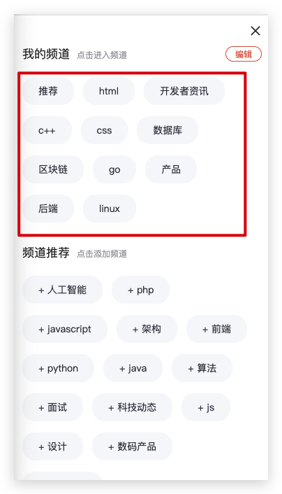

# 极客园H5项目【5首页】

> 主要业务：频道管理（我的频道、可选频道）、频道文章列表加载和切换

## 01-页面结构

**目标**：能够根据模板搭建首页页面结构


**步骤**：

1. 根据模板搭建 Home 页面结构

## 02-使用antd-mobile组件库的Tabs组件

**目标**：能够掌握antd-mobile组件中Tabs组件的使用

**步骤**：

1. 打开 antd-mobile 组件库的文档，找到 Tabs 组件
2. 找到示例代码，并拷贝到项目中
3. 分析 Tabs 组件的结构和基本使用
4. 调整 Tabs 的样式

**核心代码**：

Home/index.tsx 中：

```tsx
import { Tabs } from 'antd-mobile'

const Home = () => {
  return (
    // ...
    // 注意：此处别忘了添加 tabs 类名
    <Tabs className="tabs" activeLineMode="fixed">
      <Tabs.Tab title="推荐" key="1">
        推荐频道的内容
      </Tabs.Tab>
      <Tabs.Tab title="html" key="2">
        html频道的内容
      </Tabs.Tab>
      <Tabs.Tab title="开发者资讯" key="3">
        开发者资讯频道的内容
      </Tabs.Tab>
      <Tabs.Tab title="c++" key="4">
        c++频道的内容
      </Tabs.Tab>
      <Tabs.Tab title="css" key="5">
        css频道的内容
      </Tabs.Tab>
    </Tabs>
  )
}
```

## 03-获取首页频道列表数据

**目标**：能够获取首页频道列表数据

**分析说明**：

对于首页来说，不管用户是否登录，都可以查看。但是，是否登录会对后续的频道管理操作产生影响：

1. 如果用户已登录，此时，获取到的就是用户自己的频道数据
   - 可以操作自己的频道数据，并且这个数据是同步到服务器
2. 如果用户未登录，此时，获取的是默认的频道列表数据
   * 不能操作频道数据

**步骤**：

1. 根据接口，在 types/data.d.ts 中添加频道列表数据的类型
2. 创建 actions/home.ts 文件，在该文件中创建获取频道列表数据的 action 并导出
3. 在该 action 中，发送请求获取用户的频道列表数据
9. 在 Home 组件中通过 useInitialState 自定义 hook 验证是否正确

**核心代码**：

types/data.d.ts 中：

```ts
export type Channel = {
  id: number
  name: string
}
export type UserChannel = {
  channels: Channel[]
}
export type UserChannelResponse = ApiResponse<UserChannel>
```

actions/home.ts 中：

```ts
import { UserChannelResponse } from '@/types/data'
import { RootThunkAction } from '@/types/store'
import { http } from '@/utils'

export const getUserChannel = (): RootThunkAction => {
  return async (dispatch) => {
    const res: UserChannelResponse = await http.get('/user/channels')
    const { channels } = res.data
    console.log('频道列表：', channels)
  }
}
```

reducres/home.ts

```ts
const initialState = {}

export const home = (state = initialState, action: unknown) => {
  return state
}
```

reducres/index.ts

```diff
import { combineReducers } from 'redux'
+import { home } from './home'
import { login } from './login'
import { profile } from './profile'

const rootReducer = combineReducers({
  login,
  profile,
+ home
})
export default rootReducer

```

Home/index.tsx 中：

```tsx
import { useInitialState } from '@/utils/use-initial-state'
import { getUserChannel } from '@/store/actions'

const Home = () => {
  useInitialState(getUserChannel, 'home')
}
```

## 04-渲染频道列表数据

**目标**：能够渲染首页频道列表数据


**步骤**：

1. 在 types/store.d.ts 中添加获取频道列表数据的 action 类型
2. 回到获取频道列表数据的 action 中，分发 action 以将频道数据保存到 redux 中
3. 创建 reducers/home.ts 文件，处理获取频道数据的 action
4. 将状态 home 合并到根 reducer 中
5. 在 Home 组件中通过 useInitialState 自定义 hook 获取频道列表数据并渲染

**核心代码**：

actions/home.ts 中：

```diff
import { UserChannelResponse } from '@/types/data'
import { RootThunkAction } from '@/types/store'
import { http } from '@/utils'

export const getUserChannel = (): RootThunkAction => {
  return async (dispatch) => {
    const res: UserChannelResponse = await http.get('/user/channels')
    const { channels } = res.data
    console.log('频道列表：', channels)
+   dispatch({ type: 'home/getUserChannel', payload: channels })
  }
}

```

types/store.d.ts 中：

```ts
import type { Channel } from './data'

type RootAction = LoginAction | ProfileAction | HomeAction

export type HomeAction = {
  type: 'home/getUserChannel'
  payload: Channel[]
}
```

reducers/home.ts 中：

```ts
import { Channel } from '@/types/data'
import { HomeAction } from '@/types/store'

type HomeState = {
  userChannel: Channel[]
}
const initialState: HomeState = {
  userChannel: []
}

const Home = (state = initialState, action: HomeAction): HomeState => {
  switch (action.type) {
    case 'home/getUserChannel':
      return {
        ...state,
        userChannel: action.payload
      }
    default:
      return state
  }
}

export default Home
```

Home/index.tsx 中：

注意⚠️：延迟渲染 Tabs，解决 tab 高亮位置错误

```tsx
const Home = () => {
  const { userChannel } = useInitialState(getUserChannel, 'home')

  return (
    <div className={styles.root}>
      {/* 延迟渲染 Tabs，解决 tab 高亮位置错误 */}
      {userChannel.length>0 && (
        <Tabs className="tabs" activeLineMode="fixed">
          {userChannel.map((item) => (
            <Tabs.Tab title={item.name} key={item.id}>
              {`推荐频道的内容:${item.id}`}
            </Tabs.Tab>
          ))}
        </Tabs>
      )}
    </div>
  )
}
```

## 05-频道管理-渲染频道管理弹出层

**目标**：能够渲染频道管理弹出层


**步骤**：

1. 将模板 components/Channels 拷贝到 Home/components 目录中
2. 在 Home 组件中导入 Channels 组件
3. 使用 Popup 组件渲染 Channels 内容
4. 创建控制频道管理弹出层展示或隐藏的状态
5. 控制弹出层的展示或隐藏

**核心代码**：

Home/index.tsx 中：

```tsx
import { useState } from 'react'
import { Popup } from 'antd-mobile'
import Channels from './components/Channels'

const Home = () => {
  const [visible, setVisible] = useState(false)

  const onChannelOpen = () => {
    setVisible(true)
  }
  const onChannelClose = () => {
    setVisible(false)
  }
}
```

```diff
  return (
    <div className={styles.root}>
      <div className="tabs-opration">
        // ...
        <Icon type="iconbtn_channel"
+        onClick={onChannelOpen} />
      </div>

+     <Popup
        visible={visible}
        onMaskClick={onChannelClose}
        position="left"
        className="channel-popup"
      >
+        <Channels onClose={onChannelClose} />
+      </Popup>
    </div>
  )
```

Home/components/Channels/index.tsx 中：

```diff
+ type Props = {
+  onClose: () => void
+}

+ const Channels = ({ onClose }: Props) => {
  return (
    // ...
   <div className="channel-header">
      <Icon type="iconbtn_channel_close"
+        onClick={onClose} />
    </div>
  )
}
```

## 06-频道管理-渲染我的频道

**目标**：能够渲染我的频道列表



**分析说明**：

我的频道中展示的数据就是在首页中获取到的用户频道列表数据，因此，只需要在频道管理组件中拿到用户频道列表数据即可

**步骤**：

1. 在 Channels 中，从 redux 中获取到用户频道数据
2. 渲染用户频道列表数据

**核心代码**：

Channels/index.tsx 中：

```tsx
import { useSelector } from 'react-redux'
import { RootState } from '@/types/store'

const Channels = ({ onClose }: Props) => {
  const { userChannel } = useSelector((state: RootState) => state.home)

}
```

```diff
  return (
    // ...
    <div className="channel-list">
      {/* 选中时，添加类名 selected */}
+      {userChannel.map(item => (
+        <span key={item.id} className={classnames('channel-list-item')}>
+         {item.name}
+          <Icon type="iconbtn_tag_close" />
+        </span>
+      ))}
    </div>
  )
```


## 07-频道管理-获取频道推荐

**目标**：能够获取到频道推荐列表数据


**分析说明**：

频道推荐（可选频道）中展示的是除了我的频道之外的其他频道数据，由于接口并没有直接提供可选频道的数据，
因此，可以拿到所有频道数据，然后，排除掉我的频道数据，剩下的就是可选频道数据了。

问题：如何从一个数组中删除另一个数组中包含的元素？

```ts
// 原生方式：
var all = [1, 3, 5, 7]
var my = [1, 7]
// 最终希望拿到：[3, 5]
all.filter(allItem => my.findIndex(myItem=>myItem === allItem)<0)

// https://www.lodashjs.com/docs/lodash.differenceBy
// 可以使用 lodash 的 differenceBy 方法：

// 从第一个数组中，排除掉第二个数组中包含的元素=》第一个参数传入所有，第二个传入从所有里需要排除（我的）
// 如何确定两个数组中的元素是否相同呢？根据第三个参数，比如，传入 x 表示如果两个数组中的元素的 x 属性
// 相同就表示两个元素相同

_.differenceBy([{ 'x': 2 }, { 'x': 1 }], [{ 'x': 1 }], 'x');
// 结果为：[{ 'x': 2 }]
```

需要安装：

```bash
npm i lodash @types/lodash
```

**步骤**：

1. 在 actions 中，发送请求，**获取所有频道数据**
2. 拿到所有频道数据排**除掉我的频道数据**，得到可选频道数据
3. 在 types 中，添加保存频道推荐数据的 action 类型
4. 在 actions 中分发 action 将频道推荐数据存储到 redux 中
5. 在 reducers 中存储推荐频道数据

**核心代码**：

actions/home.ts 中：

```ts
import { AllChannelsResponse } from '@/types/data'

export const getAllChannel = (): RootThunkAction => {
  return async (dispatch, getState) => {
    const res:AllChannelsResponse = await http.get('channels')
    const {
      home: { userChannel }
    } = getState()
    const restChannels = differenceBy(res.data.channels, userChannel, 'id')

    dispatch({ type: 'home/getRestChannel', payload: restChannels })
  }
}
```

types/store.d.ts 中：

```diff
import type { Channel } from './data'

export type HomeAction =
  | {
      type: 'home/getUserChannel'
      payload: Channel[]
    }
+  | {
+      type: 'home/getRestChannel'
+      payload: Channel[]
+    }
```

reducers/home.ts 中：

```diff
import { Articles, Channel } from '@/types/data'

type HomeState = {
  // ...
+  restChannel: Channel[]
}

const initialState: HomeState = {
  // ...
+  restChannel: [],
}

const Home = (state = initialState, action: HomeAction): HomeState => {
  switch (action.type) {
    // ...
+    case 'home/getRestChannel':
      return {
        ...state,
+        restChannel: action.payload
+      }
  }
}
```

## 08-频道管理-渲染频道推荐

**目标**：能够渲染频道推荐列表


**核心代码**：

Channels/index.tsx 中：

```tsx
import { useInitialState } from '@/utils/use-initial-state'
import { getAllChannel } from '@/store/actions'

const Channels = () => {
  const { restChannel } = useInitialState(getAllChannel, 'home')

}
```

```diff
  return (
    // ...
    <div className="channel-list">
+    {restChannel.map(item => (
        <span key={item.id} className="channel-list-item">
          + {item.name}
        </span>
+     ))}
    </div>
  )
```

## 09-频道管理-切换频道编辑状态

**目标**：能够切换频道编辑状态


**步骤**：

1. 添加控制是否为编辑的状态
2. 给编辑/保存按钮添加点击事件
3. 在点击事件中切换编辑状态
4. 根据编辑状态判断展示保存或编辑文字内容

**核心代码**：

Channels/index.tsx 中：

```tsx
import { useState } from 'react'

const Channels = () => {
  const [isEdit, setIsEdit] = useState(false)

  const onChangeEdit = () => {
    setIsEdit(!isEdit)
  }
}
```

```diff
  return (
    // ...
+   <div className={classnames('channel-item', isEdit && 'edit')}>
      // ...
      <span className="channel-item-edit"
+     onClick={onChangeEdit}>
+        {isEdit ? '保存' : '编辑'}
      </span>
    </div>
  )
```

## 10-频道管理-我的频道高亮

**目标**：能够实现点击我的频道高亮


**分析说明**：

首页顶部的频道和频道管理中的我的频道是关联在一起的：

1. 点击频道管理中的我的频道时，首页顶部的频道会切换，并高亮
2. 点击首页顶部的频道时，频道管理对应的频道也要高亮

因此，需要准备一个状态用来记录当前选中频道，并且两个组件中都需要用到该状态，所以，可以**直接将该状态存储到 redux 中，实现状态共享**。
然后，不管是首页顶部的频道还是频道管理中的我的频道，只需要在点击切换时，**修改 redux 中记录的高亮状态值即可**。

**步骤**：

1. 在 home reducer 中，添加一个状态 channelActiveKey 用来记录当前选中频道的键
2. 在 Channel 组件中拿到该状态，在渲染我的频道列表时，让对应 key 的频道高亮
3. 为每个频道项添加点击事件，在点击事件中拿到每一个频道的 key，并分发 action 来切换选中项
4. 在 types 中，添加修改 channelActiveKey 的 action 类型
5. 在 home reducer 中，处理 action 来更新 channelActiveKey 的值
6. 在 home reducer 获取首页顶部频道数据时，为 channelActiveKey 指定默认值
7. 切换频道时，关闭频道弹出层

**核心代码**：

redcuers/home.ts 中：

```tsx
type HomeState = {
  channelActiveKey: string
}

const initialState: HomeState = {
  channelActiveKey: '0'
}

const Home = (state = initialState, action: HomeAction): HomeState => {
  switch (action.type) {
    case 'home/getUserChannel':
      return {
        ...state,
        userChannel: action.payload,
        // 设置默认值
        channelActiveKey: action.payload[0]?.id + ''
      }
    // ...
    case 'home/changeTab':
      return {
        ...state,
        channelActiveKey: action.payload
      }
  }
}
```

types/store.d.ts 中：

```ts
export type HomeAction =
  // ...
  | {
      type: 'home/changeTab'
      payload: string
    }
```

Channel/index.tsx 中：

```tsx
import { useDispatch } from 'react-redux'

const Channels = ({ onClose }: Props) => {
  const dispatch = useDispatch()

  const onChannelClick = (key: string) => {
    dispatch({ type: 'home/changeTab', payload: key })
    onClose()
  }
}
```

```diff
  return (
    // ...
    <div className="channel-list">
      {/* 选中时，添加类名 selected */}
      {userChannel.map(item => (
        <span
          key={item.id}
          className={classnames(
            'channel-list-item',
+            channelActiveKey === item.id + '' && 'selected'
          )}
+          onClick={() => onChannelClick(item.id + '')}
        >
          {item.name}
          <Icon type="iconbtn_tag_close" />
        </span>
      ))}
    </div>
  )
```


## 11-频道管理-首页顶部频道切换

**目标**：能够实现首页频道切换和高亮功能


**步骤**：

1. 在 Home 组件中拿到该状态，并设置为 Tabs 组件的 activeKey
2. 为 Tabs 组件添加 onChange，拿到当前选中的 tab 的键，并且分发 action 来修改 channelActiveKey

**核心代码**：

Home/index.tsx 中：

```tsx
import { useDispatch, useSelector } from 'react-redux'
import { HomeAction } from '@/types/store'

const Home = () => {
  const dispatch = useDispatch()
  const { channelActiveKey } = useSelector((state: RootState) => state.home)

  const onTabChange = (key: string) => {
    dispatch({ type: 'home/changeTab', payload: key })
  }

  return (
    // ...
    <Tabs
      activeKey={channelActiveKey}
      onChange={onTabChange}
    >
    </Tabs>
  )
}
```

## 12-频道管理-删除频道

**目标**：能够删除我的频道数据


**分析说明**：

1. 推荐频道不能删除
2. 至少要保留 4 个频道

**步骤**：

1. 修改**频道项的点击事件参数为 channel 即当前频道数据**
2. 在我的频道项的点击事件中，判断当前是否为编辑状态
3. 如果不是编辑状态，执行频道切换操作
4. 如果是编辑状态，判断是否为推荐频道或频道数量小于等于 4
5. 如果是，阻止删除
6. 如果不是，分发删除频道的 action

**核心代码**：

Channels/index.tsx 中：

```tsx
import { delChannel } from '@/store/actions'
import { Channel } from '@/types/data'

const Channels = () => {
  const onChannelClick = (channel: Channel) => {
    if (!isEdit) {
      dispatch({ type: 'home/changeTab', payload: channel.id + '' })
      onClose()
      return
    }

    if (channel.id === 0 || channelActiveKey === channle.id.toString()) return
    if (userChannel.length <= 4) return
    dispatch(delChannel(channel))
  }
}
```

```diff
          <div className="channel-list">
            {/* 选中时，添加类名 selected */}
            {userChannel.map((item) => (
              <span
                key={item.id}
                onClick={() => onChannelClick(item)}
                className={classnames(
                  'channel-list-item',
                  channelActiveKey === item.id + '' && 'selected'
                )}>
                {item.name}
-                {/* 排除 推荐 以及 当前选中项的 删除的图标 */}
+                {item.id !== 0 && item.id.toString() !== channelActiveKey && (
+                  <Icon type="iconbtn_tag_close" />
+                )}
              </span>
            ))}
          </div>
```

actions/home.ts 中：

```ts
// 删除我的频道
export const delChannel = (channel: Channel): RootThunkAction => {
  return async (dispatch, getState) => {
    await http.delete(`/user/channels/${channel.id}`)
  }
}
```

## 13-频道管理-删除频道更新状态

**目标**：能够在删除频道后更新页面状态

**步骤**：

1. 在 types 中添加删除频道的 action 类型
2. 在删除频道 action 中，分发 action 到 redux
3. 在 reducers 中删除频道，并将被删除频道添加到推荐频道中

**核心代码**：

types/store.d.ts 中：

```ts
export type HomeAction =
  // ...
  | {
      type: 'home/delChannel'
      payload: Channel
    }
```

actions/home.ts 中：

```diff

// 删除我的频道
export const delChannel = (channel: Channel): RootThunkAction => {
  return async (dispatch, getState) => {
    await http.delete(`/user/channels/${channel.id}`)
-    // 更新状态
+    dispatch({ type: 'home/delChannel', payload: channel })
  }
}
```

reducers/home.ts 中：

```diff
+import { sortBy } from 'lodash'

const Home = (state = initialState, action: HomeAction): HomeState => {
  switch (action.type) {
    // ...
+    case 'home/delChannel':
      return {
        ...state,
-       // 删除当前频道
+        userChannel: state.userChannel.filter(
+         item => item.id !== action.payload.id
+        ),
-       // 将被删除频道添加到推荐频道中，并且根据 id 进行排序
+        restChannel: sortBy([...state.restChannel, action.payload], 'id')
      }
  }
}
```

## 14-频道管理-添加频道（作业）

**目标**：能够实现添加频道功能

**步骤**：

1. 为可选频道中的频道项绑定点击事件，并拿到当前被点击的频道
2. 在 actions 中调用后台接口新增用户频道
3. 在 types 中增加添加频道的 action 类型
4. 在添加频道的 action 中分发 action 来更新 redux
5. 在 reducers 中处理添加频道的 action

**核心代码**：

Channels/index.tsx 中：

```diff
const Channels = () => {
+  const onAddChannel = (channel: Channel) => {
+    dispatch(addChannel(channel))
+  }

  return (
    // ...
    <div className="channel-list">
      {restChannel.map(item => (
        <span
+         onClick={() => onAddChannel(item)}
        >
          + {item.name}
        </span>
      ))}
    </div>
  )
}
```

actions/home.ts 中：

```ts
// 添加我的频道
export const addChannel = (channel: Channel): RootThunkAction => {
  return async (dispatch, getState) => {
    await http.patch('/user/channels', { channels: [channel] })
    // 更新状态
    dispatch({ type: 'home/addChannel', payload: channel })
  }
}
```

types/store.d.ts 中：

```ts
export type HomeAction =
  // ...
  | {
      type: 'home/addChannel'
      payload: Channel
    }
```

reducers/home.ts 中：

```ts
const Home = () => {
  switch (action.type) {
    // ...
    case 'home/addChannel':
      return {
        ...state,
        // 新增我的频道
        userChannel: [...state.userChannel, action.payload],
        // 从推荐中删除
        restChannel: state.restChannel.filter(
          (item) => item.id !== action.payload.id
        ),
      }
  }
}
```

## 15-文章列表-根据模板搭建文章列表结构

**目标**：能够根据模板搭建频道文章列表结构


**步骤**：

1. 将模板 ArticleItem 拷贝到 src/components 公共组件目录中
2. 将模板 components/ArticleList 拷贝到 pages/Home/components 目录中
3. 在 Home 组件中渲染文章列表结构
4. 分析每个模板的作用，以及模板的结构

**核心代码**：

Home/index.tsx 中：

```tsx
import ArticleList from './components/ArticleList'

const Home = () => {
  return (
    // ...
    <Tabs.Tab>
      {/* 在每个 Tabs.Tab 中渲染文章列表组件 */}
      <ArticleList />
    </Tabs.Tab>
  )
}
```

## 16-文章列表-InfiniteScroll组件

**目标**：能够使用antd-mobile的InfiniteScroll组件

**分析说明**：

>InfiniteScroll 组件在渲染时，会自动调用 loadMore 加载文章列表数据

- 注意⚠️：对于 `InfiniteScroll` 组件来说，如果没有正确处理 loadMore 函数，会导致在加载数据时，重复执行多次 loadMore 函数

```tsx
function loadMore() { // 错误
  doRequest()
}

async function loadMore() { // 错误
  doRequest()
}

async function loadMore() { // 正确
  await doRequest()
}

function loadMore() { // 正确
  return doRequest()
}
```

- 对于 `InfiniteScrool` 组件来说，在第一次渲染时，会进行以下判断，来决定是否加载更多数据：
  1. hasMore 是否为 true，如果为 true 调用 loadMore 加载更多数据
  2. 该组件所在位置 减去 可滚动区域的底部位置是否小于 threshold （默认值 250），如果小于就说明触底了，就会加载更多数据
- 造成递归获取数据的情况：只发送请求获取数据，但是，没有渲染数据，导致位置判断一直小于 threshold，就会一直获取数据。

**步骤**：

1. 找到 antd-mobile 组件库中的 InfiniteScroll 组件
2. 拷贝示例代码到 ArticleList 组件中
3. 通过示例代码给出的数据，渲染文章列表

**核心代码**：

ArticleList/index.tsx 中：

```tsx
import { InfiniteScroll } from 'antd-mobile'
import { useState } from 'react'
import { sleep } from 'antd-mobile/es/utils/sleep'

let count = 0

async function mockRequest() {
  if (count >= 5) {
    return []
  }
  await sleep(2000)
  count++
  return [
    'A',
    'B',
    'C',
    'D',
    'E',
    'F',
    'G',
    'H',
    'I',
    'J',
    'K',
    'L',
    'M',
    'N',
    'O',
    'P',
    'Q'
  ]
}
const ArticleList = () => {
  const [data, setData] = useState<string[]>([])
  const [hasMore, setHasMore] = useState(true)
  async function loadMore() {
    const append = await mockRequest()
    setData(val => [...val, ...append])
    setHasMore(append.length > 0)
  }

  return (
    <div className={styles.root}>
      {/* 文章列表中的每一项 */}
      {data.map((item, index) => (
        <div key={index} className="article-item">
          <ArticleItem type={1} />
        </div>
      ))}
      {/*
        loadMore 加载数据的函数
        hasMore 布尔值，true 表示还有更多数据；false 表示没有更多数据了
      */}
      <InfiniteScroll loadMore={loadMore} hasMore={hasMore} />
    </div>
  )
}
```

**总结**：

1. InfiniteScroll 组件会自动调用 loadMore 加载数据吗？如果 hasMore 为true，就会自动加载数据；否则，不会自动加载
  - 该组件会自动填满可滚动区域，并且保证触发加载事件的滚动触底距离阈值（threshold）大于等于 250（距离底部250px就触发）

## 17-文章列表-获取频道文章列表数据

**目标**：能够获取频道文章列表数据

**步骤**：

1. 首页给 ArticleList 组件传递频道 id
2. 根据接口，在 types/data.d.ts 中添加频道文章列表数据的类型
3. 在 api中创建获取文章列表数据的后台接口方法
5. 在 ArticleList 组件中的 loadMore 内部根据当前频道ID获取文章列表数据

**核心代码**：

Home/index.tsx 中：

```diff
const Home = () => {
  return (
    // ...
    <Tabs
    >
      {userChannel.map(item => (
        <Tabs.TabPane title={item.name} key={item.id}>
-          {/* 传递频道 id */}
+          <ArticleList channel_id={channelActiveKey} />
        </Tabs.TabPane>
      ))}
    </Tabs>
  )
}
```

ArticleList/index.tsx 中：

```tsx
import { getArticleList } from '@/api/home'
import { ArticlesItem } from '@/types/data'

type Props = {
  channel_id: string
}
const ArticleList = ({ channel_id }: Props) => {
  const [data, setData] = useState<ArticlesItem[]>([])
  // 控制是否加载完成
  const [hasMore, setHasMore] = useState(true)
  // 保持时间戳数据
  const timestamp = useRef(Date.now())
  // 加载更多
  async function loadMore() {
    const append = await getArticleList({
      channel_id,
      timestamp: timestamp.current,
    })
		console.log(append)
  }
  
}
```

types/data.d.ts 中：

```ts
// 文章列表
export type ArticlesItem = {
  art_id: string
  aut_id: string
  aut_name: string
  comm_count: number
  cover: {
    type: 0 | 1 | 3
    images: string[]
  }
  pubdate: string
  title: string
}
export type Articles = {
  pre_timestamp: number
  results: ArticlesItem[]
}
export type ArticlesResponse = ApiResponse<Articles>
```

api/home.ts 中：

```ts
import { ArticlesResponse } from './../types/data.d'
import { http } from '@/utils'

// 获取文章列表数据
type ParmasArticle = {
  channel_id: string
  timestamp: number
}
export function getArticleList(
  parmas: ParmasArticle
): Promise<ArticlesResponse> {
  return http.get('/articles', { params: parmas })
}
```


## 18-文章列表-下拉触底加载更多文章列表项

**目标**：能够实现触底加载更多文章列表项

**分析说明**：

> 如何加载更多数据

1. 如何加载下一页的数据？传递接口返回的 pre_timestamp
2. 是否有更多数据：如果没有更多文章数据，则 pre_timestamp 为 null

- 注意：对于 `InfiniteScroll` 组件来说，如果没有正确处理 loadMore 函数，会导致在加载数据时，重复执行多次 loadMore 函数

> 注意事项

- 对于 `InfiniteScrool` 组件来说，在第一次渲染时，会进行以下判断，来决定是否加载更多数据：
  1. hasMore 是否为 true，如果为 true 调用 loadMore 加载更多数据
  2. 该组件所在位置 减去 可滚动区域的底部位置是否小于 threshold （默认值 250），如果小于就说明触底了，就会加载更多数据
- 造成递归获取数据的情况：只发送请求获取数据，但是，没有渲染数据，导致位置判断一直小于 threshold，就会一直获取数据。

**步骤**：

1. 修改判断是否有更多文章列表数据的逻辑
2. 渲染文章列表数据

**核心代码**：

ArticleList/index.tsx 中：

```diff
  const [data, setData] = useState<ArticlesItem[]>([])
  // 控制是否加载完成
  const [hasMore, setHasMore] = useState(true)
  // 保持时间戳数据
  const timestamp = useRef(Date.now())
  // 加载更多
  async function loadMore() {
    const append = await getArticleList({
      channel_id,
      timestamp: timestamp.current,
    })
+    setData((val) => [...val, ...append.data.results])
-    // append.data.pre_timestamp === null 不存在表示：没有数据
+    if (append.data.pre_timestamp) {
+      timestamp.current = append.data.pre_timestamp
+    } else {
+      setHasMore(false)
+    }
  }
```


说明1：使用 InfiniteScroll 组件，进入页面就会一直不停的加载所有文章列表数据，可能是以下原因造成的：

1. 只更新文章列表状态，没有渲染文章列表数据。导致，InfiniteScroll 组件感觉有更多数据（一直没有触底），就会一直加载数据
2. 样式造成的问题：要保证从 html => body => #root => .app => Layout_root => Home_root => adm-tabs tabs => adm-tabs-content => ArticleList_root 的高度都为 100%，也就是**文章列表内容的全部父级元素都要设置高度**。我们的项目中，要占满整个屏幕，所以高度为：100%。这样，才能保证文章列表内容超长时，出现区域（文章列表区域）滚动。InfiniteScroll 组件是相对于最近的一个**可滚动的父元素**，来判断位置的，所以，在 ArticleList_root 父元素中 设置了 `overflow-y: scroll`，也就是，**判断  InfiniteScroll 组件所在位置是否超过 ArticleLIist_root 元素的视口 threshold 阈值**，没超过也就是触底了，此时就继续获取数据，直到超过 threshold 阈值。

说明2：文章列表数据触底加载更多的条件是，**每次都拿到上一次请求返回的时间戳，根据该时间戳来获取下一页数据**

```ts
第一次请求： 传入最新的时间戳 Date.now() 				 ===> 接口返回： { pre_timestamp1, results }
第二次请求： 传入上次返回的时间戳 pre_timestamp1 	===> 接口返回： { pre_timestamp2, results }
第二次请求： 传入上次返回的时间戳 pre_timestamp2 	===> 接口返回： { pre_timestamp3, results }

...
```

## 19-文章列表-渲染文章列表项内容(作业)

**目标**：能够通过文章列表数据渲染文章列表项内容


**分析说明**：

我们使用 dayjs 来格式化日期，文章列表项需要用到相对时间和国际化：

[dayjs 国际化文档](https://dayjs.gitee.io/docs/zh-CN/i18n/loading-into-browser)
[dayjs 相对时间插件](https://dayjs.gitee.io/docs/zh-CN/plugin/relative-time)

**步骤**：

1. 安装 dayjs：`yarn add dayjs`
2. 启用相对时间插件，并将语言设置为 zh-cn 中文
3. 创建 renderArticleList 函数，来渲染文章列表
4. 根据文章列表项的数据格式，为 ArticleItem 组件设置 props
5. 组装好文章列表项数据，传递给 ArticleItem 组件
6. ArticleItem 组件内部接收数据并渲染

**核心代码**：

ArticleList/index.tsx 中：

```diff
  return (
    <div className={styles.root}>
      {/* 文章列表中的每一项 */}
      {data.map((item, index) => (
+       <div key={item.art_id} className="article-item">
+          <ArticleItem type={item.cover.type} item={item} />
        </div>
      ))}
      {/*
        loadMore 加载数据的函数
        hasMore 布尔值，true 表示还有更多数据；false 表示没有更多数据了
      */}
      <InfiniteScroll loadMore={loadMore} hasMore={hasMore} />
    </div>
  )
```

ArticleItem/index.tsx 中：

```tsx
import { ArticlesItem } from '@/types/data'

type Props = {
  /**
   * 0 表示无图
   * 1 表示单图
   * 3 表示三图
   */
  type: 0 | 1 | 3
  item: ArticlesItem
}
const ArticleItem = ({ type, item }: Props) => {
  return (
    <div className={styles.root}>
      <div
        className={classnames(
          'article-content',
          type === 3 && 't3',
          type === 0 && 'none-mt'
        )}>
        <h3>{item.title}</h3>
        {type !== 0 && (
          <div className="article-imgs">
            {item.cover.images.map((img, i) => (
              <div key={i} className="article-img-wrapper">
                
              </div>
            ))}
          </div>
        )}
      </div>
      <div className={classnames('article-info', type === 0 && 'none-mt')}>
        <span>{item.aut_name}</span>
        <span>{item.comm_count} 评论</span>
        <span>{item.pubdate}</span>
        <span className="close">
          <Icon type="iconbtn_essay_close" />
        </span>
      </div>
    </div>
  )
}
```

utils/utils.ts

格式化时间方法：

```ts
// moment 插件  dayjs 插件  都是处理时间格式
import dayjs from 'dayjs'
// 使用dayjs插件（按需）
import relativeTime from 'dayjs/plugin/relativeTime'
// 国际化
import 'dayjs/locale/zh-cn'
dayjs.locale('zh-cn')
// 添加插件
dayjs.extend(relativeTime)

// 相对时间换算
/**
 *
 * @param {*} value 获取模版中值：val | filter
 */
export const relTime = (value: string) => {
  // console.log(dayjs())
  return dayjs().from(value)
}
```

使用:

```diff
<div className={classnames('article-info', type === 0 && 'none-mt')}>
  <span>{item.aut_name}</span>
  <span>{item.comm_count} 评论</span>
+<span>{relTime(item.pubdate)}</span>
  <span className="close">
    <Icon type="iconbtn_essay_close" />
  </span>
</div>
```


## 20-文章列表-点击文章项跳转到详情(作业)

**目标**：能够在点击文章项时跳转到文章详情页面


**步骤**：

1. 将文章详情页面ArticleDetail模板拷贝到 pages 目录中
2. 在 App 组件中配置文章详情页路由
3. 为每个文章列表项绑定点击事件
4. 点击时，根据文章id，跳转到文章详情页对应的路由

**核心代码**：

ArticleList/index.tsx 中：

```diff
+import { useHistory } from 'react-router-dom'

const ArticleList = () => {
+ const history = useHistory()

  const renderArticleList = () => {
    return data.map((item, index) => (
        <div
          key={item.art_id}
          className="article-item"
+         onClick={() => history.push(`/article/${item.art_id}`)}>
          <ArticleItem type={item.cover.type} item={item} />
        </div>
      ))
  }
}
```

App.tsx 中：

```diff
// 导入路由
import { Router, Route } from 'react-router-dom'

+ import Article from './pages/ArticleDetail'

function App() {
  return (
    <Router history={history}>
      <div className="app">
+        <Route path="/article/:artId">
+          <Article />
+        </Route>
      </div>
    </Router>
  )
}
```
## 第五天

