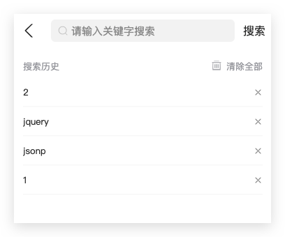

# 极客园H5项目【6搜索】

> 主要业务：根据关键词搜索新闻、搜索输入防抖处理、搜索联想词、搜索历史记录管理、搜索结果

## 01-路由和页面结构

**目标**：能够根据模板搭建搜索页面结构


**步骤**：

1. 将搜索页面的模板拷贝到 pages 目录中
2. 在 App 组件中分别配置搜索和搜索结果页面的路由
3. 在 Home 组件中为搜索按钮绑定点击事件，跳转到搜索页面

**核心代码**：

App.tsx 中：

```tsx
import Search from './pages/Search'
import SearchResult from './pages/Search/Result'

const App = () => {
  return (
    // ...
    <Route exact path="/search">
      <Search />
    </Route>
    <Route path="/search/result">
      <SearchResult />
    </Route>
  )
}
```

Home/index.tsx 中：

```diff
+import { useHistory } from 'react-router-dom'

const Home = () => {
+ const history = useHistory()

  return (
    // ...
    <Icon type="iconbtn_search"
+     onClick={() => history.push('/search')} />
  )
}
```

## 02-Search组件基本使用

**目标**：能够使用antd-mobile组件库中的Search组件
**步骤**：

1. 创建状态，通过受控组件方式获取Search的值

**核心代码**：

Search/index.tsx 中：

```tsx
import { useState } from 'react'

const SearchPage = () => {

  const [searchTxt, setSearchTxt] = useState('')

  const onSearchChange = (value: string) => {
    setSearchTxt(value)
  }
}
```

```diff
  return (
    // ...
    <Search
      placeholder="请输入关键字搜索"
+    value={searchTxt}
+    onChange={onSearchChange}
    />
  )
```


## 03-获取搜索联想关键词

**目标**：能够在搜索框输入内容时获取搜索联想关键词


**步骤**：

1. 根据接口，在 types 中添加联想关键词返回类型

2. 在api中封装联想关键词后台接口

3. 在搜索框的 change 事件中发送请求获取搜索联想关键词

   

**核心代码**：

Search/index.tsx 中：

```diff
import { getSuggestion } from '@/api/search'

const SearchPage = () => {

  const onSearchChange = (value: string) => {
    setSearchTxt(value)
+    if (!value.trim()) return
+    const suggestList = await getSuggestion({ q: value })
    console.log(suggestList.data.options)
  }
}
```

types/data.d.ts 中：

```ts
// 搜索关键词
export type Suggestion = {
  options: string[]
}
export type SuggestionResponse = ApiResponse<Suggestion>
```

api/search.ts 中：

```ts
import { SuggestionResponse } from './../types/data.d'
import { http } from '@/utils'

// 获取搜索联想词
type ParmasSuggest = {
  q: string
}
export function getSuggestion(
  parmas: ParmasSuggest
): Promise<SuggestionResponse> {
  return http.get('/suggestion', { params: parmas} )
}
```

## 04-搜索输入时防抖-lodash

**目标**：能够在搜索框中输入内容时进行防抖处理

**分析说明**：

> 实际开发中，直接借助第三方库来实现防抖功能即可。

有两种方式：

* lodash 的 debounce 函数，参数：
  1. 异步请求函数
  1. 延迟时间

* [ahooks](https://ahooks.gitee.io/zh-CN)（阿里提供的 hooks 库）库提供的 `useDebounceFn` hook

使用lodash 的 debounce 函数：

```tsx
// 导入 lodash 中的防抖函数
import debounce from 'lodash/debounce'
// 在组件外部处理，防止多次调用
// 1.获取防抖处理后的可执行函数
const debounceFn = debounce(async (value) => {
  const suggestList = await getSuggestion({ q: value })
  console.log(suggestList.data.options)
}, 500)

```

```diff
const SearchPage = () => {
	  // ...
    const onSearchChange = async (value: string) => {
    setSearchTxt(value)
    if (!value.trim()) return
    // 普通写法
    // const suggestList = await getSuggestion({ q: value })
    // console.log(suggestList.data.options)
-    // 2.调用debounceFn
+   debounceFn(value)
  }

  return (
    <SearchBar
      value={searchText}
      placeholder="请输入关键字搜索"
      onChange={onSearchChange}
    />
  )
}
```

## 05-搜索输入时防抖-ahook

使用[ahooks](https://ahooks.gitee.io/zh-CN)（阿里提供的 hooks 库）库提供的 `useDebounceFn` hook：

```ts
const {
  // 防抖函数
  run,
} = useDebounceFn(
  // 需要防抖执行的函数
  fn,
  // 配置防抖的配置项，比如，设置超时时间
  options
);
```

**步骤**：

1. 安装 ahooks 包：`yarn add ahooks@2.10.14`
2. 导入 `useDebounceFn` hook
3. 创建防抖函数
4. 搜索框中输入内容时，调用防抖函数

**核心代码**：

Search/index.tsx 中：

```tsx
import { useDebounceFn } from 'ahooks'

const SearchPage = () => {
  const { run: debounceGetSuggest } = useDebounceFn(
    async (value: string) => {
      const suggestList = await getSuggestion({ q: value })
      console.log(suggestList.data.options)
    },
    {
      wait: 500
    }
  )

  const onSearchChange = (value: string) => {
    // ...
    debounceGetSuggest(value)
  }
}
```

总结：

>防抖和节流区别

	1. 函数防抖延迟时间内连续触发的事件只在最后执行一次=》搜索框搜索输入，表单验证等
	1. 函数节流保证延迟时间内只执行一次=》滚动加载， 高频点击提交，表单重复提交等

## 06-渲染联想关键词

**目标**：能够渲染联想关键词列表

**步骤**：

1. 声明联想关键词列表状态，搜索时存储状态
2. 判断是否有联想关键词，有的话添加 show 类名，来展示列表
3. 遍历联想关键词并渲染

**核心代码**：

Search/index.tsx 中：

```diff
+ const [suggestList, setSuggestList] = useState<string[]>([])
 const { run } = useDebounceFn(
    async (value: string) => {
      const suggestList = await getSuggestion({ q: value })
      console.log(suggestList.data.options)
+    setSuggestList(suggestList.data.options)
    },
    {
      wait: 500,
    }
  )
```

```diff
const SearchPage = () => {

  return (
    // ...
      {/* 联想关键词 */}
      <div
        className={classnames(
          'search-result',
+        suggestList.length ? 'show' : ''
        )}>
+        {suggestList.map(
+          (item, i) =>
+            item && (
+              <div className="result-item" key={i}>
+                <Icon className="icon-search" type="iconbtn_search" />
+                <div className="result-value text-overflow">
                  {/* <span>黑马</span> */}
+                 {item}
+                </div>
+              </div>
+            )
+        )}
      </div>>
  )
}
```

## 07-清空联想关键词

**目标**：能够在搜索文本框为空时清空联想关键词

**步骤**：为空时重置联想词状态

**核心代码**：

Search/index.tsx 中

```diff
  const onSearchChange = async (value: string) => {
    setSearchTxt(value)
+    if (!value.trim()) return setSuggestList([])
    run(value)
  }
```

## 08-联想关键词高亮

**目标**：能够让联想搜索关键词高亮


**分析说明**：

比如，搜索内容为 '1'，接口返回的数据：['1', '012', '1.11', '01', '18']，约定让每一项联想建议的第一个 '1' 高亮

那么，就要找到 '1' 的使用span包裹它。比如，以 '012' 为例：

```ts
'0<span>1</span>2'
```

**步骤**：

1. 遍历 suggestion 数组，replace替换关键词使用span包裹
5. 使用`dangerouslySetInnerHTML={{ __html: html字符串 }}`渲染联想结果

**核心代码**：

Search/index.tsx 中：

```diff
  const { run } = useDebounceFn(
    async (value: string) => {
      const suggestList = await getSuggestion({ q: value })
      console.log(suggestList.data.options)
-      // 处理高亮
+      const newList = suggestList.data.options.map((item) => {
+        return item && item.replace(value, `<span>${value}</span>`)
+      })
+      setSuggestList(newList)
    },
    {
      wait: 500,
    }
  )
```

```diff
      {/* 联想关键词 */}
      <div
        className={classnames(
          'search-result',
          suggestList.length ? 'show' : ''
        )}>
        {suggestList.map(
          (item, i) =>
            item && (
              <div className="result-item" key={i}>
                <Icon className="icon-search" type="iconbtn_search" />
                <div
                  className="result-value text-overflow"
+                  dangerouslySetInnerHTML={{ __html: item }}>
-                  {/* <span>黑马</span> */}
-                  {/* {item} */}
                </div>
              </div>
            )
        )}
      </div>
```

说明：`dangerouslySetInnerHTML`渲染html字符片段

## 09-跳转到搜索结果页面

**目标**：能够点击搜索关键词跳转到结果页面

**步骤**：

1. 为**联想列表项绑定点击事件**
3. 在点击事件中拿到联想关键词，跳转到结果页面，同时传递联想关键词
4. 为**搜索按钮绑定点击事件**
5. 在点击事件中，拿到当前搜索内容，跳转到结果页面，同时传递搜索关键词

**核心代码**：

Search/index.tsx 中：

```tsx
const SearchPage = () => {
  // ...
  // 跳转结果页
  const onSearch = (val: string) => {
    console.log(val)
    history.push(`/search/result?q=${val}`)
  }
}
```

```diff
  return (
    // ...
    <span className="search-text"
+   onClick={() => onSearch(searchTxt)}>
      搜索
    </span>

      {/* 联想关键词 */}
      <div
        className={classnames(
          'search-result',
          suggestList.length ? 'show' : ''
        )}>
        {suggestList.map(
          (item, i) =>
            item && (
              <div className="result-item" key={i}>
                <Icon className="icon-search" type="iconbtn_search" />
                <div
                  className="result-value text-overflow"
+                 onClick={() =>
+                    onSearch(
+                      item.replace(`<span>${searchTxt}</span>`, searchTxt)
+                    )
+                  }
                  dangerouslySetInnerHTML={{ __html: item }}>
                  {/* <span>黑马</span> */}
                  {/* {item} */}
                </div>
              </div>
            )
        )}
      </div>
  )
```


## 10-搜索历史记录

**目标**：能够将搜索关键词保存到历史记录



**步骤**：

1. 创建历史记录状态，默认值从本地读取

2. 创建存储历史记录状态方法，进行排重

3. 在useEffect中存储历史记录状态数据到本地

4. 跳转搜索结果页时，调用存储方法

   

**核心代码**：

Search/index.tsx 中：

```diff
  const onSearch = (val: string) => {
    // ...
-   // 使用定时器处理跳转后useEffect不执行问题
+    setTimeout(() => history.push(`/search/result?q=${val}`))
    // 存储搜索记录
+    saveHistory(val)
  }
```

存储历史记录：

```tsx
import { useEffect } from 'react'
const GEEK_SEARCH_KEY = 'GEEK_SEARCH_KEY'
const SearchPage = () => {
  // 搜索历史记录
  const [historyList, setHistoryList] = useState<string[]>(
    JSON.parse(localStorage.getItem(GEEK_SEARCH_KEY) ?? '[]')
  )
  const saveHistory = (val: string) => {
    if (historyList.some((item) => item === val)) return
    setHistoryList([val, ...historyList])
  }
  
  useEffect(() => {
    localStorage.setItem(GEEK_SEARCH_KEY, JSON.stringify(historyList))
  }, [historyList])
}
```

## 11-渲染历史记录

**目标**：能够在进入搜索页面时渲染历史记录

**步骤**：

1. 根据是否有联想词列表，来决定是否展示历史记录（2选1）
2. 遍历历史记录数据，渲染列表

**核心代码**：

Search/index.tsx 中：

```diff
const SearchPage = () => {
  //...
  return (
    // ...
      {/* 搜索历史记录 */}
-      {/* 联想词列表无数据才展示历史记录 */}
+      {suggestList.length === 0 && (
        <div
          className="history"
          style={{
+           display: historyList.length === 0 ? 'none' : 'block',
          }}>
          <div className="history-header">
            <span>搜索历史</span>
            <span>
              <Icon type="iconbtn_del" />
              清除全部
            </span>
          </div>

          <div className="history-list">
+           {historyList.map((item) => (
              <span key={item} className="history-item">
                <span className="text-overflow">{item}</span>
                <Icon type="iconbtn_essay_close" />
              </span>
+            ))}
          </div>
        </div>
      )}
  )
}
```

## 12-删除和清空历史记录

**目标**：能够实现删除搜索历史记录

**步骤**：

1. 为历史记录列表项的删除按钮绑定点击事件
2. 在点击事件中删除当前历史记录，并更新到本地缓存中
3. 为清除全部按钮绑定点击事件
4. 在点击事件中清空历史记录，并移除本地缓存
5. 点击历史记录跳转结果页，处理事件冒泡问题

**核心代码**：

Search/index.tsx 中：

```tsx
const SearchPage = () => {
  // ...
  // 操作历史记录
  const delHistory = (val: string) => {
    setHistoryList(historyList.filter((item) => item !== val))
  }
  const clearHistory = () => {
    setHistoryList([])
  }
}
```

```diff
  return (
    <div className={styles.root}>
      // ...
      {/* 搜索历史记录 */}
      {/* 联想词列表无数据才展示历史记录 */}
      {suggestList.length === 0 && (
        <div
          className="history"
          style={{
            display: historyList.length === 0 ? 'none' : 'block',
          }}>
          <div className="history-header">
            <span>搜索历史</span>
+           <span onClick={clearHistory}>
              <Icon type="iconbtn_del" />
              清除全部
            </span>
          </div>

          <div className="history-list">
            {historyList.map((item) => (
              <span key={item} className="history-item"
+              onClick={() => history.push(`/search/result?q=${item}`)}
              >
                <span className="text-overflow">{item}</span>
                <Icon
-                	 {/* 注意：处理事件冒泡 */}
+                  onClick={() => delHistory(item)}
                  type="iconbtn_essay_close"
                />
              </span>
            ))}
          </div>
        </div>
      )}
    </div>
  )
```


## 13-获取搜索结果数据

**目标**：能够获取搜索结果数据


**分析说明**：

可以通过 DOM 自带的 `URLSearchParams` 来获取查询参数，也就是 URL 地址中 ? 后面的参数

[参考：MDN URLSearchParams](https://developer.mozilla.org/zh-CN/docs/Web/API/URLSearchParams)

**步骤**：

1. 根据接口，在 types 中创建搜索结果数据的类型
2. 在 api 中封装发送请求获取搜索结果数据后台方法
3. 根据q查询参数，获取搜索结果渲染

**核心代码**：

Result/index.tsx 中：

```tsx
import { getSearchList } from '@/api/search'
import { ArticlesItem } from '@/types/data'
const Result = () => {
  // ...
  const params = new URLSearchParams(window.location.search)
  const q = params.get('q') ?? ''
  console.log(q)
  // const page = useRef(0)
  const [list, setList] = useState<ArticlesItem[]>([])
  useEffect(() => {
    const getResult = async () => {
      const {
        data: { results, total_count },
      } = await getSearchList({ q, page: 1 })

      console.log(results, total_count)
      setList(results)
    }
    getResult()
  }, [q])
  // ...
}
```

```diff
  const renderArticleList = () => {
+    return list.map((item, index) => {
      return (
        <div
+         key={item.art_id}
          className="article-item"
         onClick={() => history.push(`/article/${item.art_id}`)}>
+         <ArticleItem type={item.cover.type} item={item} />
        </div>
      )
    })
  }
```

types/data.d.ts 中：

```ts
// 搜索结果
export type SearchResult = {
  page: number
  per_page: number
  total_count: number
  results: Articles['results']
}
export type SearchResultResponse = ApiResponse<SearchResult>
```

api/search.ts 中：

```ts
// 获取搜索结果列表
type ParmasSearch = {
  q: string
  page: number
}
export function getSearchList(
  parmas: ParmasSearch
): Promise<SearchResultResponse> {
  return http.get('/search', { params: parmas })
}
```


## 14-搜索结果下拉加载更多(作业)

**目标**：实现搜索结果列表的下拉加载更多

**分析说明**：

>使用antd-mobile的InfiniteScroll组件

```ts
  const [list, setList] = useState<ArticlesItem[]>([])
  // useEffect(() => {
  //   const getResult = async () => {
  //     const {
  //       data: { results, total_count },
  //     } = await getSearchList({ q, page: 1 })

  //     console.log(results, total_count)
  //     setList(results)
  //   }
  //   getResult()
  // }, [q])
  const [hasMore, setHasMore] = useState(true)
  const page = useRef(1)
  async function loadMore() {
    const {
      data: { results, total_count },
    } = await getSearchList({ q, page: page.current })
    setList([...list, ...results])
    if (total_count === list.length) {
      setHasMore(false)
    } else {
      page.current++
    }
  }
```

```diff
  return (
    <div className={styles.root}>
      <NavBar onBack={() => history.go(-1)}>搜索结果</NavBar>
      <div className="article-list">
        {renderArticleList()}
+      <InfiniteScroll loadMore={loadMore} hasMore={hasMore} />
      </div>
    </div>
  )
```

## 15-使用Image组件实现图片懒加载

**目标**：能够使用Image组件优化图片展示

**核心代码**：

ArticleItem/index.tsx 中：

```tsx
import { Image } from 'antd-mobile'

const ArticleItem = () => {
  return (
    // ...
    <Image
      // 开启懒加载
      lazy
      // 设置图片宽高(默认撑开图片宽高)
      style={{
        '--width': '110px',
        '--height': '75px'
      }}
      src={item}
      alt=""
    />
  )
}
```


# 第六天
