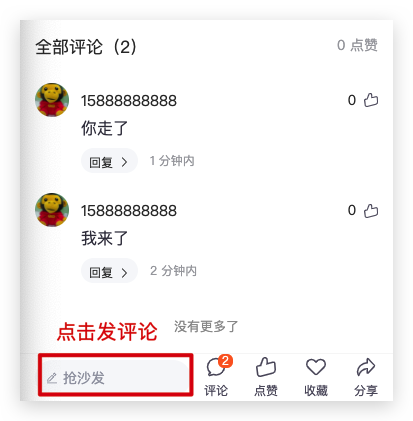

# 极客园H5项目【7文章详情】

>主要业务：文章详情渲染、文章代码内容高亮、加载loading、文章状态操作（关注、点赞、收藏）、评论列表和发表评论、评论列表标题吸顶

## 01-文章详情结构

**目标**：能够根据模板搭建文章详情页面结构


**步骤**：

1. 将文章详情ArticleDetail页面的模板拷贝到 pages 目录中
2. 在 App 组件中配置文章详情页面的路由

## 02-获取文章详情

**目标**：能够获取文章详情数据


**步骤**：

1. 创建文章详情 article 接口返回数据类型
2. 在api下创建获取文章详情后台接口
5. 在文章详情页面中发送请求获取详情数据

**核心代码**：

data.d.ts 中：

```ts
// -- 文章详情 --
export type ArticleDetail = {
  art_id: string
  title: string
  pubdate: string
  aut_id: string
  aut_name: string
  aut_photo: string
  is_followed: boolean
  attitude: number
  content: string
  is_collected: boolean
  // 接口中缺失
  comm_count: number
  like_count: number
  read_count: number
}
export type ArticleDetailResponse = ApiResponse<ArticleDetail>
```

api/article.ts 中：

```ts
import { ArticleDetailResponse } from './../types/data.d'
import { http } from '@/utils/request'

// 获取文章详情
export function getArticleDetail(id: string): Promise<ArticleDetailResponse> {
  return http.get(`/articles/${id}`)
}
```

pages/ArticleDetail/index.tsx 中：

```tsx
import { useEffect } from 'react'
import { getArticleDetail } from '@/api/article'

const Article = () => {
// 1. 获取文章详情
  const params = useParams<{ artId: string }>()
  console.log(params)
  useEffect(() => {
    const getDetail = async () => {
      const { data } = await getArticleDetail(params.artId)
      console.log(data)
    }
    getDetail()
  }, [params.artId])
  
}
```

## 03-渲染文章详情

**目标**：能够渲染文章详情信息

**分析说明**：

[参考：dayjs 本地换化格式](https://day.js.org/docs/zh-CN/display/format#%E6%9C%AC%E5%9C%B0%E5%8C%96%E6%A0%BC%E5%BC%8F)

使用 dayjs 的本地化格式，可以展示：`2021年10年24日` 格式的日期

utils/utils.ts

```ts
export const formatTime = (val: string) => {
  return dayjs(val).format('YYYY年MM月DD')
}
```

**步骤**：

1. 在文章详情状态数据
1. 在获取到数据之后存储状态
2. 使用格式化方法格式化日期

**核心代码**：

pages/ArticleDetail/index.tsx 中：

设置状态数据：

```diff
+ import { ArticleDetail } from '@/types/data'
+ import { formatTime } from '@/utils/utils'
 // 1. 获取文章详情
  const params = useParams<{ artId: string }>()
  console.log(params)
+  const [detail, setDetail] = useState<ArticleDetail>()
  useEffect(() => {
    const getDetail = async () => {
      const { data } = await getArticleDetail(params.artId)
      console.log(data)
+      setDetail(data)
    }
    getDetail()
  }, [params.artId])
```
绑定渲染：
```ts
  const renderArticle = () => {
    // 文章详情
    return (
      detail && (
        <div className="wrapper">
          <div className="article-wrapper">
            <div className="header">
              <h1 className="title">{detail.title}</h1>

              <div className="info">
                <span>{formatTime(detail.pubdate)}</span>
                <span>{detail.read_count} 阅读</span>
                <span>{detail.comm_count} 评论</span>
              </div>

              <div className="author">
                
                <span className="name">{detail.aut_name}</span>
                <span
                  className={classNames(
                    'follow',
                    detail.is_followed ? 'followed' : ''
                  )}>
                  {detail.is_followed ? '已关注' : '关注'}
                </span>
              </div>
            </div>

            <div className="content">
              <div
                className="content-html dg-html"
                dangerouslySetInnerHTML={{ __html: detail.content }}
              />
              <div className="date">
                发布文章时间：{formatTime(detail.pubdate)}
              </div>
            </div>
          </div>

          <div className="comment">
            <div className="comment-header">
              <span>全部评论（{detail.comm_count}）</span>
              <span>{detail.like_count} 点赞</span>
            </div>

            <div className="comment-list">
              <CommentItem />

              <InfiniteScroll hasMore={false} loadMore={loadMoreComments} />
            </div>
          </div>
        </div>
      )
    )
  }
```

```diff
        <NavBar
          onBack={() => history.go(-1)}
          right={
            <span>
              <Icon type="icongengduo" />
            </span>
          }>
+         {detail && (
            <div className="nav-author">
+              
+              <span className="name">{detail.aut_name}</span>
              <span
                className={classNames(
                  'follow',
+                  detail.is_followed ? 'followed' : ''
                )}>
+                {detail.is_followed ? '已关注' : '关注'}
              </span>
            </div>
          )}
        </NavBar>
```

## 04-渲染文章内容

**目标**：能够渲染HTML字符串格式的文章内容

**分析说明**：

[参考：React 的 dangerouslySetInnerHTML](https://zh-hans.reactjs.org/docs/dom-elements.html#dangerouslysetinnerhtml)

[参考：MDN innerHTML 安全问题](https://developer.mozilla.org/zh-CN/docs/Web/API/Element/innerHTML#%E5%AE%89%E5%85%A8%E9%97%AE%E9%A2%98)

`dangerouslySetInnerHTML` 是 React 为浏览器 DOM 提供 `innerHTML` 的替换方案，用来在 JSX 中渲染 HTML 格式的字符串内容

通常来讲，使用代码直接设置 HTML 存在风险，因为很容易无意中使用户暴露于[跨站脚本（XSS）](https://baike.baidu.com/item/%E8%B7%A8%E7%AB%99%E8%84%9A%E6%9C%AC%E6%94%BB%E5%87%BB/8186208)的攻击

**HTML 5 中规定：不执行由 `innerHTML` 插入的 `<script>` 标签。**

但是，有很多不依赖 script 标签去执行 JavaScript 的方式。比如，以下代码会执行 alert 弹窗，造成安全问题：

```tsx
// 注意：此处图片的 onerror 属性的代码，还是会被执行，不仅影响了用户体验，还会存在 XSS 攻击问题
<div
  className="content-html dg-html"
  dangerouslySetInnerHTML={{
    __html: ""
  }}
></div>
```

因此，为了安全可以通过类似于 `dompurify` 包，来对 HTML 字符串内容进行“消毒”：

```tsx
import DOMPurify from 'dompurify'

// 比如，将 '<div><script>alert(111)</script></div>' 转化为： '<div></div>'
// 比如，将 '' 转化为：''
const clean = DOMPurify.sanitize(dirty)
```

**步骤**：

1. 安装 dompurify 和 类型声明文件：`yarn add dompurify` `yarn add -D @types/dompurify`
2. 导入 dompurify 包
3. 通过 dangerouslySetInnerHTML 来展示消毒后的 HTML 内容

**核心代码**：

```diff
import DOMPurify from 'dompurify'

<div
  className="content-html dg-html"
  dangerouslySetInnerHTML={{
+    __html: DOMPurify.sanitize(content)
  }}
/>
```

## 05-文章内容代码块高亮

**目标**：能够使用 highlight.js实现文章内容代码高亮


**分析说明**：

[highlight.js npm](https://www.npmjs.com/package/highlight.js)

**步骤**：

1. 安装 highlight.js：`yarn add highlight.js`
2. 在 useEffect 中获取到包含 代码 的标签（可能是 code 标签，也可能是 pre 标签）
3. 遍历这些 DOM，分别为每个 DOM 元素，应用 highlightElement 即可

**核心代码**：

hooks/index.ts

```tsx
import highlight from 'highlight.js'
import 'highlight.js/styles/dark.css'

const useCodeLight = () => {
  // 文章详情 代码内容 高亮
  useEffect(() => {
    highlight.configure({
      // 忽略警告
      ignoreUnescapedHTML: true,
    })
    // 设置高亮
    const dgHtmlDOM = document.querySelector('.dg-html')
    const codes = dgHtmlDOM?.querySelectorAll<HTMLElement>('pre code')
    if (codes && codes.length > 0) {
      codes.forEach((el) => {
        // 让每个 code 内容实现代码高亮
        highlight.highlightElement(el)
      })
      return
    }

  }, [])
}
```

说明❓：后台返回文章code代码片段已经经过hjs高亮处理，只需要引入样式即可

## 06-加载loading效果

**目标**：能够在文章详情加载中展示loading效果


**分析说明**：

- [react-content-loader 在线设计骨架屏](https://skeletonreact.com/)

**步骤**：

1. 安装：`yarn add react-content-loader`
2. 如果是加载中，就渲染 loading 效果

```tsx
import ContentLoader from 'react-content-loader'

const Article = () => {
  // ...
  const [loading, setLoading] = useState(true)

	if (loading) {
    return (
      // 根据当前页面结构，设计好的 loading 效果
      <ContentLoader
        speed={2}
        width={375}
        height={230}
        viewBox="0 0 375 230"
        backgroundColor="#f3f3f3"
        foregroundColor="#ecebeb"
      >
        <rect x="16" y="8" rx="3" ry="3" width="340" height="10" />
        <rect x="16" y="26" rx="0" ry="0" width="70" height="6" />
        <rect x="96" y="26" rx="0" ry="0" width="50" height="6" />
        <rect x="156" y="26" rx="0" ry="0" width="50" height="6" />
        <circle cx="33" cy="69" r="17" />
        <rect x="60" y="65" rx="0" ry="0" width="45" height="6" />
        <rect x="304" y="65" rx="0" ry="0" width="52" height="6" />
        <rect x="16" y="114" rx="0" ry="0" width="340" height="15" />
        <rect x="263" y="208" rx="0" ry="0" width="94" height="19" />
        <rect x="16" y="141" rx="0" ry="0" width="340" height="15" />
        <rect x="16" y="166" rx="0" ry="0" width="340" height="15" />
      </ContentLoader>
    )
  }
  
}
```

```diff
  // 1. 获取文章详情
  const params = useParams<{ artId: string }>()
  console.log(params)
  const [detail, setDetail] = useState<ArticleDetail>()
  useEffect(() => {
    const getDetail = async () => {
      const { data } = await getArticleDetail(params.artId)
      console.log(data)
      setDetail(data)
-   // 关闭loading
+     setLoading(false)
    }
    getDetail()
  }, [params.artId])
```

## 07-点击滚动到评论区域

**目标**：能够在点击评论图标时滚动到评论内容位置


**分析说明**：

[参考：MDN getBoundingClientRect](https://developer.mozilla.org/zh-CN/docs/Web/API/Element/getBoundingClientRect)

[参考：MDN scrollTo()](https://developer.mozilla.org/zh-CN/docs/Web/API/Element/scrollTo)

说明❓：评论区距离页面顶部滚动高度 = 评论区距离页面可视区顶部高度 - 页面头部高度 + 页面滚动高度(默认0)

**步骤**：

1. 分析 CommentFooter 组件的结构，添加 onShowComment 属性并作为评论图标的点击事件
2. 在文章详情页面中，创建 onShowComment 函数，并指定为 CommentFooter 组件的属性
3. 创建获取评论区域DOM的 ref 对象
5. 获取到评论区域相对于页面顶部的高度，来跳转到相应位置

**核心代码**：

ArticleDetail/index.tsx 中：

```tsx
/**
 * 导航栏高度的常量
 */
const NAV_BAR_HEIGTH = 45

const Article = () => {
  // ...
  const commentRef = useRef<HTMLDivElement>(null)
  const wrapperRef = useRef<HTMLDivElement>(null)
  const isShowComment = useRef(false)
  
  // 展示 or 隐藏评论内容
  const onShowComment = () => {
    const wrapper = wrapperRef.current
    if (!wrapper) return
    const comment = commentRef.current
    if (!comment) return

    const commentTop = comment.getBoundingClientRect().top
    // console.log(commentTop)
    if (!isShowComment.current) {
      // 还没有展示评论信息，此时，就展示评论信息
      wrapper.scrollTo({
        // wrapper.scrollTop 表示已经滚动的距离
        top: commentTop - NAV_BAR_HEIGTH + wrapper.scrollTop,
        // 如果想要滚动时，带有动画效果，可以使用 smooth 即可
        behavior: 'auto'
      })
      isShowComment.current = true
    } else {
      // 已经展示评论信息，此时，需要返回页面顶部
      wrapper.scrollTo(0, 0)
      isShowComment.current = false
    }
  }
 
}
```

```diff
  const renderArticle = () => {
    return (
      <div className="wrapper"
+     ref={wrapperRef}>

      <div className="comment"
+      ref={commentRef}></div>

      </div>
    )
  }

  return (
    // ...
    <CommentFooter
+    onShowComment={onShowComment} />
	)
```

ArticleDetail/components/CommentFooter.tsx 中：

```diff
type Props = {
  // ...
+  onShowComment?: () => void
}

+const CommentFooter = ({ onShowComment }: Props) => {
  return (
    <div className={styles.root}>
      // ...
      {type === 'normal' && (
        <>
          <div className="action-item"
+         onClick={onShowComment}>
            <Icon type="iconbtn_comment" />
            <p>评论</p>
            {!!1 && <span className="bage">{1}</span>}
          </div>
        </>
      )}
    </div>
  )
}
```

## 08-关注文章作者

**目标**：能够实现关注文章作者功能


**分析说明**：

关注作者、收藏文章、点赞文章，这三个功能的实现方式几乎一样

**步骤**：

1. 给关注按钮绑定点击事件
2. 发送请求，并传递 aut_id（作者 id）进行关注操作（取反）
2. 更新本地文章详情作者关注状态数据

**核心代码**：

ArticleDetail/index.tsx 中：

```tsx
import { follow, unFollow } from '@/api/article'

const onFollow = () => {
  if (detail.is_followed) {
    await unFollow(detail.aut_id)
    setDetail({ ...detail, is_followed: false })
  } else {
    await follow(detail.aut_id)
    setDetail({ ...detail, is_followed: true })
  }
}

// 添加关注事件
<span
  onClick={onFollow}
  >
  {is_followed ? '已关注' : '关注'}
</span>
```

api/article.ts 中：

```ts
// 关注作者
export function follow(id: string) {
  return http.post('/user/followings', {
    target: id,
  })
}
// 取关作者
export function unFollow(id: string) {
  return http.delete(`/user/followings/${id}`)
}
```

## 09-收藏文章

**目标**：能够实现收藏文章功能


**步骤**：

1. 为 CommentFooter 组件添加 onCollected 、is_collected 属性，并作为收藏按钮的点击事件
2. 在文章详情中，创建 onCollected 函数，并作传递给 CommentFooter 组件
3. 在 onCollected 函数中，调用接口收藏文章并更新文章详情收藏状态数据

**核心代码**：

CommentFooter.tsx 中：

```diff
type Props = {
  // ...
+  onCollected?: () => void
+  is_collected?: boolean
}

+const CommentFooter = ({ onCollected, is_collected }: Props) => {
  return (
    <div className={styles.root}>
      // ...
      {type === 'normal' && (
        <>
        	<div className="action-item"
+        	onClick={onCollected}>
        		<Icon
+              type={is_collected ? 'iconbtn_collect_sel' : 'iconbtn_collect'}
            />
        	</div>
        </>
      )}
    </div>
  )
}
```

ArticleDetail/index.tsx 中：

```tsx
const Article = () => {
  // 收藏 or 取消收藏 -- 文章
  const onCollected = async () => {
    if (detail.is_collected) {
      await unFav(detail.art_id)
      setDetail({ ...detail, is_collected: false })
    } else {
      await fav(detail.art_id)
      setDetail({ ...detail, is_collected: true })
    }
  }

  return (
    // ...
    <CommentFooter onCollected={onCollected} is_collected={detail?.is_collected} />
	)
}
```

pi/article.ts 中：

```ts
// 收藏文章
export function fav(art_id: string) {
  return http.post('/article/collections', {
    target: art_id,
  })
}
// 取消收藏文章
export function unFav(art_id: string) {
  return http.delete(`/article/collections/${art_id}`)
}
```

## 10-文章点赞(作业)

**目标**：能够实现文章点赞功能


**步骤**：

1. 封装统一方法处理文章关注、收藏等操作

说明：用户对文章的态度, **0-不喜欢（取消点赞），1-点赞**	

>提示:
>
>根据不同操作，封装复用函数，找不同？抽离参数：
>
>1. 修改的属性：'is_followed' | 'is_collected' | 'attitude'
>2. 修改对象：id（文章ID，作者ID...）
>3. 正向操作接口：fn
>4. 反向操作接口：fn

```ts
type: 'is_followed' | 'is_collected' | 'attitude',
id: string,
sel: Function,
unSel: Function
```

**核心代码**：

CommentFooter.tsx 中：

```diff
type Props = {
  // ...
+  onLike?: () => void
+  attitude?: number
}

+ const CommentFooter = ({ onLike, attitude }: Props) => {
  return (
    <div className={styles.root}>
      // ...
      {type === 'normal' && (
        <>
        	<div className="action-item"
+        	onClick={onLike}>
+      		<Icon type={attitude === 1 ? 'iconbtn_like_sel' : 'iconbtn_like2'} />
	        </div>
        </>
      )}

      {type === 'reply' && (
        <div className="action-item"
+        onClick={onLike}>
+        	<Icon type={attitude === 1 ? 'iconbtn_like_sel' : 'iconbtn_like2'} />
        </div>
      )}
    </div>
  )
}
```

ArticleDetail/index.tsx 中：

```tsx
  // 6. 统一处理关注作者、收藏文章、点赞文章
  /**
   *
   * @param type 类型
   * @param id 参数
   * @param sel 正向操作
   * @param unSel 反向操作
   * @returns
   */
  const onArticle = async (
    type: 'is_followed' | 'is_collected' | 'attitude',
    id: string,
    sel: Function,
    unSel: Function
  ) => {
    if (detail[type] && detail[type] !== -1) {
      await unSel(id)
      setDetail({ ...detail, [type]: type === 'attitude' ? 0 : false })
    } else {
      await sel(id)
      setDetail({ ...detail, [type]: type === 'attitude' ? 1 : true })
    }
  }
```

```diff
{/* 底部评论栏 */}
<CommentFooter
onShowComment={onShowComment}
+ onCollected={() =>
+ onArticle('is_collected', detail!.art_id, fav, unFav)
+}
+onLike={() => onArticle('attitude', detail!.art_id, like, unLike)}
+attitude={detail?.attitude}
is_collected={detail?.is_collected}
/>
```

api/article.ts 中：

```ts
// 点赞文章
export function like(art_id: string) {
  return http.post('/article/likings', {
    target: art_id,
  })
}
// 不点赞文章
export function unLike(art_id: string) {
  return http.delete(`/article/likings/${art_id}`)
}
```

## 11-使用枚举作为评论类型

**目标**：能够使用枚举类型区分不同的评论类型

**分析说明**：

评论的类型有两种：1 文章的评论  2 评论的回复

接口文档中给出的值为：'a' 和 'c'，因此，可以通过联合类型来指定。但是，此处 a 和 c 的含义不明确，所以，可以**通过枚举来自己指定更有意义的名称**

```ts
// 此处 a 和 c 的含义不明确
type CommentType = 'a' | 'c'

// ---

// 使用枚举类型来指定评论类型：
enum CommentType {
  Article = 'a',
  Comment = 'c'
}

// 使用：
CommentType.Article 表示文章的评论
CommentType.Comment 表示评论的回复
```

**核心代码**：

```ts
// 创建枚举，来表示评论类型
enum CommentType {
  Article = 'a',
  Comment = 'c'
}
```

## 12-获取评论列表数据

**目标**：能够获取评论列表数据


**分析说明**：

>对于评论列表数据来说，如果 **评论列表长度和total_count相同**，则说明已经没有更多评论数据了

所以， 作为 InfiniteScroll 组件是否还需要加载更多数据的判断条件

**步骤**：

1. 根据接口，创建接口返回数据的类型
4. 定义评论列表和控制是否加载完成状态
6. 使用useRef定义分页offset偏移量
4. 创建loadMore加载更多函数，发送请求获取评论列表数据
   1. 判断是否加载完成
      1. 完成：设置加载完成状态
      2. 没有完成：修改偏移量offset值


**核心代码**：

data.d.ts 中：

```ts
// 评论项的类型
export type ArticleCommentItem = {
  com_id: string
  aut_id: string
  aut_name: string
  aut_photo: string
  like_count: number
  reply_count: number
  pubdate: string
  content: string
  is_liking: boolean
  is_followed: boolean
}
// 文章评论的类型
export type ArticleComment = {
  total_count: number
  end_id: string | null
  last_id: string | null
  results: ArticleCommentItem[]
}
export type ArticleCommentResponse = ApiResponse<ArticleComment>
```

api/article.ts 中：

```ts
// 获取评论数据
/**
 *
 * @param type a或c 评论类型，a-对文章(article)的评论，c-对评论(comment)的回复
 * @param id 文章id或评论id
 * @param offset 获取评论数据的偏移量，表示从此id的数据向后取，不传表示从第一页开始读取数据
 * @returns
 */
export function getComments(
  type: string,
  id: string,
  offset: string | null
): Promise<ArticleCommentResponse> {
  return http.get('/comments', { params: { type, source: id, offset } })
}
```

ArticleDetail/index.tsx 中：

```tsx
  // 7. 评论列表
const [commentList, setCommentList] = useState<ArticleCommentItem[]>([])
  // 控制是否加载完成
  const [hasMore, setHasMore] = useState(true)
  // 分页偏移量offset
  const offset = useRef<string | null>(null)
  const loadMoreComments = async () => {
    const { data } = await getComments(
      CommentType.Article,
      params.artId,
      offset.current
    )
    console.log('pl:', data)
    setCommentList([...commentList, ...data.results])
    if (commentList.length === data.total_count) {
      setHasMore(false)
    } else {
      offset.current = data.last_id
    }
  }
```

```diff
          <div className="comment" ref={commentRef}>
            <div className="comment-header">
              <span>全部评论（{detail.comm_count}）</span>
              <span>{detail.like_count} 点赞</span>
            </div>

            <div className="comment-list">
+              {commentList.map((item) => (
+                <CommentItem key={item.com_id} />
+              ))}

              <InfiniteScroll
+              hasMore={hasMore} loadMore={loadMoreComments} />
            </div>
          </div>
```

## 13-渲染评论列表数据

**目标**：能够渲染评论列表数据

**步骤**：

1. 分析其结构 CommentItem 组件模板
4. 将 NoneComment 模板以及图片资源，拷贝到公共组件 components 目录中
5. 如果没有评论项数据，渲染 NoneComment 组件
5. 渲染 CommentItem 组件时，传递评论数据item

**核心代码**：

ArticleDetail/index.tsx 中：

```diff
+import NoneComment from '@/components/NoneComment'

<div className="comment" ref={commentRef}>
  <div className="comment-header">
    <span>全部评论（{detail.comm_count}）</span>
    <span>{detail.like_count} 点赞</span>
  </div>

+  {detail.comm_count === 0 ? (
+    <NoneComment />
  ) : (
    <div className="comment-list">
      {/* {Array.from(new Array(10)).map((item, i) => (
                <CommentItem key={i} />
              ))} */}
      {commentList.map((item) => (
        <CommentItem key={item.com_id}
+        {...item}
        />
      ))}

      <InfiniteScroll hasMore={hasMore} loadMore={loadMoreComments} />
    </div>
  )}
</div>
```

CommentItem/index.tsx 中：

```diff
+import { ArticleCommentItem } from '@/types/data'

type Props =
+ Partial<ArticleCommentItem> & {
  // normal 普通
  type?: 'normal'
}

const CommentItem = (
+{
  aut_photo,
  aut_name,
  like_count,
  is_followed,
  is_liking,
  content,
  reply_count,
  pubdate,
+}: Props) => {
 	// ...
}
```

## 14-展示文章评论弹出层

**目标**：能够展示文章评论弹出层



**步骤**：

1. 拷贝 CommentInput 组件模板到 ArticleDetail/components 目录中
2. 定义控制文章评论弹出层展示隐藏的状态
3. 点击底部 CommentFooter 抢沙发内容时，展示弹出层
4. 点击弹出层内返回按钮时，隐藏弹出层

**核心代码**：

ArticleDetail/index.tsx 中：

```tsx
const Article = () => {
  const [commentVisible, setCommentVisible] = useState(false)

  const onCommentShow = () => setCommentVisible(true)
  const onCommentHide = () => setCommentVisible(false)

  // 渲染评论抽屉
  const renderCommentPopup = () => {
    return (
      <Popup
        className="comment-popup"
        position="bottom"
        visible={commentVisible}
        onMaskClick={onCommentHide}
      >
          <CommentInput onClose={onCommentHide} />
      </Popup>
    )
  }

  return (
		// ...
    <div>
      <CommentFooter
        onCommentPopup={onCommentShow}
      />
      
      // 在 Article 组件的最后，渲染该 Popup 即可
      {renderCommentPopup()}
    </div>  	
  )
}
```

CommentFooter/index.tsx 中：

```diff
type Props = {
  // ...
+  onCommentPopup?: () => void
}

+const CommentFooter = ({ onCommentPopup }: Props) => {
  return (
  	// ...
    <div className="input-btn"
+      onClick={onCommentPopup}>
  )
}
```

## 15-文章发表评论

**目标**：能够实现文章评论功能

**分析：**借助子传父


**步骤**：

1. 为 CommentInput 组件添加发表评论的回调事件类型，并调用该回调，将评论信息回传给父组件
2. 父组件 Article 中创建发表评论的函数，并通过参数拿到评论内容
3. 准备对文章评论的接口数据类型
3. 发送请求对文章评论，并在发表评论后关闭弹出层更新评论列表状态数据

**核心代码**：

CommentInput/index.tsx 中：

```diff
type Props = {
-  // 发表评论
+  onAddComment: (content: string) => void
}

+const CommentInput = ({ onAddComment }: Props) => {
  return (
  	// ...
    <span className="publish"
+     onClick={() => onAddComment(value)}>
      发表
    </span>
  )
}
```

ArticleDetail/index.tsx 中：

```diff
  // 8. 添加评论
  const [commentVisible, setCommentVisible] = useState(false)

  const onCommentShow = () => setCommentVisible(true)
  const onCommentHide = () => setCommentVisible(false)
  // 对文章发表评论
  const onAddComment = async (content: string) => {
    const { data } = await addComment({ target: detail!.art_id, content })
-    // 向文章评论列表追加最新评论数据
-    // 注意：处理默认没有加载情况下，新增评论=》不进行本地新增,避免重复添加问题
+    commentList.length > 0 && setCommentList([data.new_obj, ...commentList])
-    // 更新评论数量
+    setDetail({ ...detail, comm_count: detail?.comm_count + 1 })
    // 关闭评论抽屉
    onCommentHide()
  }
```

api/article.ts 中：

```ts
// 对文章发表评论
type DataComment = {
  target: string // 评论的目标id（评论文章即为文章id，对评论进行回复则为评论id）
  content: string // 评论/回复内容
  art_id?: string // 文章id，对评论内容发表回复时，需要传递此参数，表明所属文章id。对文章进行评论，不要传此参数。
}
export function addComment(
  data: DataComment
): Promise<AddArticleCommnetResponse> {
  return http.post('/comments', data)
}
```

data.d.ts 中：

```ts
// 文章发布评论的类型
// 注意：接口文档中的返回类型与后台接口返回数据不一致
export type AddArticleCommnet = {
  com_id: string
  new_obj: ArticleCommentItem
  target: string
}
export type AddArticleCommnetResponse = ApiResponse<AddArticleCommnet>
```

## 16-评论点赞

**目标**：能够为文章的评论项点赞


说明❓：不同用户只能对某一评论点赞一次

**步骤**：

1. 在api中封装对评论点赞的后台接口

2. 为子组件 CommentItem 添加点赞事件的 props 类型，并点赞按钮绑定点击事件

3. 在父组件中创建对评论点赞的函数，并传递给子组件

4. 在父组件中处理对评论点赞接口请求和状态数据更新

   

**核心代码**：

ArticleDetail/index.tsx 中：

```tsx
import {
  likeComment,
  unLikeComment,
} from '@/api/article' 


// 9. 对文章评论点赞
  const onThumbsUp = async (com_id: string, is_liking: boolean) => {
    // 1. 接口操作
    if (is_liking) {
      // 取消点赞
      await unLikeComment(com_id)
    } else {
      // 点赞
      await likeComment(com_id)
    }
    // 2. 更新评论状态
    const newList = commentList.map((item) => {
      if (item.com_id === com_id) {
        return {
          ...item,
          is_liking: !is_liking,
          like_count: item.like_count + (is_liking ? -1 : 1),
        }
      }
      return item
    })
    setCommentList(newList)
  }

<CommentItem
  {...item}
  onThumbsUp={() => onThumbsUp(item.com_id, item.is_liking)}
/>
```

CommentItem/index.tsx 中：

```diff
type Props = Partial<ArticleCommentItem> & {
  // normal 普通 - 文章的评论
  type?: 'normal'
+  onThumbsUp?: () => void
}

{/* 文章评论-点赞 */}
<span className="thumbs-up"
+ onClick={onThumbsUp}>
{like_count}
<Icon type={is_liking ? 'iconbtn_like_sel' : 'iconbtn_like2'} />
</span>
```

api/article.ts 中：

```ts
// 点赞评论
export function likeComment(com_id: string) {
  return http.post('/comment/likings', {
    target: com_id,
  })
}
// 取消点赞评论
export function unLikeComment(com_id: string) {
  return http.delete(`/comment/likings/${com_id}`)
}
```

## 扩展-评论列表标题吸顶

**目标**：能够实现评论列表标题吸顶效果


**分析说明**：

[参考：CSS position 粘性定位 sticky](https://developer.mozilla.org/zh-CN/docs/Web/CSS/position)

CSS 支持粘性定位，来实现吸顶效果。比如：

```css
.sticky-header {
  position: sticky;
  top: 10px;
}
```

注意：须指定 [`top`](https://developer.mozilla.org/zh-CN/docs/Web/CSS/top), [`right`](https://developer.mozilla.org/zh-CN/docs/Web/CSS/right), [`bottom`](https://developer.mozilla.org/zh-CN/docs/Web/CSS/bottom) 或 [`left`](https://developer.mozilla.org/zh-CN/docs/Web/CSS/left) 四个阈值其中之一，才可使粘性定位生效。否则其行为与相对定位相同

**核心代码**：

ArticleDetail/index.module.scss 中：

```scss
// 评论列表标题：
    .comment {
			// ...
      .comment-header {
        position: sticky;
        top: 0;
        z-index: 2;
        background: #fff;
        // ...
      }
}
```


## 第七天

