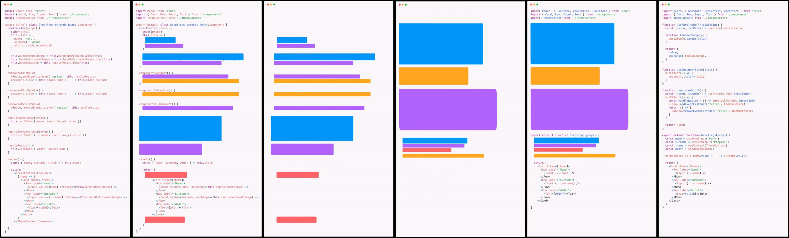

# useState 模拟实现

- hooks 使用的注意点： 不能在 `if/for/其他的函数中` 来使用 Hooks

- 因为在这些情况下，使用 Hooks 可能会导致 hooks 的执行顺序发生改变。因为 **React Hooks 内部是通过 hooks 的调用顺序来区分到底是哪个 hook**。

## 模拟实现 useState

```tsx
// 创建自己的 useState
let state: number[] = []
let hookIndex = 0

const useState = (initialState: number) => {
  state[hookIndex] = state[hookIndex] || initialState

  // 修改状态的函数
  let curHookIndex = hookIndex
  const setState = (value: number) => {
    state[curHookIndex] = value
    // 重新渲染组件
    render()
  }

  // Tuple 类型
  type UseStateTuple = [number, (value: number) => void]
  const ret: UseStateTuple = [state[hookIndex], setState]

  hookIndex++
  return ret
}

const App = () => {
  const [count, setCount] = useState(100)
  const [age, setAge] = useState(16)

  // +1
  const onIncrement = () => {
    setCount(count + 1)
  }

  const onAgeIncrement = () => {
    setAge(age + 1)
  }

  return (
    <div style={{ backgroundColor: 'pink', padding: 10 }}>
      <h1>计数器：{count}</h1>
      <button onClick={onIncrement}>+1</button>

      <hr />
      <p>年龄：{age}</p>
      <button onClick={onAgeIncrement}>年龄+1</button>
    </div>
  )
}

function render() {
  ReactDOM.render(<App />, document.getElementById('root'))

  // 重置 hookIndex 的值
  hookIndex = 0
}
render()
```

## 模拟实现 useEffect

```tsx
import ReactDOM from 'react-dom'

/**
 * 模拟实现 useEffect Hook：
 *
 * useEffect 的说明：
 * 使用方式： useEffect(() => {}, [])
 *
 * useEffect 会根据依赖项是否改变来决定是否调用 callback
 * 所以，为了判断，需要将 useEffect 的依赖项存在变量 state 中
 *
 * 注意：因为依赖项可以为任意数据，所以，为了简单，我们直接将
 *      修改变量 state 的类型修改为 any[]
 *
 * 步骤：
 * 1. 根据 useEffect Hook 的使用方式，来为其提供参数和返回值。
 *    注意：实际上 useEffect 的回调函数是有返回值的。但是，此处，我们先不处理返回值的问题。
 *
 * 2. 在 useEffect 中获取到上一次的依赖项
 *
 * 3. 在每次调用 useEffect 后，让 hookIndex 加 1
 *    目的：为下一次使用 useEffect 做准备
 *
 * 4. 根据有没有依赖项的值，来决定是否调用 callback
 *    1 如果没有依赖项参数，每次都要调用 callback
 *    2 如果有依赖项参数，只在依赖项改变时调用 callback 即可
 *      1 如果是空数组，可以保证只调用一次即可
 *      2 如果不是空数组，可以保证只在依赖项改变时调用
 *
 * 5. 在调用 callback 后，将新的依赖项保存到变量 state 中
 *    目的：更新 useEffect 的依赖项，保证下一次检查时，数据正确
 */

let state: any[] = []
let hookIndex = 0

const useState = (initialState: number) => {
  state[hookIndex] = state[hookIndex] || initialState

  // 修改状态的函数
  let curHookIndex = hookIndex
  const setState = (value: number) => {
    state[curHookIndex] = value
    // 重新渲染组件
    render()
  }

  // Tuple 类型
  type UseStateTuple = [number, (value: number) => void]
  const ret: UseStateTuple = [state[hookIndex], setState]

  hookIndex++
  return ret
}

// 创建自己的 useEffect
const useEffect = (callback: () => void, deps?: any[]) => {
  // 获取上一次的依赖
  const lastDeps = state[hookIndex]

  // 记录有没有依赖项
  let hasNoDeps = false
  // 记录依赖项是否发生改变
  let hasDepsChanged = false
  // 判断有没有依赖项
  if (!deps) {
    // 没有依赖项
    hasNoDeps = true
  } else {
    // 前提：只要代码执行到这，说明是有依赖项的
    // 如果上一次的依赖项为空，说明是第一次执行 useEffect
    // 此时，不管 useEffect 的依赖项时什么，都必须要执行一次 回调函数
    if (!lastDeps) {
      hasDepsChanged = true
    } else {
      // 有依赖项
      // 通过 some 方法的返回值来表示依赖项是否发生改变
      // 约定：返回 true 表示发生了变化；返回 false 表示没有发生变化
      hasDepsChanged = deps.some((item, index) => {
        return item !== lastDeps[index]
      })
    }
  }

  if (hasNoDeps || hasDepsChanged) {
    callback()
    // 将最新的依赖项保存到 state 变量中
    state[hookIndex] = deps
  }

  hookIndex++
}

const App = () => {
  // 第一次使用：0
  const [count, setCount] = useState(100)
  // 第二次使用：1
  const [age, setAge] = useState(16)

  // useEffect(() => {
  //   console.log('1 effect')
  // })

  useEffect(() => {
    console.log('2 effect')
  }, [])

  // useEffect(() => {
  //   console.log('3 effect', count)
  // }, [count])

  useEffect(() => {
    console.log('3 effect', count, age)
  }, [count, age])

  // +1
  const onIncrement = () => {
    setCount(count + 1)
  }

  const onAgeIncrement = () => {
    // debugger
    setAge(age + 1)
  }

  return (
    <div style={{ backgroundColor: 'pink', padding: 10 }}>
      <h1>计数器：{count}</h1>
      <button onClick={onIncrement}>+1</button>

      <hr />
      <p>年龄：{age}</p>
      <button onClick={onAgeIncrement}>年龄+1</button>
    </div>
  )
}

function render() {
  ReactDOM.render(<App />, document.getElementById('root'))

  // 重置 hookIndex 的值
  hookIndex = 0
}
render()
```

# 状态逻辑复用

## 组件复用的说明

问题1：如果两个组件中的部分功能相似或相同，但 UI 结构不同，该如何优化相似的功能？**复用**

问题2：复用什么？1. state 状态  2. 操作 state 状态的方法。也就是：**组件状态逻辑复用**

在 Hooks 之前，组件的状态逻辑复用经历了：[mixins(混入)](https://zh-hans.reactjs.org/docs/react-without-es6.html#mixins)、[HOCs(高阶组件)](https://zh-hans.reactjs.org/docs/higher-order-components.html)、[render-props](https://zh-hans.reactjs.org/docs/render-props.html) 等模式

注意：这几种方式不是新的API，而是利用React自身特点的编码技巧，演化而成的固定模式（写法）

*通过一个鼠标位置的案例，来演示组件的状态逻辑复用*。

## mixins 混入（已废弃）

[参考：React mixins](https://zh-hans.reactjs.org/docs/react-without-es6.html#mixins)

[参考：mixins 弊大于利](https://zh-hans.reactjs.org/blog/2016/07/13/mixins-considered-harmful.html)

存在的问题：

- Mixins 引入了隐式依赖关系，组件中的方法和数据的来源不明确，不利于维护

- Mixins 导致名称冲突

## 高阶组件

[React 高阶组件 - B站视频链接 https://www.bilibili.com/video/BV14y4y1g7M4?p=70](https://www.bilibili.com/video/BV14y4y1g7M4?p=70)

[参考：React 文档 HOC](https://zh-hans.reactjs.org/docs/higher-order-components.html)

### 概述

高阶组件（HOC，High-Order Component）作用：通过增强组件的能力，来**实现组件状态逻辑复用**

采用 包装（装饰）模式 ，比如，

- 手机：获取保护功能

- 手机壳 ：提供保护功能


高阶组件就相当于手机壳，通过包装组件，增强组件功能

### 基本使用

高阶组件是一个函数，接收要包装的组件，返回增强后的组件

高阶组件的命名约定以 `with` 开头，比如：withMouse、withRouter 等

原理：高阶组件内部创建一个类组件，在这个类组件中提供复用的状态逻辑代码，通过 prop 将复用的状态传递给被包装组件

```tsx
// 高阶组件内部创建的类组件：
const withMouse = (BaseComponent) => {
  class Wrapper extends React.Component {
    state = {
      x: 0,
      y: 0
    }
    render() {
      // const { x, y } = this.state
      return <BaseComponent x={x} y={y} {...wrapper组件状态数据} />
    }
	}
  
  return Wrapper
}

// 参数：需要增强的组件
// 返回值：增强后的组件
const HOCComponent = withMouse(被包装的组件)
```

示例：

假设 withMouse 高阶组件，可以拿到鼠标位置状态，而 Cat 组件需要使用鼠标位置状态，就可以通过高阶组件来复用鼠标位置相关的状态逻辑代码了：

```tsx
// withMouse 高阶组件：提供鼠标位置相关的状态逻辑
const CatWithMouse = withMouse(Cat)

// 复用1：

// 使用高阶组件包装后，组件内部就可以通过 props 来获取鼠标位置
const Cat = (props) => {
  // props => { x: 1, y: 1 }
  return (
  	
  )
}
// 渲染时，要渲染增强后返回的组件
<CatWithMouse />

// 复用2：

// 使用高阶组件包装后，组件内部就可以通过 props 来获取鼠标位置
const PositionWithMouse = withMouse(Position)

const Position = ({ x, y }) => {
  return (
    <div>鼠标当前位置：(x: {x}, y: {y})</div>
  )
}
<PositionWithMouse />
```

### 封装 withMouse 高阶组件

```jsx
// 创建高阶组件
const withMouse = (BaseComponent) => {
  // 该类组件用来提供状态逻辑
  return class Wrapper extends React.Component {
    state = {
      x: 0,
      y: 0
    }

    handleMousemove = e => {
      const { pageX, pageY } = e

      this.setState({
        x: pageX,
        y: pageY
      })
    }

    componentDidMount() {
      window.addEventListener('mousemove', this.handleMousemove)
    }

    componentWillUnmount() {
      window.removeEventListener('mousemove', this.handleMousemove)
    }

    render() {
      const { x, y } = this.state
      return <BaseComponent x={x} y={y} />
    }
  }
}
```

### 高阶组件的注意点

1. 推荐设置 displayName 属性

- 作用： 用来在 React 浏览器开发者工具（插件）中展示名称

```jsx
const withMouse = () => {
  class Wrapper ... {}

  // 设置 displayName
  Wrapper.displayName = `WithMouse${getDisplayName(WrappedComponent)}`
  function getDisplayName(WrappedComponent) {
    return WrappedComponent.displayName || WrappedComponent.name || 'Component'
  }

  return Wrapper
}
```

2. 推荐传递 props

- 如果没有传递，那么，props 会丢失
- 最终的 props 传递路径： 增强后的组件（CatWithMouse） -> 高阶组件函数中的Mouse -> 被包装组件（Cat）

```jsx
const withMouse = (WrappedComponent) => {
  class Mouse ... {
    render() {

      // {...this.props} 就表示将接收到 props 传递给被包装组件
      return <WrappedComponent {...this.props} />
    }
  }
  return Mouse
}

const CatWithMouse = withMouse(Cat)

// 注意： 如果不传递 props，那么，name属性就丢了
<CatWithMouse name="rose" />
```

## render-props 模式

[React render-props - B站视频链接 https://www.bilibili.com/video/BV14y4y1g7M4?p=64](https://www.bilibili.com/video/BV14y4y1g7M4?p=64)

[参考：React 文档 render-props 模式](https://zh-hans.reactjs.org/docs/render-props.html)

### 基本使用

将要复用的状态逻辑代码封装到一个组件中，通过一个值为函数的 prop 对外暴露数据，实现状态逻辑复用

比如，要通过 render-props 实现鼠标位置的状态逻辑复用：

1. 创建一个类组件，提供鼠标位置相关的状态逻辑代码
2. 调用传给该组件的 render 属性，将状态通过参数暴露出去
3. 通过 render 属性的返回值指定要渲染的结构内容

```tsx
class Mouse extends React.Component {
	// … 省略state和操作state的方法
  
  render() {
    return this.props.render(this.state)
  }
}
```

```tsx
<Mouse 
  render={(mouse) => (
		<p>鼠标当前位置 {mouse.x}，{mouse.y}</p>
	)}
/>
```

### children代替render属性

- 注意：并不是该模式叫 render props 就必须使用名为render的prop，实际上可以使用任意名称的prop

- 把prop是一个函数并且告诉组件要渲染什么内容的技术叫做：render props 模式

```tsx
<Mouse>
	{({x, y}) => <p>鼠标的位置是 {x}，{y}</p>}
</Mouse>

// 组件内部：
this.props.children(this.state)
```

比如，Context 中的 Consumer 组件就是 render-props 的使用模式

```tsx
// Context 中的用法：
<Consumer>
	{data => <span>data参数表示接收到的数据 -- {data}</span>}
</Consumer>
```

## React Hooks 状态逻辑复用

```tsx
// 创建自定义 hook，实现鼠标位置状态逻辑复用
const useMouse = () => {
  const [position, setPosition] = useState({ x: 0, y: 0 })
  
  useEffect(() => {
    const onMouseMove = e => {
      const { pageX, pageY } = e
      setPosition({
        x: pageX,
        y: pageY
      })
    }
    
    window.addEventListener('mousemove', onMouseMove)
    return () => window.removeEventListener('mousemove', onMouseMove)
  }, [])
  
  return position
}

// 复用：
const Cat = () => {
  const { x, y } = useMouse()
  return (
  	
  )
}

const Position = () => {
  const { x, y } = useMouse()
  return (
    <div>鼠标当前位置：(x: {x}, y: {y})</div>
  )
}
```

## 为什么要有 Hooks

从以下两个角度来看下 Hooks 出现之前(React v16.8 以前)React 存在的问题

两个角度: 1 **组件的状态逻辑复用**  2 class 组件自身的问题

1. 组件的状态逻辑复用：
   - 在 Hooks 之前，组件的状态逻辑复用经历了：[mixins(混入)](https://zh-hans.reactjs.org/docs/react-without-es6.html#mixins)、[HOCs(高阶组件)](https://zh-hans.reactjs.org/docs/higher-order-components.html)、[render-props](https://zh-hans.reactjs.org/docs/render-props.html) 等模式
   - (早已废弃)mixins 的问题：1 数据来源不清晰 2 命名冲突
   - HOCs、render-props 的问题：重构组件结构，导致组件形成 JSX 嵌套地狱问题，这两种模式都不是官方实现。所以，React 急需一种官方的方式，来解决状态逻辑复用导致的其他问题。

2. class 组件自身的问题：
   - 选择：函数组件和 class 组件之间的区别以及使用哪种组件更合适
   - 需要理解 class 中的 this 是如何工作的
   - 相互关联且需要对照修改的代码被拆分到不同生命周期函数中
   - 相比于函数组件来说，不利于代码压缩和优化，也不利于 TS 的类型推导

正是由于 React 原来存在的这些问题，才有了 Hooks 来解决这些问题。



# 性能优化


React 自身提供了一些与性能优化相关的 API，按照 class 或 hooks，分为两类：

1. class
   - `PureComponent`
   - `shouldComponentUpdate`
2. hooks
   - `React.memo`
   - `useMemo`
   - `useCallback`

*注：对于性能优化来说，一定要**避免过早优化**，也就是在没有出现性能问题前，可以不用进行优化。因为只要是优化，就会有成本，所以，优化时一定要确保成本小于优化带来的收获。*

React 对性能的理解：只要用户不感觉卡顿，那就是没有性能问题。

## 优化的方向

React 组件的特性：只要父组件更新，子组件都会无条件的更新


注意，此处的 `更新` 指的是：子组件中的代码重新执行一遍，进行一次 diff，最终只把变化后的内容更新到浏览器中

但是，某些情况下，子组件是没有必要更新的，比如：

1. 子组件是一个展示组件，仅仅用来展示一段静态的 JSX 结构
2. 子组件没有从父组件中接收任何 props
3. 父组件传递给子组件的 props 引用变了，但是，本质内容没变（比如，父组件给子组件传递了一个回调函数）

此时，就可以通过上述 API 来进行优化。

## React.memo

`React.memo` 是一个高阶组件，用来包裹 **函数组件** 来阻止函数组件不必要的更新

用法：【hooks-demo1.js】

```jsx
const Child2 = React.memo(() => {
  console.log('Child2 re-render')
  return <div>Child2</div>
})

// 通过 React.memo 避免不必要的组件更新
const Child2 = React.memo(
  () => {
    console.log('Child2 re-render')
    return <div>Child2</div>
  }

  // 如果需要自己来对比 props ，就需要传入第二个参数
  // 如果返回 false，表示更新前后的两次 props 发生了改变，此时，组件会重新渲染
  // 如果返回 true，表示更新前后的两次 props 没有改变，此时，组件不会重新渲染
  // (prevProps, nextProps) => {
  //   console.log(prevProps, nextProps)
  //   return false
  // }
)
```

说明：`React.memo` 会对比组件更新前后两次接收到的 props 是否相同，
- 如果相同，就阻止组件重新渲染
- 如果不同，才会重新渲染组件

*注意：**函数组件**每次更新时，会重新执行组件中的所有代码，也就是每次都会重新创建该组件中声明的函数、对象等等*

### 浅对比的说明

注意：`React.memo` 对比 props 的方式是：`浅对比`，也就是之比较值或引用是否相同

比如：

```js
// 对于简单类型来说，比较的是：值是否相同
1 === 1           // true   -> 组件不会重新渲染
true === false    // false  -> 组件会重新渲染

// 对于引用类型来说，比较的是：引用是否相同
[1, 2] === [1, 2] // false  -> 组件会重新渲染
{} === {}         // false  -> 组件会重新渲染
```

这样，就导致了一个问题：对于**引用类型的 props**来说，即使更新前后的 prop 值相同，但是引用不同，还是会导致组件重新渲染。

因此，针对于这种 props 是引用类型的情况，需要使用 `useCallback` 或 `useMemo` 来处理。

## useCallback

作用：缓存（记忆）一个函数，该函数只在依赖项变化时才会重新创建新函数（改变）

一般都会配合 React.memo 高阶组件来使用 

用法：【hooks-demo2.js】

```jsx
const fn = () => {
  console.log('fn 执行了')
}

// 第一个参数：要缓存的函数
// 第二个参数：依赖项，类似于 useEffect 的第二个参数
const memoFn = useCallback(fn, [])

<Child2 fn={memoFn} />
```

## useMemo

作用：缓存（记忆）一个对象（非函数），该对象只在依赖项变化时才会改变

一般都会配合 React.memo 高阶组件来使用

用法：【hooks-demo3.js】

```jsx
const memoObj = useMemo(() => {
  return {
    name: '豆豆'
  }
}, [])
<Child2 obj={memoObj} />
```

- 使用 useMemo 模拟 useCallback 的功能：

```tsx
// 使用 useMemo 来模拟 useCallback
const memoFn = useMemo(() => {
  return () => {
    console.log('fn 执行了', count)
  }
}, [count])

<Child2 fn={memoFn} />
```

- useMemo 的回调函数代码只会在依赖项改变时重新执行，因此，除了缓存对象之外，还可以**避免昂贵计算，提升性能**
  - 如果一个数据，需要经过昂贵的大量计算得到，此时，也可以使用 useMemo 来缓存数据，避免重复计算提升性能

```tsx
const memoObj = useMemo(() => {
	// 模拟昂贵计算：
  // 创建长度为 1000 的数组
  const nums = new Array(1000).fill(0).map((item, index) => index)
  
  return {
    name: '豆豆'
  }
}, [])
<Child2 obj={memoObj} />
```

## class 组件优化

对于 class 组件来说，`PureComponent` 的作用相当于 `React.memo`；而 `shouldComponentUpdate` 可以自定义 props 之间的对比规则

- `PureComponent` 用法：【class-demo4.js】 - 浅对比
- `shouldComponentUpdate` 用法：【class-demo5.js】
  - 注意：`shouldComponentUpdate` 不能与 `PureComponent` 一起使用

---

# 虚拟DOM和Diff算法

[React 虚拟DOM、Diff算法 - B站视频链接 https://www.bilibili.com/video/BV14y4y1g7M4?p=87](https://www.bilibili.com/video/BV14y4y1g7M4?p=87)

## 虚拟 DOM

虚拟 DOM（Virtual DOM），就是一个 JS 对象，用来描述我们希望在页面中看到的 HTML 结构内容

为什么使用虚拟 DOM？ 真实 DOM 对象属性多，处理起来繁琐、效率低。更重要的原因：React 要做跨平台开发，而不是被束缚在浏览器端。

- 原生 DOM 对象： 也是一个 JS 对象，是浏览器默认提供的
- DOM 对象 和 HTML 元素之间是一一对应的关系

```jsx
const element = {
  type: 'h1',
  props: {
    className: 'greeting',
    children: 'Hello JSX!'
  }
}

// JSX

const d1 = <div></div>
// 虚拟DOM => { type: 'div' }
// const divDOM = document.createElement('div')

<div>123</div>
// 虚拟DOM => { type: 'div', props: { chilren: '123' } }

<div className="tab">123</div>
// 虚拟DOM => { type: 'div', props: { className: 'tab', chilren: '123' } }
```

## React JSX 语法转化的过程

- 转化过程：JSX => React.createEelement() 或 _jsxRuntime  => 虚拟DOM ----> DOM -> HTML

```jsx
// JSX
const el = <div className="abc" onClick={() => {}}>123</div>

// 旧的转化方式：
// React 元素
const el = /*#__PURE__*/ React.createElement(
  "div",
  {
    className: "abc",
    onClick: () => {}
  },
  "123"
);

// 新的转化方式：
var _jsxRuntime = require("react/jsx-runtime");
const el = /*#__PURE__*/ (0, _jsxRuntime.jsx)("div", {
  className: "abc",
  onClick: () => {},
  children: "123"
});

// 虚拟 DOM
{
  type: 'div',
  props: {
    className: "abc",
    onClick: () => {},
    children: "123"
  }
}
```

## Diff 算法的说明

- 第一次页面渲染的过程：1 JSX + state => 2 虚拟DOM树（JS对象） => 3 浏览器中看到的HTML结构内容
- 当更新了状态，就会重新渲染组件，也就会重新生成一棵新的 虚拟DOM树
- Diff 算法就会：**对比 初始虚拟DOM树 和 更新后的虚拟DOM树，找到不同之处，最终，只将不同的地方更新到页面中**
- 在 React 中最多会同时存在两个虚拟DOM对象：最新的虚拟DOM 和 上一次的虚拟DOM
- 注意：只要状态更新，组件就会重新“渲染”。此处的渲染执行的是：
  1. 组件中的代码重新执行
  2. 重新生成新的虚拟DOM对象 
  3. 进行一次Diff
- 注意：这个过程都是 JS 操作，不涉及DOM操作。最终，只将变化的内容更新到浏览器中（这是  DOM 操作）。


- 注意：render 重新执行，不代表把整个组件重新渲染到页面中。而实际上，React内部会使用 *虚拟DOM* 和 *Diff 算法*来做到 **部分更新**
  - 部分更新（打补丁）：只将变化的地方重新渲染到页面中，这样可以减少 DOM 操作

[参考：React 文档 - 协调](https://zh-hans.reactjs.org/docs/reconciliation.html)

### Diff 算法的示例 - 1

- 如果两棵树的**根元素类型**不同，React 会销毁旧树，创建新树

```jsx
// 旧树
<div>
  <Counter />
</div>

// 新树
<span>
  <Counter />
</span>

执行过程：destory Counter -> insert Counter
```

### Diff 算法的示例 - 2

- 对于类型相同的 React DOM 元素，React 会对比两者的属性是否相同，只更新不同的属性
- 当处理完这个 DOM 节点，React 就会递归处理子节点。

```jsx
// 旧
<div className="before" title="stuff"></div>
// 新
<div className="after" title="stuff"></div>
只更新：className 属性

// 旧
<div style={{color: 'red', fontWeight: 'bold'}}></div>
// 新
<div style={{color: 'green', fontWeight: 'bold'}}></div>
只更新：color属性
```

### Diff 算法的示例 - 3

- 1 当在子节点的后面添加一个节点，这时候两棵树的转化工作执行的很好

```jsx
// 旧
<ul>
  <li>first</li>
  <li>second</li>
</ul>

// 新
<ul>
  <li>first</li>
  <li>second</li>
  <li>third</li>
</ul>

执行过程：
React会匹配新旧两个<li>first</li>，匹配两个<li>second</li>，然后添加 <li>third</li> tree
```

- 2 但是如果你在开始位置插入一个元素，那么问题就来了：

```jsx
// 旧
<ul>
  <li>1</li>
  <li>2</li>
</ul>

// 新
<ul>
  <li>3</li>
  <li>1</li>
  <li>2</li>
</ul>

执行过程：
React 将改变每一个子节点，而非保持 <li>1</li> 和 <li>2</li> 不变
```

### key 属性

为了解决以上问题，React 提供了一个 key 属性。当子节点带有 key 属性，React 会通过 key 来匹配原始树和后来的树。

```jsx
// 旧
<ul>
  <li key="2015">1</li>
  <li key="2016">2</li>
</ul>

// 新
<ul>
  <li key="2014">3</li>
  <li key="2015">1</li>
  <li key="2016">2</li>
</ul>

执行过程：
现在 React 知道带有key '2014' 的元素是新的，对于 '2015' 和 '2016' 仅仅移动位置即可
```

- 说明：key 属性在 React 内部使用，但不会传递给你的组件
- 推荐：在遍历数据时，推荐在组件中使用 key 属性：`<li key={item.id}>{item.name}</li>`
- 注意：**key 只需要保持与他的兄弟节点唯一即可，不需要全局唯一**
- 注意：**尽可能的减少数组 index 作为 key，数组中插入元素的等操作时，会使得效率底下**

```jsx
<ul>
  <li key="0">1 <input /></li>
  <li key="1">2 <input /></li>
</ul>

<ul>
  <li key="0">3 <input /></li>
  <li key="1">1 <input /></li>
  <li key="2">2 <input /></li>
</ul>
```

- 使用索引作为 key 的说明：

```tsx
import { useState } from 'react'

export default function App() {
  const [list, setList] = useState(['jack', 'rose'])

  return (
    <div>
      {/*
        使用 index 作为 key 会导致临时数据（比如，文本框中输入的内容）错误
        因为使用 index 作为 key 后，React 会按照索引来复用元素
        比如，我们在 索引为0 的文本框中输入：100
             插入元素后，即使索引为 0 的元素已经变为新的元素了，但是，最终还是索引为 0 的文本框中有 100 内容
             这样，就会导致数据错乱了
      */}
      {/* <ul>
        {list.map((item, index) => (
          <li key={index}>
            {item} <input />
          </li>
        ))}
      </ul> */}

      <ul>
        {list.map((item, index) => (
          <li key={item}>
            {item} <input />
          </li>
        ))}
      </ul>
      <button onClick={() => setList(['tom', ...list])}>给数组添加数据</button>
    </div>
  )
}
```

## 虚拟 DOM 的真正价值

虚拟DOM的真正价值： **虚拟DOM让React代码摆脱了浏览器的限制（束缚），只要能够运行JS的地方，就可以执行 React 代码**

所以，**使用 React 能够很好的实现跨平台开发**

也可以将 React 看做是： 面向虚拟 DOM 编程


## React Fiber

React 15 中的虚拟DOM和Diff存在一定的缺陷，所以，React 16 推出了全新的 React Fiber 架构，来解决虚拟DOM存在的问题。

在理解 React 15 中的虚拟DOM存在的问题之前，先了解一些浏览器的运行机制，这有利于我们对虚拟DOM缺陷的理解。

### 浏览器刷新频率与JS运行时间

浏览器刷新频率：`60HZ` 也就是每秒刷新 60 次，大概 16.6ms 浏览器刷新一次（记住这个跟性能密切相关的数字 16.6）

由于 `GUI 渲染线程`和 `JS 线程`是互斥的，所以 JS 代码执行和浏览器布局、绘制不能同时执行

**在这 16.6ms 的时间里，浏览器既需要完成 JS 的执行，也需要完成样式的重排和重绘**，如果 JS 执行的时间过长，超出了 16.6ms，

这次刷新就没有时间执行样式布局和样式绘制了，于是在页面上就会表现为卡顿。


### React 15 的虚拟DOM 和 Diff

React 15 的架构，主要包含以下两块内容：

1. Reconciler：（协调器）负责调用 render 生成虚拟 DDOM，进行 Diff，找出变化后的虚拟 DOM
2. Renderer：（渲染器）负责接收 Reconciler 通知，将变化的组件渲染在当前宿主环境，比如浏览器（react-dom），不同的宿主环境会有不同的 Renderer


存在的缺陷：

当 React 状态更新时，会**递归同步更新 DOM 树**

如果节点非常多，即使只有一次 state 变更，React 也需要进行复杂的递归更新，更新一旦开始，**中途就无法中断**，直到遍历完整颗树，才能释放 JS 主线程

如果 React 组件内容过多，就会导致在 16.6 ms 内无法完成全部的状态更新而导致没有足够的时间去执行浏览器的渲染，于是在页面上就表现为卡顿。


React 15 的状态更新过程：

- **批处理**：多次调用 setState() 会合并为一次更新
- 原理：调用 setState() 并没有立即更新状态，而是存储到 `_pendingStateQueue` 队列中，将需要更新的组件存入 `dirtyComponent` 中。在非 异步代码 中，React 会将 `isBatchingUpdates` 标记设置为 true，表示批量更新；而当 异步代码 执行时，由于 React 已经将内部的 `isBatchingUpdates` 标记设置为 false，所以，异步代码中操作 setState 表现为非批量更新，而是调用一次 setState 就更新一次状态、组件
- 其实，这是一个 bug，因为这**导致 React 在不同情况下 setState 表现不一致**
- React 为了解决这个问题，提供了一个 API 来实现手动批处理：`ReactDOM.unstable_batchedUpdates()`

### React 16 的 Fiber 架构

- [参考：React 各个版本特性的变化](https://juejin.cn/post/7010539227284766751)
- [React 16 实现的动画效果](https://claudiopro.github.io/react-fiber-vs-stack-demo/fiber.html)
- [React 15 实现的动画效果](https://claudiopro.github.io/react-fiber-vs-stack-demo/stack.html)

React 16 的架构，主要包裹以下 3 块内容：
1. Scheduler（调度器）：调度任务的优先级，高优任务优先进入 Reconciler

2. Reconciler（协调器）：负责找出变化的组件（使用 `Fiber` 重构）

3. Renderer（渲染器）：负责将变化的组件渲染到页面上

React 也在后续的几个大版本中，都沿用了这个架构，为了 React 18 做铺垫。

除了架构上的变化，React 在这个版本提出了一个非常重要的概念：`Concurrent Mode` - 并发模式


### Concurrent Mode

Concurrent 模式是一组 React 的新功能，可帮助应用保持响应，并根据用户的设备性能和网速进行适当的调整

具体来说，React 采用了以下两个策略：

1. 大任务拆分小任务

React 的解决思路，就是在浏览器每一帧的时间中预留一些时间给 JS 线程，React 利用这部分时间更新组件。

当预留的时间不够用时，React 将线程控制权交还给浏览器让他有时间渲染UI，React 则等待下一帧再继续被中断的工作。

将大任务分拆到每一帧中，每一帧执行一小部分任务的操作，就是我们常说的：**时间切片**

2. 任务划分优先级

`Concurrent Mode` 就是为了解决实现以上两点，设计了一套新的架构，重点就是，让组件的渲染 “可中断” 并且具有 “优先级”。


每个 Fiber 对应一个 React 元素，每个 Fiber 都有 3 个属性：child（第一个子节点）、sibling（兄弟节点）、return（父级节点）。

这样，将来 React 在进行 diff 时，就可以按照 Fiber 之间的顺序，一个个的执行，比如，可以把每个 Fiber 节点看成是一个小任务。

每个小任务完成后就会看下是否还有剩余时间，如果有就继续处理下一个 Fiber；如果没有剩余时间，就将当前处理的 Fiber 引用存储起来，然后，将控制权交还给浏览器，

由浏览器完成渲染。然后，下一帧，React 恢复上一次的工作，接着处理下一个 Fiber 工作。所以，这个阶段的工作是可中断、可恢复执行的。


### 双缓存 Fiber tree

React 做更新处理时，会同时存在**两颗 fiber tree**，优势：复用 Fiber 节点

一颗是已经存在的 old fiber tree，对应当前屏幕显示的内容，通过根节点 fiberRootNode 的 **currrent** 指针可以访问，称为 **current fiber tree**；

另外一颗是更新过程中构建的 new fiber tree，称为 **workInProgress fiber tree**。

这两棵树之间通过 `alternate` 属性连接。

```ts
currentFiber.alternate === workInProgressFiber
workInProgressFiber.alternate === currentFiber
```

**diff** 比较，就是在构建 **workInProgress fiber tree** 的过程中，判断 **current fiber tree** 中的 fiber node 是否可以被 **workInProgress fiber tree** 复用。

能被复用，意味在本次更新中，需要做组件的 update 以及 dom 节点的 move、update 等操作；

不可复用，则意味着需要做组件的 mount、unmount 以及 dom 节点的 insert、delete 等操作。

当更新完成以后，fiberRootNode 的 current 指针会指向 workInProgress fiber tree，作为下一次更新的 current fiber tree。


### 浏览器的 requestIdleCallback API

演示任务切分：

```js
// 用法示例
let tasksNum = 5000

requestIdleCallback(unImportWork)

function unImportWork(deadline) {
  console.log('---- 开始 ----')
  // 判断这一帧是否还有剩余时间
  while (deadline.timeRemaining() && tasksNum > 0) {
    console.log(`执行了${5000 - tasksNum + 1}个任务`)
    tasksNum--
  }
  console.log('---- 结束 ----')
  if (tasksNum > 0) {
    // 在未来的帧中继续执行
    requestIdleCallback(unImportWork)
  }
}
```

借助这个 API，就可以让浏览器只在空闲时，执行 JS 代码。而 React 中时间切片的本质就是：模拟实现 requestIdleCallback 这个函数。

注意：由于兼容性和刷新帧率的问题，React 并没有直接使用 requestIdleCallback ， 而是使用了 MessageChannel 模拟实现，原理是一样的。


