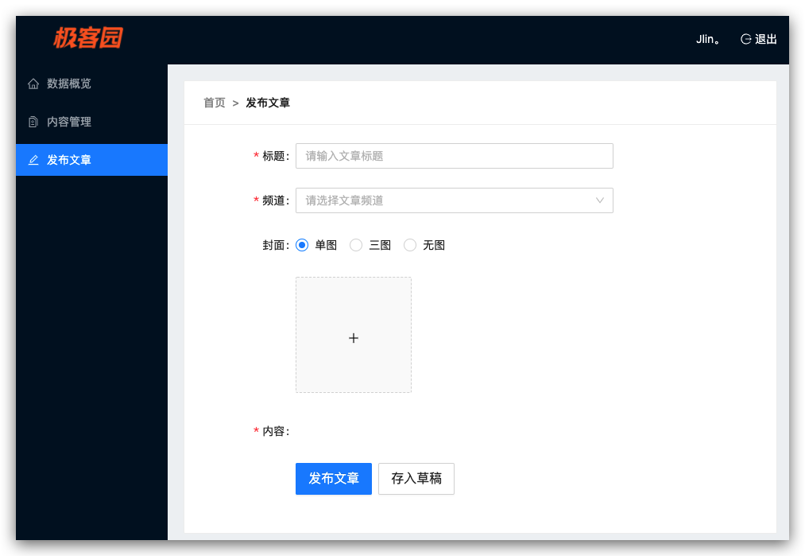
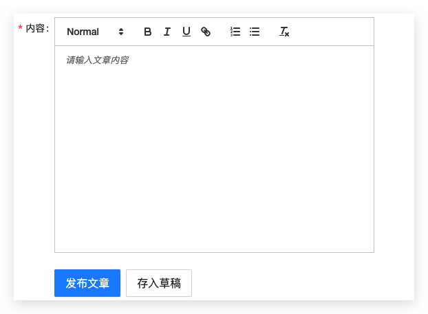

# 极客园PC项目【发布文章】

## 01-基本结构

**目标**：能够搭建发布文章页面的基本结构



**步骤**：

1. 使用 Card、Form 组件搭建基本页面结构
2. 创建样式文件，对样式做调整

**核心代码**：

pages/Publish/index.js 中：

```jsx
import {
  Card,
  Breadcrumb,
  Form,
  Button,
  Radio,
  Input,
  Upload,
  Space,
  Select
} from 'antd'
import { PlusOutlined } from '@ant-design/icons'
import { Link } from 'react-router-dom'
import styles from './index.module.scss'

const { Option } = Select

const Publish = () => {
  return (
    <div className={styles.root}>
      <Card
        title={
          <Breadcrumb separator=">">
            <Breadcrumb.Item>
              <Link to="/home">首页</Link>
            </Breadcrumb.Item>
            <Breadcrumb.Item>发布文章</Breadcrumb.Item>
          </Breadcrumb>
        }
      >
        <Form
          labelCol={{ span: 4 }}
          wrapperCol={{ span: 16 }}
          initialValues={{ type: 1 }}
        >
          <Form.Item
            label="标题"
            name="title"
            rules={[{ required: true, message: '请输入文章标题' }]}
          >
            <Input placeholder="请输入文章标题" style={{ width: 400 }} />
          </Form.Item>
          <Form.Item
            label="频道"
            name="channel_id"
            rules={[{ required: true, message: '请选择文章频道' }]}
          >
            <Select placeholder="请选择文章频道" style={{ width: 400 }}>
              <Option value={0}>推荐</Option>
            </Select>
          </Form.Item>

          <Form.Item label="封面">
            <Form.Item name="type">
              <Radio.Group>
                <Radio value={1}>单图</Radio>
                <Radio value={3}>三图</Radio>
                <Radio value={0}>无图</Radio>
                {/* <Radio value={-1}>自动</Radio> */}
              </Radio.Group>
            </Form.Item>
            <Upload
              name="image"
              listType="picture-card"
              className="avatar-uploader"
              showUploadList
            >
              <div style={{ marginTop: 8 }}>
                <PlusOutlined />
              </div>
            </Upload>
          </Form.Item>
          <Form.Item
            label="内容"
            name="content"
            rules={[{ required: true, message: '请输入文章内容' }]}
          ></Form.Item>

          <Form.Item wrapperCol={{ offset: 4 }}>
            <Space>
              <Button size="large" type="primary" htmlType="submit">
                发布文章
              </Button>
              <Button size="large">存入草稿</Button>
            </Space>
          </Form.Item>
        </Form>
      </Card>
    </div>
  )
}

export default Publish
```

pages/Publish/index.module.scss 中：

```scss
.root {
  position: relative;
 	
  :global {
    .ant-upload-list {
      .ant-upload-list-picture-card-container,
      .ant-upload-select {
        width: 146px;
        height: 146px;
      }
    }  
  }
}
```

## 02-富文本编辑器

**目标**：能够富文本编辑器



**步骤**：

1. 安装富文本编辑器：`yarn add react-quill`
2. 导入富文本编辑器**组件以及样式文件**
3. 渲染富文本编辑器组件
4. 通过 Form 组件的 initialValues 为富文本编辑器设置初始值，否则会报错
5. 调整富文本编辑器的样式

**核心代码**：

pages/Publish/index.js 中：

```diff
+ import ReactQuill from 'react-quill'
+ import 'react-quill/dist/quill.snow.css'

const Publish = () => {
  return (
    // ...
    <Form
      labelCol={{ span: 4 }}
      wrapperCol={{ span: 16 }}
-      // 注意：此处需要为富文本编辑表示的 content 文章内容设置默认值（报错）
+      initialValues={{ content: '' }}
    >
      <Form.Item
        label="内容"
        name="content"
        rules={[{ required: true, message: '请输入文章内容' }]}
      >
+        <ReactQuill
+          className="publish-quill"
+          theme="snow"
+         placeholder="请输入文章内容"
+       />
      </Form.Item>
    </Form>
  )
}
```

pages/Publish/index.module.scss 中：

```scss
:global {
  .publish-quill {
    .ql-editor {
      height: 300px;
    }
  }
}
```

## 03-封装频道组件

**目标**：能够封装频道组件实现内容管理和发布文章页面的复用

**分析说明**：

我们封装的 Channel 组件是需要配合 Form.Item 来使用的，所以，必须遵循 Form 自定义组件的规则

- Form 自定义组件的规则：为组件提供 value 和 onChange 属性，让其作为 Form.Item 的**受控组件**
- 参考：[antd Form 自定义组件](https://ant-design.gitee.io/components/form-cn/#components-form-demo-customized-form-controls)

**步骤**：

1. 在 src/components 目录中创建 Channel/index.js 文件
2. 将内容管理页面中与频道相关的逻辑拷贝到该组件中
3. 为 Channel 组件提供 value 和 onChange 属性来实现配合 Form.Item 使用
4. 使用 value 作为选中值
5. 使用 onChange 来处理选中项切换
6. 在内容管理和发布文章页面复用该组件

**核心代码**：

src/components/Channel/index.js 中：

```jsx
import { Select } from 'antd'
import { useDispatch, useSelector } from 'react-redux'

const { Option } = Select

const Channel = ({ value, onChange, width = 400 }) => {
  const dispatch = useDispatch()
  const { channels } = useSelector(state => state.article)

  useEffect(() => {
    dispatch(getChannels())
  }, [dispatch])

  return (
    <Select
      placeholder="请选择文章频道"
      style={{ width }}
      value={value}
      onChange={onChange}
    >
      {channels.map(item => (
        <Option key={item.id} value={item.id}>
          {item.name}
        </Option>
      ))}
    </Select>
  )
}

export default Channel
```

pages/Article/index.js 中：

```jsx
import Channel from '@/components/channel'

const Article = () => {
  return (
    // ...
    <Form.Item label="频道" name="channel_id">
      <Channel />
    </Form.Item>
  )
}
```

pages/Publish/index.js 中：

```jsx
import Channel from '@/components/channel'

const Publish = () => {
  return (
    // ...
    <Form.Item
      label="频道"
      name="channel_id"
      rules={[{ required: true, message: '请选择文章频道' }]}
    >
      <Channel width={200} />
    </Form.Item>
  )
}
```

## 04-上传封面

**目标**：能够实现上传封面图片

**分析说明**：

[参考文档：Upload 完全控制的上传列表](https://ant-design.gitee.io/components/upload-cn/#components-upload-demo-fileList)

```jsx
// Upload 组件说明：
<Upload
  className="avatar-uploader"
  // 发到后台的文件参数名
  // 必须指定，根据接口文档的说明，需要设置为 image
  name="image"
  // 上传组件展示方式
  listType="picture-card"
  // 展示已上传图片列表
  showUploadList
  // 接口地址
  // 注意：Upload 再上传图片时，默认不会执行 axios 的请求，所以，此处需要手动设置完整接口地址
  action="http://geek.itheima.net/v1_0/upload"
  // 多选
	multiple
  // 已经上传的文件列表，设置该属性后组件变为 受控
  fileList={fileList}
  // 上传文件改变时的回调
  onChange={onUploadChange}
>
  <div style={{ marginTop: 8 }}>
    <PlusOutlined />
  </div>
</Upload>
```

**步骤**：

1. 为 Upload 组件添加 action 属性，指定封面图片上传接口地址
2. 根据接口文档，给 Upload 组件添加 name 属性，值为：image（注意：不加该 name 属性会报错！）
3. 创建状态 fileList 存储已上传封面图片地址，并设置为 Upload 组件的 fileList 属性值
4. 为 Upload 添加 onChange 属性，监听封面图片上传、删除等操作
5. 在 change 事件中拿到当前图片数据，并存储到状态 fileList 中

**核心代码**：

pages/Punlish/index.js 中：

```jsx
import { useState } from 'react'

const Publish = () => {
  const [fileList, setFileList] = useState([])

  const onUploadChange = info => {
    // info.fileList 用来获取当前的文件列表
    const fileList = info.fileList.map(file => {
      // 刚从本地上传的图片
      if (file.response) {
        return {
          url: file.response.data.url
        }
      }
      // 已有图片
      return file
    })
    setFileList(fileList)
  }

  return (
    // ...
    <Upload
      name="image"
      listType="picture-card"
      className="avatar-uploader"
      showUploadList
      action="http://geek.itheima.net/v1_0/upload"
			multiple
      fileList={fileList}
      onChange={onUploadChange}
    >
      <div style={{ marginTop: 8 }}>
        <PlusOutlined />
      </div>
    </Upload>
  )
}
```

## 05-控制封面数量

**目标**：能够控制封面上传数量

**分析说明**：利用 Upload 组件的 maxCount 属性来实现控制功能

**步骤**：

1. 创建状态 maxCount
2. 给 Radio 添加 onChange 监听单图、三图、无图的切换事件
3. 在切换事件中修改 maxCount 值
4. 只在 maxCount 不为零时展示 Upload 组件
5. 修改 Upload 组件的 maxCount、multiple 属性

**核心代码**：

pages/Publish/index.js 中：

```diff
const Publish = () => {
+  const [maxCount, setMaxCount] = useState(1)

+  const changeType = e => {
    const count = e.target.value
    setMaxCount(count)
+  }

  return (
    // ...
    <Form.Item label="封面">
      <Form.Item name="type">
+        <Radio.Group onChange={changeType}>
          <Radio value={1}>单图</Radio>
          <Radio value={3}>三图</Radio>
          <Radio value={0}>无图</Radio>
        </Radio.Group>
      </Form.Item>

+      {maxCount > 0 && (
        <Upload
          name="image"
          listType="picture-card"
          className="avatar-uploader"
          showUploadList
          action="http://geek.itheima.net/v1_0/upload"
+          maxCount={maxCount}
+          multiple={maxCount > 1}
        >
          <div style={{ marginTop: 8 }}>
            <PlusOutlined />
          </div>
        </Upload>
      )}
    </Form.Item>
  )
}
```

## 06-动态切换封面数量

**目标**：能够实现动态切换封面数量

**分析说明**：

问题：如果当前有 3 张图，选择单图只显示一张（3张 -> 1张），再切换到三图继续显示三张（1张 -> 3张），该如何实现？

回答：通过 ref 存储所有图片，需要几张就展示几张（也就是把 ref 当仓库，用多少拿多少）

**步骤**：

1. 通过 `useRef` hook 创建 ref 对象，在上传图片时，存储所有已上传图片
2. 如果是单图，只展示第一张图片
3. 如果是三图，展示所有图片

**核心代码**：

pages/Publish/index.js 中：

```diff
import { useRef } from 'react'

const Publish = () => {
+  const fileListRef = useRef([])

  const changeType = e => {
    const count = e.target.value
    setMaxCount(count)

+    if (count === 1) {
      // 单图，只展示第一张
      const firstImg = fileListRef.current[0]
      setFileList(firstImg === undefined ? [] : [firstImg])
+    } else if (count === 3) {
      // 三图，展示所有图片
      setFileList(fileListRef.current)
+    }
  }

  // 上传图片时，将所有图片存储到 ref 中
  const onUploadChange = info => {
    // ...
+    fileListRef.current = fileList
  }
}
```

## 07-组装表单提交数据

**目标**：能够在表单提交时组装表单数据

**步骤**：

1. 给 Form 表单添加 onFinish 用来获取表单提交数据
2. 在事件处理程序中，拿到表单数据按照接口需要格式化数据

**核心代码**：

pages/Publish/index.js 中：

```js
import { message } from 'antd'

const Publish = () => {
  const onFinish = async (values) => {
    // 说明：如果选择 3 图，图片数量必须是 3 张，否则，后端会当做单图处理
    //      后端根据上传图片数量，来识别是单图或三图
    if (values.type !== fileList.length)
      return message.warning('封面数量与所选类型不匹配')

    const { type, ...rest } = values
    const data = {
      ...rest,
      // 注意：接口会按照上传图片数量来决定单图 或 三图
      cover: {
        type,
				images: fileList.map(item => item.url)
      }
    }
  
    console.log('接口需要的数据格式：', data)
  }
}
```

## 08-提交数据-发布文章

**目标**：能够提交数据并跳转内容管理页面

**步骤**：

1. 在组装表单提交数据后，分发提交数据的异步 action
2. 在 action 中拿到数据并发送请求
3. 提交数据后，跳转到内容管理页面

**核心代码**：

pages/Publish/index.js 中：

```js
import { useDispatch } from 'react-redux'
import { useHistory } from 'react-router-dom'
import { updateArticle } from '@/store/actions'

const Publish = () => {
  const onFinish = async () => {
    // ...

    try {
      await dispatch(updateArticle(data))

      message.success('发布成功', 1, () => {
        history.push('/home/article')
      })
    } catch {}
  }
}
```

actions/article.js 中：

```js
export const updateArticle = (data) => {
  return async () => {
    await http.post('/mp/articles?draft=false', data)
  }
}
```

## 09-存入草稿-获取表单数据

**目标**：能够在点击存入草稿时获取到表单数据

**分析说明**：

如果要在非提交按钮中获取到表单数据，需要通过调用 Form 的实例方法来实现。有两个方法：
1. `getFieldsValue()` 仅获取表单数据，不进行表单校验
2. `validateFields()` 先**进行表单校验，再获取表单数据**【此处，使用该方法】
- 存入草稿功能类似于发布文章，只是 draft 参数值为 true。因此，可以复用发布文章的逻辑

**步骤**：

1. 通过 `Form.useForm()` 创建表单的控制实例
2. 将创建好的实例，设置为 Form 的 form 属性值
3. 为存入草稿按钮绑定点击事件
4. 在事件中，调用表单的 validateFields 方法，先进行表单校验再获取表单值

**核心代码**：

pages/Publish/index.js 中：

```diff
const Publish = () => {
  // 创建表单实例
  // 注意：此处的 form 是从数组中解构出来的
+  const [form] = Form.useForm()

+  const saveDraft = async () => {
    try {
      const values = await form.validateFields()

      console.log(values)
    } catch {}
+  }

  return (
    <Form
+      form={form}
    >
      <Button size="large"
+        onClick={saveDraft}>
        存入草稿
      </Button>
    </Form>
  )
}
```

## 10-存入草稿-提交数据

**目标**：能够实现存入草稿功能

**分析说明**：存入草稿功能类似于发布文章，只是 draft 值为true。所以，可以复用发布文章的逻辑

**步骤**：

1. 封装方法 publishArticle，该方法有两个参数：1 表单数据 2 类型（发布 or 草稿）
2. 在该方法中实现封面图片判断、表单数据格式处理、action 分发等功能
3. 复用该方法，即在发布文章或存入草稿时，传入相应参数调用

**核心代码**：

pages/Publish/index.js 中：

```js
// 复用发布文章
const saveArticles = async (values, saveType) => {
  if (values.type !== fileList.length)
    return message.warning('封面数量与所选类型不匹配')

  const { type, ...rest } = values

  const data = {
    ...rest,
    cover: {
      type,
      // images: fileList
      images: fileList.map(item => item.url)
    }
  }

  try {
    // true 草稿
    // false 正常发布
    await dispatch(updateArticle(data, saveType === 'add'))

    const showMsg = saveType === 'add' ? '发布成功' : '存入草稿成功'
    message.success(showMsg, 1, () => {
      history.push('/home/article')
    })
  } catch {}
}
```

```diff
const onFinish = values => {
+ saveArticles(values, 'add')
}

const saveDraft = async () => {
  try {
    const values = await form.validateFields()
+   saveArticles(values, 'draft')
  } catch {}
}
```

actions/article.js 中：

```diff
+ export const updateArticle = (data, draft) => {
  return async () => {
+   await http.post(`/mp/articles?draft=${draft ? 'false' : 'true'}`, data)
  }
}
```

## 12-编辑文章-展示编辑文章文案

**目标**：能够在编辑文章时展示编辑文章时的文案

**分析说明**：

通过路由的 `useParams` hook 可以拿到路由参数

**步骤**：

1. 通过路由参数拿到文章id
2. 根据文章 id 是否存在判断是否为编辑状态
3. 如果是编辑状态，展示编辑时的文案信息

**核心代码**：

pages/Publish/index.js 中：

```diff
+import { useParams } from 'react-router-dom'

const Publish = () => {
+  const params = useParams()
+  const isEdit = params.id !== undefined

  return (
    <Card
      title={
        <Breadcrumb separator=">">
          <Breadcrumb.Item>
            <Link to="/home">首页</Link>
          </Breadcrumb.Item>
          <Breadcrumb.Item>
+          {isEdit ? '修改文章' : '发布文章'}
          </Breadcrumb.Item>
        </Breadcrumb>
      }
    >
      // ...
      <Button size="large" type="primary" htmlType="submit">
+        {isEdit ? '修改文章' : '发布文章'}
      </Button>
  )
}
```

## 11-编辑文章-填充文章数据

**目标**：能够在编辑文章时在表单中展示文章数据

**分析说明**：

动态给表单设置数据，需要调用表单的实例方法：`setFieldsValue()`

**步骤**：

1. 判断文章 id 是否存在，如果存在就根据 id 获取文章详情数据
3. 格式化文章数据，展示在表单中

**核心代码**：

pages/Publish/index.js 中：

```js
import { http } from '@/utils' 

useEffect(() => {
    const loadData = async () => {
      if (!isEdit) return
      // 编辑
      try {
        // 获取文章信息
        const res = await http.get(`/mp/articles/${articleId}`)
        const {
          id,
          title,
          channel_id,
          content,
          cover: { type, images },
        } = res.data
        // 文章数据
        const article = {
          id,
          title,
          channel_id,
          content,
          type,
          images,
        }
        const { images: imgs, ...formValue } = article
        // 动态设置表单数据
        form.setFieldsValue(formValue)

        // 格式化封面图片数据
        const imageList = imgs.map((item) => ({ url: item }))
        setFileList(imageList)
        setMaxCount(formValue.type)
        fileListRef.current = imageList
      } catch {}
    }
    // 执行
    loadData()
  }, [articleId, isEdit, form])
```

## 12-编辑文章-编辑或存入草稿

**目标**：能够在编辑文章时对文章进行修改或存入草稿

**分析说明**：

- 编辑时修改文章或存入草稿的功能，类似于发布时的发布和存入草稿
- 因此，也可以继续复用之前的逻辑

**核心代码**：

pages/Publish/index.js 中：

```diff
const saveArticles = async (values, saveType) => {
  if (values.type === 3 && fileList.length !== 3)
    return message.warning('封面数量不为3张')

  const { type, ...rest } = values

  const data = {
    ...rest,
    cover: {
      type,
      images: fileList
    }
  }

-  // 如果是编辑，就将 id 存储到 data 中，传递给接口
+  if (isEdit) {
    data.id = params.articleId
+  }

  try {
    // 注意：此处为 action 加入第三个参数，表示是否是编辑
    await dispatch(updateArticle(data, saveType === 'add',
+ isEdit))

+    const text = isEdit ? '修改' : '发布'
+    const showMsg = saveType === 'add' ? `${text}成功` : '存入草稿成功'
    message.success(showMsg, 1, () => {
      history.push('/home/article')
    })
  } catch {}
}
```

actions/article.js 中：

```diff
export const updateArticle = (data, draft, isEdit) => {
  return async () => {
+    if (isEdit) {
-      // 编辑
+      await http.put(
+        `/mp/articles/${data.id}?draft=${draft ? 'false' : 'true'}`,
+        data
+      )
    } else {
      // 发布
      await http.post(`/mp/articles?draft=${draft ? 'false' : 'true'}`, data)
    }
  }
}
```

## 第四天


