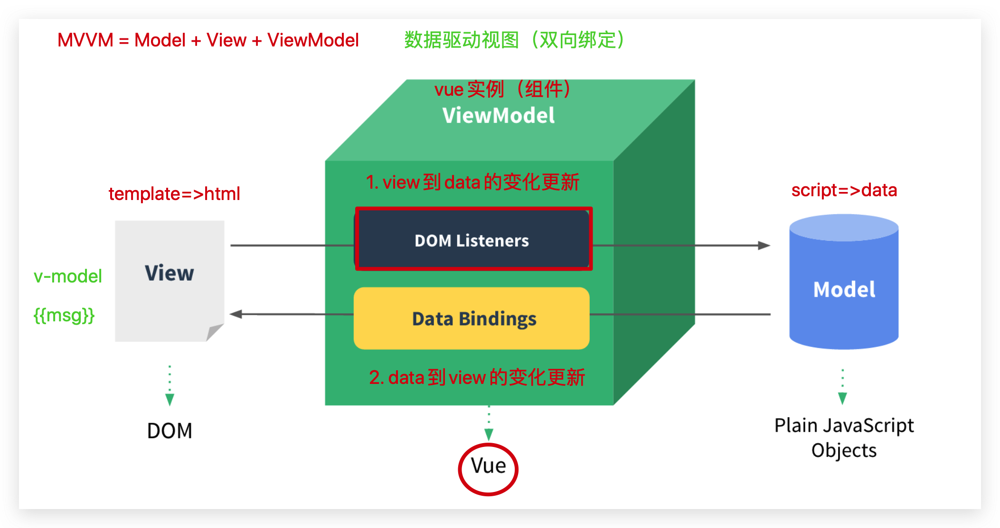
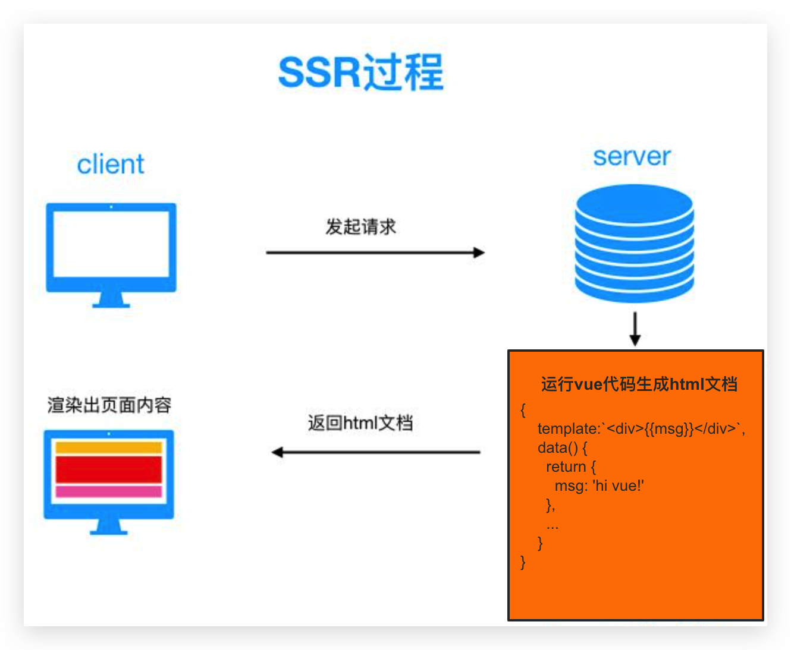

# Vue进阶

* [x] 能够说出vue数据驱动视图的原理
* [x] 能够说出defineProperty的作用
* [x] 能够说出服务端渲染和客户端渲染的区别
* [x] 理解Nuxt.js的作用
* [x] 能够理解asyncData的作用

**内容介绍**

1. MVVM（Vue）实现原理（2天）
   * Object.defineProperty()方法的使用

   * 发布订阅模式=》eventBus=>事件总线

   * 实现MVVM框架
2. SSR（server side render）服务端渲染（1天）
   * nuxt框架实现服务端渲染


**阶段说明** 

1. 本阶段**MVVM和SSR**部分的内容相对抽象、不易理解=》面试造火箭，工作拧螺丝
2. 本阶段不要求掌握编码,但需要用自己的语言将内容进行描述
3. 本阶段要求对Vue基本使用非常熟练


> 本阶段的内容**MVVM**部分在面试环节Vue部分属于重点项、必问点，常见的面试问题:

- Vue 数据绑定的原理？
- MVVM 数据绑定的原理？
- Vue 双向数据绑定的原理？
- Vue 数据响应式原理？
- 数据响应式原理？
- 数据驱动视图的原理?

> 服务端渲染SSR面试常问：

* 什么是SSR？
* 什么是同构应用？
* vue为什么做SSR？
* SSR和CSR渲染的区别？


# vue原理

## 01-MVVM-介绍和演示

MVVM是设计模式或架构思想=》前人总结的经验=》vue基于它做了实现


详细说明：



- Model（M）：普通的 JavaScript 对象，例如 Vue 实例中的 data
  - 响应数据
- View（V）：视图 template
  - HTML DOM 模板 #app
- ViewModel（VM）：Vue实例
  - 负责数据和视图的更新
  - 它是 Model数据 和 View 视图通信的一个桥梁（大脑中枢）
- 简单一句话：**数据驱动视图**

演示效果：`02-其它资源/vue.html`

```html
  <div id="app">
    <h1>{{msg}}</h1>
    <p>
      <input type="text" v-model="msg">
    </p>
  </div>

  <!-- vue.js cdn -->
  <script src="https://cdn.jsdelivr.net/npm/vue/dist/vue.js"></script>
  <script>
    var vm = new Vue({
      el: '#app',
      data: {
        msg: 'hello vue!'
      }
    })
    console.log('vm实例：', vm)
  </script>
```

> 研究原理的套路

1. 玩明白  vue.js
2. 分析特点  重点vm实例


## 02-MVVM-数据响应式原理-介绍

**问题**：当你修改data中定义的数据时，视图会进行更新=》重新渲染，展示最新数据=》怎么做到的？

* Vue怎么知道咱们改了data数据？=> 通过Object.defineProperty对data中所有数据进行劫持

例子：this.msg = 'newVal' 修改data中数据 =》劫持到数据的变更=》刷新视图

扩展阅读：[Vue文档说明](https://cn.vuejs.org/v2/guide/reactivity.html) 


**结论：**Vue的MVVM的实现原理包含以下几部分：

1. Object.defineProperty()方法->[MDN文档](https://developer.mozilla.org/zh-CN/docs/Web/JavaScript/Reference/Global_Objects/Object/defineProperty)

2. js**发布订阅模式**: 在数据变化时->通知多个绑定数据的位置更新视图

## 03-Object.defineProperty()-基本使用

- 作用： `Object.defineProperty()` 方法会直接在一个对象上定义一个新属性，或者修改一个对象的现有属性，劫持 并返回这个对象。
- 语法：Object.defineProperty(obj, prop, descriptor)
  - 形参1: 被操作的对象
  - 形参2:新属性或者现有属性
  - 形参3:属性描述符
  - 返回值:返回被操作的对象
- **注意**：
  - value和get/set不能同时进行设置
  - 获取/设置属性值不能直接使用=》**被设置对象**，避免进入死循环

```js
const per = {
  name: 'zs'
}

var _age = 1000
const per1 = Object.defineProperty(per, 'age', {
  // value: 200,
  set(age) {
    _age = age
  },
  get() {
    return _age
  }
})
per1.age = 2000
console.log(per1.age);
```

**结论**：当访问对象的属性时,会调用属性的get方法；当为对象的属性设置值时,会调用属性的set方法


## 04-Object.defineProperty()-模拟vm对象

目的: 利用Object.defineProperty()模拟Vue中的**Vue实例化对象的效果**	

核心:把data的数据挂到vm对象上,直接访问vm.数据名字可以调用对应的set/get方法

```js
const data = {
    msg: 'abc'
}
// 组件实例
const vm = {}

Object.defineProperty(vm, 'msg', {
    get() {
        console.log('get');

        return data.msg
    },
    set(value) {
        console.log('set');
        data.msg = value
    }
})

console.log(vm);
```

说明：虽然没有完全遵循 [MVVM 模型](https://zh.wikipedia.org/wiki/MVVM)，但是 Vue 的设计也受到了它的启发。因此在文档中经常会使用 `vm` (ViewModel 的缩写) 这个变量名表示 Vue 实例。


## 05-Object.defineProperty()-可枚举

目的: 利用属性描述符中的**enumerable**选项设置属性是否可以被遍历访问

代码：

```js
 const data = {
   msg: 'abc'
}

 const vm = {}

 Object.defineProperty(vm, 'msg', {
   enumerable: true,
   get() {
     console.log('get');
     return data.msg
   },
   set(value) {
     console.log('set');
     data.msg = value
   }
 })

// console.log(vm);
for (const key in vm) {
  console.log(key);
}
```


## 06-Object.defineProperty()-可配置和严格模式

目的:利用属性描述符中的**configurable**选项设置属性是否可以被delete删除

代码

```js
'use strict';

const data = {
  msg: 'abc'
}

const vm = {}

Object.defineProperty(vm, 'msg', {
  configurable: true,
  enumerable: true,
  get() {
    console.log('get');
    return data.msg
  },
  set(value) {
    console.log('set');
    data.msg = value
  }
})

delete vm.msg
// console.log(vm);
for (const key in vm) {
  console.log(key);
}
```

注意：js可以开启严格模式'use strict' [MDN文档](https://developer.mozilla.org/zh-CN/docs/Web/JavaScript/Reference/Strict_mode)


## 07-Object.defineProperty()-可写性

目的:利用属性描述符中的**writable** 选项设置属性是否可写,可以被修改

代码

```js
 'use strict';

const data = {
  msg: 'abc'
}

const vm = {}

Object.defineProperty(vm, 'msg', {
  configurable: true,
  enumerable: true,
  value: data.msg,
  writable: false
})

vm.msg = '新值'
console.log(vm);

```

注意⚠️：

1. writable和访问器(set/get)无法同时设置
2. 如果被劫持对象
   * 默认定义过被劫持属性=>writable默认值true
   * 默认没有定义过被劫持属性（新增）=》writable默认值false

  

## 08-Object.defineProperty()-总结

* 作用1：为对象增加/现有属性做控制（劫持）

* 作用2：为属性添加访问控制

  * 取值->get()

  * 改值->set(newVal)

**结论**: 

1. 模拟vm的结构=>把组件data中定义的数据，放到组件实例vm中做劫持 
2. 修改数据时,执行set->**更新视图**


## 09-发布订阅模式的介绍和基础实现

> 设计模式: 前人总结的经验,用于开发

介绍：Vue的MVVM原理实现中,当数据变化时,要**通知多个位置更新视图**,所以我们可以使用设计模式->发布订阅模式来实现->eventBus

核心用法:

- 监听/注册一个自定义事件 bus.$on('事件类型',处理函数)
- 发布事件 bus.$emit('事件类型',参数)

> 基础实现

准备：简单回顾es5类(构造函数)的创建和继承

步骤：

1. 创建EventEmitter构造函数
2. 注册原型方法\$on和\$emit

代码：

```js
// 注册事件(订阅消息)
// bus.on('click',fn1)
// bus.on('mouseover',fn2)
// bus.on('xxoo',fn3)
// 把多个事件类型和事件处理函数进行保存


// 触发事件(发布消息)
// bus.$emit('click',1)
// bus.$emit('mouseover',2)
// bus.$emit('xxoo',3)
// 把多个事件类型进行取出,并且执行事件处理函数


// 使用构造函数进行封装
function EventEmitter() {

}

EventEmitter.prototype.$on = function() {

}

EventEmitter.prototype.$emit = function() {

}
```


## 10-发布订阅模式的实现-$on

> 实现$on订阅事件方法

步骤：

1. 在EventEmitter中初始化实例属性subs，存储事件队列=》设计数据结构
2. 完善原型$on方法=》向subs中添加订阅事件

```js
// 使用构造函数进行封装
function EventEmitter() {
  // 事件队列：数据结构
  // {'click':[fn1,fn2,...],'mouseover':[fn1,fn2,...]}
  this.subs = {}
}

// 注册事件=>保存事件方法
// click , fn
EventEmitter.prototype.$on = function(eventType, handler) {
  // // subs ---> {click:[fn1]}
  // if (this.subs[eventType]) {
  //     this.subs[eventType].push(handler)
  // } else {
  //     // sub2 ---> {}
  //     this.subs[eventType] = []
  //     this.subs[eventType].push(handler)
  // }
  this.subs[eventType] = this.subs[eventType] || []
  this.subs[eventType].push(handler)
}
```


## 11-发布订阅模式的实现-$emit

> 实现事件发布$emit方法

步骤：

1. 从事件队列subs中获取某个事件
2. 如果存在，执行对应事件的所有订阅方法
3. 创建EventEmitter实例测试

```js
EventEmitter.prototype.$emit = function(eventType) {
    if (this.subs[eventType]) {
        this.subs[eventType].forEach((handler) => {
            handler()
        })
    }
}

// 测试
const em = new EventEmitter()
em.$on('a', function() {
    console.log('---a');
})
em.$on('b', function() {
    console.log('---b');
})
em.$on('c', function() {
    console.log('---c');
})
em.$emit('a')
em.$emit('b')
em.$emit('c')

```

## 12-发布订阅模式的实现-$emit-参数

> $emit事件分发时，传递参数给订阅事件函数

* 传递多个参数es5的形式

```js
 EventEmitter.prototype.$emit = function(eventType, a,b) {
            if (this.subs[eventType]) {
                this.subs[eventType].forEach((handler) => {
                    handler(a,b)
                })
            }
        }
```

* 传递多个参数es6的形式=》...args=>合并参数

```js
 EventEmitter.prototype.$emit = function(eventType, ...rest) {
            if (this.subs[eventType]) {
                this.subs[eventType].forEach((handler) => {
                    handler(...rest)
                })
            }
        }
```

说明：这里用到了ES6语法=>接收**剩余参数**...rest


## 13-发布订阅模式的实现-$emit-this问题

目的：我们希望$on事件触发时的this是em实例化对象

```diff
EventEmitter.prototype.$emit = function(eventType, ...rest) {
            if (this.subs[eventType]) {
                this.subs[eventType].forEach((handler) => {
-                    handler(...rest)
+                    handler.call(this, ...rest)
                })
            }
        }
```

* 这里用到了call方法修改函数内部的this指向

* this指向用法总结

1. 如果函数调用时,前面没东西->独立调用: this=>window （口诀：函数体内this是由调用者决定）
2. obj.fn()   this=》obj
3. bind/call/apply =》eg：fn.call(obj)   this->obj（普通函数）
4. new Fn()   this->实例对象

注意：箭头函数忠贞不渝（不能被改变this执行）=》this指向由外边第一层


## 14-发布订阅模式的实现-总结

> 发布订阅：一个发布者，多个订阅者（一个订阅者对应一个回调函数）

```js
// 注册事件(订阅消息)
// bus.on('click',fn1)
// bus.on('mouseover',fn2)
// bus.on('xxoo',fn3)
// 把多个事件类型和事件处理函数进行保存


// 触发事件(发布消息)
// bus.$emit('click',1)
// bus.$emit('mouseover',2)
// bus.$emit('xxoo',3)
// 把多个事件类型进行取出,并且执行事件处理函数


// 使用构造函数进行封装
function EventEmitter() {
    // {'click':[fn1,fn2,...],'mouseover':[fn1,fn2,...]}
    this.subs = {}
}

// 注册事件
// click , fn
EventEmitter.prototype.$on = function(eventType, handler) {
    this.subs[eventType] = this.subs[eventType] || []
    this.subs[eventType].push(handler)
}


EventEmitter.prototype.$emit = function(eventType, ...rest) {
    if (this.subs[eventType]) {
        this.subs[eventType].forEach((handler) => {
            handler.call(this, ...rest)
        })
    }
}

const em = new EventEmitter()
em.$on('a', function(...rest) {
    console.log('---a', rest);
})
em.$on('b', function() {
    console.log('---b');
})
em.$on('c', function() {
    console.log('---c', this);
})

// em.$emit('a', 100, 1, 2, 3, 4)
// em.$emit('b', 200)
em.$emit('c', 300)
```

**结论**：利用发布订阅模式可以实现当事件触发时会通知到很多人去做事情,Vue响应式中做的事情是更新DOM


## 15-MVVM实现-需求分析和初始代码

> 实现简易版本vue（mvvm）

需求：

1. 初始化（new）构造器，传入配置项参数=》挂载点选择符el和data数据
2. 设置data的数据响应=》Object.defineProperty
3. 模版编译：
   * 数据绑定显示到模版
   * 数据变化反应到模版<=>模版变化反应到数据（双向绑定）

**目标**：**了解mvvm的思想和基本实现过程**

步骤：

1. 创建练习使用的页面vue.html
2. 创建入口容器div#app
3. 创建Vue构造函数
4. 初始化Vue实例，传入测试参数el和data项

演示效果：`02-其它资源/vue.html`

思想：**数据驱动视图**

```html
<body>
  <div id="app"></div>


  <!-- 实现 -->
  <script>
    function Vue(options) {

    }

  </script>
  <!-- 使用 -->
  <script>
    var vm = new Vue({
      el:'#app',
      data:{
        msg:'hello vue!'
      }
    })
  </script>
</body>
```


## 16-MVVM实现-数据拦截

> 实现数据拦截构造器

需求：把传入的配置项data数据挂载到vm上并做拦截处理=》`vm.数据=值`响应式

步骤：

1. 创建Observer构造函数，传入vm和data
2. 枚举data对象，在vm实例上添加data的所有属性，为每一个data属性设置属性劫持控制
   * 添加Observer的原型方法defineReactive，单独处理data对象key的劫持设置

```diff
function Vue(options) {
+  // 数据拦截
+  new Observer(options.data, this)
}
```

```js
    /**
     * 数据拦截构造器：Observer	
     * data 拦截数据
     * vm vue实例
     */
    function Observer(data, vm) {
      Object.keys(data).forEach((key) => {
        this.defineReactive(vm, key, data)
      })
    }
    // 对象的key设置拦截
    Observer.prototype.defineReactive = function (vm, key, data) {
      Object.defineProperty(vm, key, {
        get() {
          // val 相当于 data[key]用法
          return data[key]
        },
        set(newVal) {
          if (newVal === data[key]) return;
          // 参数val赋新值
          data[key] = newVal
        }
      })
    }
```

* 测试数据劫持

## 17-MVVM实现-模版编译-设计分析

> 编译模版，显示默认绑定的数据

需求：设置数据，绑定到模版，加载后显示到页面中 => 使用测试代码展示效果

分析：

1. 根据节点类型处理指令（v-model）
   * 节点类型：nodeType=>（1-元素节点   3-文本节点）
2. 根据节点类型处理**差值表达式**和**v-model指令**（{{data}} ｜ v-model="data"）

步骤：

1. 获取挂载点元素，存储到vm的$el属性
2. 创建构造函数Compiler，接收vm作为参数；在Compiler上添加$vm属性存储vm
3. Compiler添加原型方法compile，接收$el作为参数
4. 使用元素childNodes属性获取所有子节点，遍历和递归处理所有元素节点
   * node.nodeType = 1 =》元素节点 =〉定义编译元素节点方法并处理并递归
   * node.nodeType = 3 =》文本节点 =〉定义编译文本节点方法处理


* Compiler构造器

```diff
// vue构造器
function Vue(options) {
  // 处理挂载点元素
+  this.$el = document.querySelector(options.el)
  // 数据拦截
  new Observer(options.data, this)
  // 编译模版
+  new Compiler(this)
}
```

```js
    /**
     * 编译模版和数据
     * vm vue实例
     */
    function Compiler(vm) {
      this.$vm = vm
      // 编译模版
      this.compile(vm.$el)
    }
    // 模版编译
    Compiler.prototype.compile = function (el) {
      // 获取el下所有子节点
      el.childNodes.forEach((node) => {
        // 元素类型
        if (node.nodeType === 1) {
          // 处理元素节点
          this.compileElement(node)
          // 递归处理其它子节点
          node.childNodes.length && this.compile(node)
        }
        // 文本类型
        else if (node.nodeType === 3) {
          this.compileText(node)
        }
      })
    }
```

```js
// 处理元素节点
Compiler.prototype.compileElement = function (node) {}
// 处理文本节点
Compiler.prototype.compileText = function (node) {}
```

* 测试

```html
  <div id="app">
    <div>
      <p>{{msg}}</p>
      <div>
        <ul>
          <li>{{msg}}</li>
          <li>{{abc}}</li>
        </ul>
      </div>
    </div>
    <h1>{{msg}}</h1>
    <input type="text" v-model="msg">
  </div>
```

```js
<script>
  var vm = new Vue({
    el: '#app',
    data: {
      msg: 'hello vue!',
      abc: 100
    }
  })
</script>
```


## 18-MVVM实现-模版编译-元素节点

> 处理元素节点指令的数据绑定和显示

说明：

* 匹配指令：hasAttribute(key) =》获取指令值：getAttribute(key)

步骤：

1. 在编译节点方法compileElement中处理指令v-model
2. **获取绑定数据key，通过vm获取初始值，赋值给元素**
3. 移除元素上绑定的指令属性

```js
    // 处理元素节点
    Compiler.prototype.compileElement = function (node) {
      if (node.hasAttribute('v-model')) {
        // 获取v-model的绑定的数据key
        let _key = node.getAttribute('v-model')
        // 初始化显示默认值
        node.value = this.$vm[_key]

        // 移除绑定属性
        node.removeAttribute('v-model')
      }
    }
```


## 19-MVVM实现-模版编译-文本节点

> 处理差值表达式数据绑定和渲染显示

说明：

* 匹配差值表达式：`/\{\{(.*)\}\}/`

步骤：

1. 使用正则`/\{\{(.*)\}\}/`匹配文本节点的值，处理差值表达式中数据
2. 通过RegExp的$1属性获取绑定的数据key
3. 通过vm[key]获取值并给节点赋值

```js
// 处理文本节点
Compiler.prototype.compileText = function (node) {
  //匹配语法糖{{data}}
  const reg = /\{\{(.*)\}\}/
  if (reg.test(node.nodeValue)) {
    // 获取匹配到的绑定数据的key
    let _key = RegExp.$1.trim()
    // 初始化显示默认值
    node.nodeValue = this.$vm[_key]
  }
}
```

扩展阅读：关于[RegExp.$1](https://developer.mozilla.org/zh-CN/docs/Web/JavaScript/Reference/Global_Objects/RegExp/n)说明


## 20-MVVM实现-数据驱动视图

> 数据改变，视图刷新

说明：使用发布订阅模式，实现响应式

步骤：

1. 初始化事件管理器=》 继承EventEmitter

```diff
    // vue构造器
    function Vue(options) {
      // 处理挂载点元素
      this.$el = document.querySelector(options.el)
+      // 继承EventEmitter
+      EventEmitter.call(this)
      // 数据拦截
      new Observer(options.data, this)
      // 编译模版
      new Compiler(this)
    }
    
+    // 继承发布订阅
+    Vue.prototype = Object.create(EventEmitter.prototype, {
+     constructor: {
+        value: Vue
+      }
+    })
		
```

2. 触发事件=>约定以数据data的key做为自定义事件名称

```diff
    // 对象的key设置拦截
    Observer.prototype.defineReactive = function (vm, key, val) {
      Object.defineProperty(vm, key, {
        get() {
          return val
        },
        set(newVal) {
          if (newVal === val) return;
          // 参数val赋新值
          val = newVal
+          // 数据变化更新视图
+          vm.$emit(key, newVal)
        }
      })
    }
```

3. 订阅事件

```diff
// 处理元素节点
Compiler.prototype.compileElement = function (node) {
  if (node.hasAttribute('v-model')) {
    // 获取v-model的绑定的数据key
    let _key = node.getAttribute('v-model')
    // 初始化显示默认值
    node.value = this.$vm[_key]
+    // 订阅数据变化
+    this.$vm.$on(_key, (newVal) => {
+      node.value = newVal
+    })

    // 移除绑定属性
    node.removeAttribute('v-model')
  }
}
```

```diff
    // 处理文本节点
    Compiler.prototype.compileText = function (node) {
      //匹配语法糖{{data}}
      const reg = /\{\{(.*)\}\}/
      if (reg.test(node.nodeValue)) {
        // 获取匹配到的绑定数据的key
        let _key = RegExp.$1.trim()
        // 初始化显示默认值
        node.nodeValue = this.$vm[_key]
+        // 订阅数据变化
+        this.$vm.$on(_key, (newVal) => {
+          node.nodeValue = newVal
+        })
      }
    }
```

4. 控制台测试=>修改vm的data


## 21-MVVM实现-视图变化改变数据

> 实现双向绑定，用户输入数据后，改变vm中data的值

步骤：

1. 给input元素绑定oninput事件
2. 用户输入时修改vm中对应data的值

* compileElement()

```diff
    // 处理元素节点
    Compiler.prototype.compileElement = function (node) {
      if (node.hasAttribute('v-model')) {
        // 获取v-model的绑定的数据key
        let _key = node.getAttribute('v-model')
        // 初始化显示默认值
        node.value = this.$vm[_key]
        // 订阅数据变化
        this.$vm.$on(_key, (newVal) => {
          node.value = newVal
        })
+        // 处理视图变化
+        node.oninput = (e) => {
+          this.$vm[_key] = e.target.value
+        }

        // 移除绑定属性
        node.removeAttribute('v-model')
      }
    }
```

* 测试

## 22-MVVM实现-总结


**结论**：

1. Vue实例化时,会遍历 data 选项的属性，data数据通过**Observer处理数据监听**
2. 通过**发布订阅设计模式**（EventEmitter）收集和更新依赖


## 扩展-vue3用法和响应式

### 基本用法演示

说明：

Vue2/3框架用法对比和v2存在的问题：`02-其它资源/vue2vs3.html`

```js
    /**
     * vue2响应式存在的=》问题：
     * 数组：
     * 1. 当你修改数组的长度时，例如：vm.items.length = newLength
     * 2. 使用数组下标改变值时
     * 对象：
     * 1. 新增属性
     * 2. 删除属性
     */
```

扩展阅读：Vue [Composition Api](https://composition-api.vuejs.org/zh/api.html#setup)文档


### 响应式原理对比

说明：

响应原理对比：`02-其它资源/proxy.html`

* Vue2 响应式存在问题=》例如：无法追踪数组下标和长度的变化

```js
let objarr = { arr: [] }
let _arr = []
// 追踪/劫持对象
Object.defineProperty(objarr, 'arr', {
  // value: 28,
  // 通过get方法读取arr
  get () {
    console.log('通过get方法读取arr的值：')
    return _arr
  },
  // 通过set修改arr的值
  set (newVal) {
    console.log('要修改arr最新的值：', newVal)
    _arr = newVal
  }
})
```

* **Vue3解决了2版本存在的一些问题并做了性能和功能上的提升**

> Vue3.0 开始用 Proxy 代替 Object.defineProperty

window.Proxy定义：

- Proxy 对象用于定义基本操作的自定义行为（如属性查找、赋值、枚举、函数调用等）
- Proxy 用于修改某些操作的默认行为,也可以理解为在目标对象之前架设一层拦截,外部所有的访问都必须先通过这层拦截,因此提供了一种机制,可以对外部的访问进行过滤和修改

**语法**：`const p = new Proxy(target, handler)`

**参数**：`target` 就是你想要代理（追踪/劫持）的对象；而 `handler` 是一个函数对象，其中定义了所有你想替 `target` 代为管理的操作对象

```js
let arr = []
// 代理数组
let arrProxy = new Proxy(arr, {
  get: (target, prop) => {
    console.log('get value by proxy')
    return prop in target ? target[prop] : undefined
  },
  set: (target, prop, value) => {
    console.log('set value by proxy')
    target[prop] = value
    return true
  }
})
```


扩展：Proxy支持拦截的操作，一共有13种（了解）

- **get(target, propKey, receiver)**：拦截对象属性的读取，比如`proxy.foo`和`proxy['foo']`。
- **set(target, propKey, value, receiver)**：拦截对象属性的设置，比如`proxy.foo = v`或`proxy['foo'] = v`，返回一个布尔值。
- **has(target, propKey)**：拦截`propKey in proxy`的操作，返回一个布尔值。
- **deleteProperty(target, propKey)**：拦截`delete proxy[propKey]`的操作，返回一个布尔值。
- **ownKeys(target)**：拦截`Object.getOwnPropertyNames(proxy)`、`Object.getOwnPropertySymbols(proxy)`、`Object.keys(proxy)`、`for...in`循环，返回一个数组。该方法返回目标对象所有自身的属性的属性名，而`Object.keys()`的返回结果仅包括目标对象自身的可遍历属性。
- **getOwnPropertyDescriptor(target, propKey)**：拦截`Object.getOwnPropertyDescriptor(proxy, propKey)`，返回属性的描述对象。
  - **defineProperty(target, propKey, propDesc)**：拦截`Object.defineProperty(proxy, propKey, propDesc）`、`Object.defineProperties(proxy, propDescs)`，返回一个布尔值。
- **preventExtensions(target)**：拦截`Object.preventExtensions(proxy)`，返回一个布尔值。
- **getPrototypeOf(target)**：拦截`Object.getPrototypeOf(proxy)`，返回一个对象。
- **isExtensible(target)**：拦截`Object.isExtensible(proxy)`，返回一个布尔值。
- **setPrototypeOf(target, proto)**：拦截`Object.setPrototypeOf(proxy, proto)`，返回一个布尔值。如果目标对象是函数，那么还有两种额外操作可以拦截。
- **apply(target, object, args)**：拦截 Proxy 实例作为函数调用的操作，比如`proxy(...args)`、`proxy.call(object, ...args)`、`proxy.apply(...)`。
- **construct(target, args)**：拦截 Proxy 实例作为构造函数调用的操作，比如`new proxy(...args)`。

### 总结

> Vue 3.0 的 Proxy & Object.defineProperty

* Proxy
  * **代理方式**：**代理整个对象**，只需做一层代理就可以监听**同级**结构下的所有属性变化，包括新增属性和删除属性
  * **本质**：`Proxy` 本质上属于元编程非破坏性数据劫持，在原对象的基础上进行了功能的衍生而又**不影响原对象**，符合**松耦合高内聚**的设计理念

* Object.defineProperty
  * **劫持方式**：**只能劫持对象的属性**，不能直接代理对象
  * **流程**：get中进行依赖收集，set数据时通知订阅者更新
  * 存在的问题：通过为属性设置getter/setter 能够完成数据的响应式，但是它并不算是实现数据的响应式的完美方案，某些情况下需要对其进行修补或者hack，这也是它的缺陷，主要表现在两个方面：
    * 无法检测到对象属性的新增或删除
    * 不能监听数组某些情况的变化（下标/长度更改）


## 扩展-作业

需求：基于现有代码，实现点击事件绑定和处理

1. 模版中支持使用：v-on:click和@click语法绑定事件
2. 事件执行时可以获取event对象；执行的上下文this指向vm实例

```html
<body>
   <div id="app">
    <div>
      <h1 @click="handlerClick">{{msg}}</h1>
      <h1 v-on:click="handlerClick2">{{msg}}</h1>
      <div>
        <ul>
          <li>{{msg}}</li>
          <li>{{abc}}</li>
          <li>
            <p><span style="color:red">{{msg}}</span></p>
          </li>
        </ul>
      </div>
    </div>
    <h1>{{msg}}</h1>
    <input type="text" v-model="msg">
  </div> 
	
  <script src="./src/myVue.js"></script>
  
  <script>
    let vm = new Vue({
      el: '#app',
      data: {
        msg: 'hello vue!',
        abc: 100
      },
      methods: {
        handlerClick(e) {
          console.log(this.msg,e)
          this.msg = Math.random() * 100
        },
        handlerClick2() {
          console.log(this)
        }
      }
    })
  </script>  
</body>  
```


# SSR渲染

最早的时候服务端渲染=》完全是在后台

典型代表：

1. Java =》动态页面 =》.jsp（html+js+css+后台动态标记）=》渲染成html
2. Php => 动态页面 =》.php
3. c#(.net) => 动态页面 =》.asp

## 01-CSR演示和特点

[黑马头条项目演示](http://heima-project.gitee.io/toutiao-mobile/#/) 

Client Side Render (客户端渲染 **CSR)**

> 指完全在浏览器端，完成HTML结构和数据获取拼接工作，同时处理js交互和css样式，完成页面的渲染工作

* 表现/特点：

1. 页面初始加载的 HTML 文档中**无核心内容**
2. 需要下载执行 js 文件结合css，由**浏览器动态生成页面**，并通过 JS 进行页面交互事件与状态管理

- 优点：

  适合前后端分离开发，方便维护，单页应用中几乎都是客户端渲染

- 缺点：

1. **首次加载慢，不利于 SEO** （和浏览器表现有差异，**爬虫**不能获取有效内容）

2. 拼接数据的操作在客户端完成，Network中看不到完整Doc页面

> 提示: 其实我们学过服务端渲染.比如node的项目/案例-> 大量代码在服务器完成


## 02-SSR渲染的演示和特点

[Nuxt官网演示](https://zh.nuxtjs.org/guide/)

Server Side Render (服务端渲染 **SSR**)：



> 指由**服务端**完成页面的 HTML 结构和数据获取拼接的页面处理技术，发送到浏览器，然后为其绑定状态与事件，结合css渲染样式，最终成为完全可交互页面的过程。

* 表现/特点：

1. 服务器**直接生成完整 HTML**（已包含数据） 文档返回给浏览器
2. 但页面交互能力有限。适合于任何后端语言：PHP、Java、Python、NodeJs等

- 优点：

  响应速度快(首屏渲染速度快)，有利于 SEO

- 缺点：

  1. 前后端代码混合在一起，难以开发和维护，不适合进行**前后端分离开发**
  2. 页面交互能力有限，需要特别处理=》js处理事件绑定


## 03-扩展-关于SEO

> SEO概念

搜索引擎优化

搜索引擎背后支持：爬虫技术=》定期去互联网中抓取搜索内容，提供给搜索引擎使用

作用： **爬虫**爬取网站内容，提供给搜索引擎索引使用

爬虫：

* 不同爬虫工作原理类似，只会爬取源码（html），不会执行网站的任何脚本（Google除外，据说Googlebot可以运行javaScript）。使用了React或者其它MVVM框架之后，页面大多数DOM元素都是在客户端根据js动态生成（CSR），可供爬虫抓取分析的内容大大减少。另外，浏览器爬虫不会等待我们的数据完成之后再去抓取我们的页面数据。

* 服务端渲染返回给客户端的是已经获取了异步数据并执行JavaScript脚本的最终HTML，网络爬中就可以抓取到完整页面的信息。

1. curl命令（[可能需要下载支持](https://curl.haxx.se/download.html)）

`curl -v http://mengi.gitee.io/toutiao-mobile/#/`

2. node简单爬虫

```js
// 引入http模块
const http = require("http")

// 定义要爬虫程序 访问的 网页
// let url = "http://tools.jb51.net/#home"
let url = "http://www.itheima.com/"

// let url = "http://localhost:8080/index_ssr.html"

// 用http模块中的get方法去请求 url 这个网页，把请求到的结果显示出来。
http.get(url, (res) => {
  let result = ""
  res.setEncoding('utf8')
  res.on('data', (chunk) => {
    result += chunk
  })
  res.on('end', () => {
    console.log(`爬虫得到的数据是: ${result}`)
  })
})
```


## 04-Vue的SSR使用(了解)

> 演示SSR流程

扩展阅读：[Vue的SSR使用](https://ssr.vuejs.org/zh/guide/#安装)


演示：`02-其它资源/vue-ssr`

1. 安装：vue vue-server-renderer
2. 渲染一个Vue实例
3. 使用服务端渲染 => node

问题：

* 以上所有操作和编码都是在服务端=》**事件绑定失效**
* 前后端代码耦合，成本高


## 05-SSR同构应用(nuxt)

**同构应用**(SSR)（isomorphic web apps）


**定义**：前后端**共用一套代码或逻辑**，而在这套代码或逻辑中，理想的状况是在浏览器端进一步渲染的过程中，判断已有的DOM结构和即将渲染出的结构是否相同，若相同，则不重新渲染DOM结构，只需要进行**事件绑定**即可。

1. 基于react、vue等框架，客户端渲染和服务器端渲染的结合，在服务器端执行一次，用于实现服务器端渲染（首屏直出内容）

2. 在客户端再执行一次，用于接管页面交互，**核心解决SEO和首屏渲染慢**的问题。

**优势**：

1. 体验好，渲染更加迅速、首屏展现的时间更快

 	2. SEO优化支持。服务端接收到请求后，会返回一个相对完整、包含了初始内容的HTML文档，所以更有利于搜索引擎爬虫获取信息，提高搜索结果展现排名。同时，更快的页面加载时间也有利于搜索结果展现排名的提升。
 	3. 实现更加灵活。服务端渲染只是直出页面的初始内容，浏览器端仍然需要做后续工作，以完成页面的最终展现。
 	4. 可维护性更强。因为借助vue和**Nuxt**等库，避免了服务端和浏览器端同时维护两套代码或逻辑。因此，整体代码量更少，维护成本更低。


## 06-Nuxt介绍

扩展阅读：[Nuxt](https://zh.nuxtjs.org/guide) 使用说明


1. Nuxt不是Vue官方提供的
2. **Nuxt是基于Vue的服务端渲染的框架**
3. Nuxt.js 预设了利用 Vue.js 开发**服务端渲染**的应用所需要的各种配置。

**介绍** 

基于 Vue、Webpack 和 Babel Nuxt.js 集成了以下组件/框架，用于开发完整而强大的 Web 应用：

> Babel作用: 编译各种各样的js->转换浏览器可以认识的js(其中各种各样的js包含ES6/ES7/ES8/ES9/typescript/jsx等)

1. [Vue 2](https://github.com/vuejs/vue)
2. [Vue-Router](https://github.com/vuejs/vue-router)
3. [Vuex](https://github.com/vuejs/vuex) (当配置了 [Vuex 状态树配置项](https://zh.nuxtjs.org/guide/vuex-store) 时才会引入)
4. [Vue 服务器端渲染](https://ssr.vuejs.org/en/)=》官方服务端渲染方案
5. [Vue-Meta](https://github.com/nuxt/vue-meta)=》配置页面title、meta等头部标签信息，利于SEO优化


## 07-Nuxt创建项目和基本使用
> 使用nuxt，写hello world

扩展阅读：[创建项目](https://zh.nuxtjs.org/guide/installation#%E4%BB%8E%E5%A4%B4%E5%BC%80%E5%A7%8B%E6%96%B0%E5%BB%BA%E9%A1%B9%E7%9B%AE)

说明：先不使用脚手架，熟悉基本使用

步骤：

1. 创建项目目录：`mkdir nuxt-demo`

2. 进入项目目录：`cd nuxt-demo`

3. 初始化npm包管理package.json配置文件：`npm init -y`

   ```js
   {
     "name": "my-app",
     "scripts": {
         // npm的脚本功能:自定义脚本
         // "start" -> npm start
       "dev": "nuxt"
     }
   }
   ```

4. 安装依赖：
```shell
npm install --save nuxt
```

5. 创建pages目录： 
```shell
mkdir pages
```
* 说明：Nuxt.js 会依据 pages 目录中的所有 *.vue 文件生成应用的路由配置。

6. 创建第一个页面，默认首页=》`pages/index.vue`=>path：`/`

   * 使用`nuxt-link`标签导航路由

   ```vue
   <template>
     <div>
       <h1 @click="had">{{msg}}</h1>
       <nuxt-link to="/list">list</nuxt-link>
     </div>
   </template>
   
   <script>
   export default {
     data () {
       return {
         msg: 'hello nuxt!'
       }
     },
     methods: {
       had () {
         alert(1)
       }
     },
   }
   </script>
   
   <style lang="scss" scoped>
   </style>
   ```

7. 启动开发服务器：
```shell
npm run dev => vue =》npm run serve
```
测试：
   * 自动生成路由配置=>`.nuxt/routes.json`
   * 生成.nuxt文件夹(编译客户端和服务端代码的结果)
   * 自动修改代码重新编译
   * 新建组件pages/list.vue->自动生成路由/自动重启


## 08-Nuxt路由用法

> 根据特定文件目录规则，自动生成路由

**用法**：在pages目录下**新建目录和组件**，自动**生成路由规则**

规则说明：

* 基础路由

  1. 新建pages/list/index.vue => path：`/list`
  2. 新建pages/list/other.vue => path：`/list/other`

* **动态路由**

  1. 新建pages/detail/_id.vue=> path：`/detail/:id`

  2. 新建pages/detail/_id/\_name.vue => path：`/detail/:id/:name`

     注意：**_参数名**

* **路由嵌套**=>父子路由=> 注意：二级路由的组件文件夹使用一级路由组件的名字创建

	1. 新建pages/layout.vue => 一级路由组件；组件模版中 添加<nuxtChild/>显示二级路由 => path：`/layout`
	2. 新建pages/layout/index.vue => 二级路由默认首页 => path：`/layout`
	3. 新建pages/layout/two.vue => 二级路由其它页面 => path：`/layout/two`


## 09-Nuxt验证服务端渲染和单页应用

* 验证是否是服务端渲染的

  * Network => Doc =>看是否可以看到页面内容=》**服务器返回是否包含完整数据和内容**

  * 编写log->看服务端控制台和客户端控制台->**二者都执行**

```vue
<template>
  <div>动态路由</div>
</template>

<script>
export default {
  created () {
    console.log(this.$route.params)
    console.log(this.$isServer)
  },
}
</script>

<style lang="less" scoped>
</style>
```

**结论**：

**nuxt框架SSR**：

特点：只是在首次加载的时候是服务端渲染，以后切换页面都属于客户端渲染

目的：只是页面首次加载是服务端渲染=》**提高首屏渲染性能和优化SEO**


* 首次加载=》**服务端渲染**的情况：created执行：2次=》有没有重复执行？=》没有
  * 服务器只处理内容渲染+客户端处理事件等交互 = 一次完整渲染
* 首次加载完以后=》**客户端渲染**的情况：切换路由的时候=》 created执行：1次 =》渲染和交互完全在客户端完成

注意：如果要使用less编写样式，需要单独安装：`npm i less less-loader -D`


## 10-Nuxt的asyncData方法

> 组件渲染之前获取后台数据
1. 作用: **为组件data提供异步API数据**=》服务端渲染，直出内容
2. 特点
   1. this->不存在
   2. 顺序:在组件创建之前=>beforeCreate之前执行
   3. 通过context上下文获取路由参数等信息
   4. 服务端(首次加载)和客户端(路由切换)都会执行
3. 场景: 获取首屏数据 axios请求

测试接口地址：https://5990367be1e4470011c46fa8.mockapi.io/meng/user

扩展阅读：[使用文档](https://zh.nuxtjs.org/guide/async-data) 

步骤：

1. 安装axios：`npm i axios`
2. 在asyncData中调用axios获取异步数据，并通过return给data设置响应数据

`list.vue`

```js
<template>
  <div>
    <p>我是列表页:{{other}}</p>
    <ul>
      <li class="cs" :key="item.name" v-for="item in userList">{{item.name}}</li>
    </ul>
    <nuxt-link to="/user/100">list</nuxt-link>
  </div>
</template>

<script>
import axios from 'axios'
export default {
  data () {
    return {
      other: 100
    }
  },
  // 组件加载之前获取数据=》服务端渲染data+html=》返给客户端
  async asyncData (context) {
    console.log(this, context.query)
    const res = await axios.get('https://5990367be1e4470011c46fa8.mockapi.io/meng/user')
    console.log(res)
    // 返回给组件data的数据
    return {
      userList: res.data
    }
  }
}
</script>

<style scoped>
.cs {
  margin: 10px;
  padding: 10px;
  background: olivedrab;
  color: #fff;
}
</style>
```

注意：

* **首次加载页面**：组件创建之前被调用(beforeCreate之前)->**服务端执行**
* 首次某个页面加载完以后：路由跳转的时候会执行->客户端执行
* asyncData返回的数据，会被融合到组件的data中
* asyncData的this不是组件的实例 而是undefined
* 只能在pages目录下创建的组件运行生效


## 11-Nuxt的服务端和客户端发送请求的区别

> axios支持客户端和服务器(node)环境

1. 客户端:  浏览器请求  => 接口服务器
2. 服务器:  中间件(asyncData中axios代码)node环境请求 =》接口服务器

测试：通过在asyncData中加入log，查看服务器日志输出情况


## 12-Nuxt的生命周期钩子函数

> 需要注意的是，在任何 Vue 组件的[生命周期](https://vue.docschina.org/v2/guide/instance.html#%E7%94%9F%E5%91%BD%E5%91%A8%E6%9C%9F%E7%A4%BA%E6%84%8F%E5%9B%BE)内， 只有 `beforeCreate` 和 `created` 这两个方法会在**客户端和服务端都被调用**，其他生命周期函数仅在客户端被调用。

**前后端都调用：**

- beforeCreate
- created

在服务端渲染期间不被调用：

- beforeMount
- mounted
- beforeUpdate
- updated
- activated
- deactivated
- beforeDestroy
- destroyed

```js
 beforeCreate() {
    console.log('----------beforeCreate----------')
    console.log(this.$isServer)
  	console.log('----------beforeCreate----------')
  },
```


## 13-案例-Nuxt脚手架创建项目
> 基于Nuxt开发SSR同构应用
1. 使用Nuxt脚手架创建项目 =》[文档](https://zh.nuxtjs.org/guide/installation#%E6%96%B0%E6%89%8B%E6%A8%A1%E6%9D%BF)

   * 使用[iview](http://iview.talkingdata.com/#/)组件库
   
   * 确保安装了 npx（npx 在 NPM 版本 5.2.0 默认安装了）：`npx create-nuxt-app <项目名>`
   
   配置项选择：


2. 运行项目=》`npm run dev`

* 熟悉目录结构=》[文档](https://zh.nuxtjs.org/guide/directory-structure/))

> pages是需要关注的重点


## 14-案例-博客-需求分析（作业）

>案例：个人主页搭建，实现简单功能

接口地址：https://5990367be1e4470011c46fa8.mockapi.io/meng/collect

作业目的：了解使用nuxt开发的基本流程

功能点介绍：

* 处理视图布局=》**基本骨架**
* 处理菜单和路由=》菜单切换=〉**动态面包屑功能**
* 获取数据=》**渲染个人介绍**


参考：https://gitee.com/heima-project/nuxt-blogs


## 15-案例-视图布局和配置-介绍

目的：了解nuxt视图布局和核心配置文件

> nuxt视图组成

* html模版+layout骨架+**pages组件**（路由动态切换）


1. html模版：在项目根目录新建app.html

   说明：定制默认的应用模版

```html
<!DOCTYPE html>
<html {{ HTML_ATTRS }}>

<head {{ HEAD_ATTRS }}>
  {{ HEAD }}
</head>

<body {{ BODY_ATTRS }}>
  {{ APP }}
</body>

</html>
```

2. layout骨架：在layouts目录中定制页面骨架=>根组件App.vue

   说明：layouts/**default.vue**

```html
<template>
  <div style="background: #eee">
    <!-- 路由加载点=》<router-view /> -->
    <Nuxt />
  </div>
</template>
```


* 项目核心配置`nuxt.config.js`

```js
export default {
  // Global page headers (https://go.nuxtjs.dev/config-head)
  head: {
    title: 'nuxt-博客',
    meta: [
      { charset: 'utf-8' },
      { name: 'viewport', content: 'width=device-width, initial-scale=1' },
      { hid: 'description', name: 'description', content: '' }
    ],
    link: [
      { rel: 'icon', type: 'image/x-icon', href: '/favicon.ico' }
    ]
  },

  // Global CSS (https://go.nuxtjs.dev/config-css)
  css: [
    'iview/dist/styles/iview.css'
  ],

  // Plugins to run before rendering page (https://go.nuxtjs.dev/config-plugins)
  plugins: [
    '@/plugins/iview'
  ],

  // Auto import components (https://go.nuxtjs.dev/config-components)
  components: true,

  // Modules for dev and build (recommended) (https://go.nuxtjs.dev/config-modules)
  buildModules: [
    // https://go.nuxtjs.dev/eslint
    '@nuxtjs/eslint-module'
  ],

  // Modules (https://go.nuxtjs.dev/config-modules)
  modules: [
    // https://go.nuxtjs.dev/axios
    '@nuxtjs/axios'
  ],

  // Axios module configuration (https://go.nuxtjs.dev/config-axios)
  axios: {},

  // Build Configuration (https://go.nuxtjs.dev/config-build)
  build: {
  }
}

```


## 16-案例-视图布局-骨架

> 简单了解iview组件库用法，使用Layout组件布局页面并拆分组件

[iview组件库](http://iview.talkingdata.com)

步骤：

1. 了解layout布局基本用法
2. 使用**上中下布局**，控制从html到.layout元素宽高100%
3. 拆分**头部**和**面包屑**为单独组件，放入components目录

`layouts/default.vue`

```vue
<template>
  <div class="layout">
    <Layout>
      <!-- 头部 -->
      <Head></Head>
      <Content :style="{padding: '0 50px'}">
        <!-- 面包屑 -->
        <Bread></Bread>
        <Card>
          <div style="min-height: 200px;">
            <nuxt />
          </div>
        </Card>
      </Content>
      <Footer class="layout-footer-center">2011-2016 &copy; TalkingData</Footer>
    </Layout>
  </div>
</template>

<script>
import Head from '~/components/head/index'
import Bread from '@/components/bread/index'
export default {
  components: {
    Head,
    Bread
  },
}
</script>
<style>
html,
body,
#__nuxt,
#__layout,
.layout,
.ivu-layout {
  width: 100%;
  height: 100%;
}
.layout {
  border: 1px solid #d7dde4;
  background: #f5f7f9;
  position: relative;
  border-radius: 4px;
  overflow: hidden;
}
.layout-logo {
  width: 100px;
  height: 30px;
  background: #5b6270;
  border-radius: 3px;
  float: left;
  position: relative;
  top: 15px;
  left: 20px;
}
.layout-nav {
  width: 420px;
  margin: 0 auto;
  margin-right: 20px;
}
.layout-footer-center {
  text-align: center;
}
</style>
```

注意⚠️：

1. Layout布局中使用Header命名组件，冲突问题=>堆栈溢出错误
2. @/指向项目根目录


## 17-案例-菜单和路由

> 处理菜单逻辑和设置路由

说明：新建动态和联系我页面

步骤：

1. 在pages目录下，新建news目录和组件
2. 在pages目录下，新建contact目录和组件
3. 在head头部组件中配置菜单路由导航

`components/head/index.vue`

```vue
<template>
  <div>
    <Menu mode="horizontal" theme="dark" :active-name="active">
      <div class="layout-logo">猛哥</div>
      <div class="layout-nav">
        <MenuItem name="/" to="/">
          <Icon type="ios-navigate"></Icon>首页
        </MenuItem>
        <MenuItem name="/news" to="/news">
          <Icon type="ios-keypad"></Icon>动态
        </MenuItem>
        <MenuItem name="/contact" to="/contact">
          <Icon type="ios-analytics"></Icon>联系我
        </MenuItem>
      </div>
    </Menu>
  </div>
</template>

<script>
export default {
  data () {
    return {
      active: this.$route.path
    }
  },
  async asyncData () {
    console.log('not run!')
  }
}
</script>
```

注意⚠️：`asyncData`方法会在组件（**限于页面组件**）每次加载之前被调用


## 18-案例-面包屑

> 实现动态面包屑

提示：根据**路由path变化**显示对应的面包屑

`components/bread/index.vue`

```js
<template>
  <Breadcrumb :style="{ margin: '20px 0' }">
    <BreadcrumbItem>博客</BreadcrumbItem>
    <BreadcrumbItem>{{ activeName }}</BreadcrumbItem>
  </Breadcrumb>
</template>

<script>
export default {
  computed: {
    activeName () {
      return this.handlerPath(this.$route.path)
    }
  },
  methods: {
    handlerPath (path) {
      switch (path) {
        case '/':
          return '首页'
        case '/news':
          return '动态'
        default:
          return '联系我'
      }
    }
  }
}
</script>

<style lang="less" scoped>
</style>

```


## 19-案例-axios模块-使用

> 使用Nuxt提供的axios模块进行请求->[文档](https://zh.nuxtjs.org/guide/modules)

1. 安装：`npm i @nuxtjs/axios`=》说明：脚手架生成项目，选择过**不需要单独安装**
2. 配置：

`nuxt.config.js`

```diff
export default {
  /*
  ** Nuxt rendering mode
  ** See https://nuxtjs.org/api/configuration-mode
  */
  mode: 'universal',
  /*
  ** Nuxt target
  ** See https://nuxtjs.org/api/configuration-target
  */
  target: 'server',
  /*
  ** Headers of the page
  ** See https://nuxtjs.org/api/configuration-head
  */
  head: {
    title: process.env.npm_package_name || '',
    meta: [
      { charset: 'utf-8' },
      { name: 'viewport', content: 'width=device-width, initial-scale=1' },
      { hid: 'description', name: 'description', content: process.env.npm_package_description || '' }
    ],
    link: [
      { rel: 'icon', type: 'image/x-icon', href: '/favicon.ico' }
    ]
  },
  /*
  ** Global CSS
  */
  css: [
    'iview/dist/styles/iview.css'
  ],
  /*
  ** Plugins to load before mounting the App
  ** https://nuxtjs.org/guide/plugins
  */
  plugins: [
    '@/plugins/iview'
  ],
  /*
  ** Auto import components
  ** See https://nuxtjs.org/api/configuration-components
  */
  components: true,
  /*
  ** Nuxt.js dev-modules
  */
  buildModules: [
  ],
  /*
  ** Nuxt.js modules
  */
  modules: [
+    '@nuxtjs/axios'
  ],
+  axios: {
+    baseURL: 'https://5990367be1e4470011c46fa8.mockapi.io'
+  },
  /*
  ** Build configuration
  ** See https://nuxtjs.org/api/configuration-build/
  */
  build: {
  }
}
```

* 测试

```js
export default {
  data () {
    return {
      detail: {}
    }
  },
  components: {
    Logo
  },
  // 正确姿势=>服务器调用，处理模版和数据的渲染
  async asyncData ({ $axios }) {
    let res = await $axios.$get('/meng/collect')
    return { detail: res }
  },
  // 错误=》客户端js处理模版和数据的渲染
  async created () {
    let res = await this.$axios.$get('/meng/collect')
    this.detail = res

  },

}
```

注意⚠️：使用created钩子调用数据刷新页面=》不能做到SEO优化目的


## 20-案例-获取数据-首页渲染

> 获取数据，渲染个人简介

作业：

1. 根据内置模块axios调用接口获取数据
2. 拿到数据绑定模版渲染

`pages/index.vue`

```vue
<template>
  <div class="container">
    <div>
      <logo />
      <h1 class="title">app-nuxt</h1>
      <div id="content">
        <ul>
          <li>{{detail.name}}</li>
          <li>{{detail.desc}}</li>
        </ul>
      </div>
    </div>
  </div>
</template>

<script>
import Logo from '@/components/Logo.vue'
export default {
  data () {
    return {
      detail: null
    }
  },
  components: {
    Logo
  },
  async asyncData ({ $axios }) {
    let res = await $axios.$get('/meng/collect')
    return { detail: res }
  }

}
</script>
```


## 扩展-关于部署

> 服务器需要安装NodeJs

关于创建vue项目脚手架选择：

1. 普通纯客户端渲染网页项目=》vue-cli =》`vue create 项目名字`
2. 服务端同构SSR渲染项目 =》`npx create-nuxt-app 项目名字`

步骤：

1. 本地运行`npm run build`打包，然后把`.nuxt`、`static`、`nuxt.config.js`、`package.json`、`package-lock.json`上传到服务器
2. 上传好后，在服务器运行`npm install`安装依赖
3. 最后运行`npm start`启动项目

说明：

> PM2是node进程管理工具，可以利用它来简化很多node应用管理的繁琐任务，如性能监控、自动重启、负载均衡等，而且使用非常简单。

可以使用[PM2](https://www.npmjs.com/package/pm2)进程守护=》`pm2 start npm -- start` = `npm start`


## SSR-使用总结

概念：SSR同构应用=》使用nuxt.js框架=〉核心思想：一套代码，服务端和客户端配合完成一次完整的服务端渲染

创建nuxt项目：`npx create-nuxt-app 项目名字`=》npx好处：随下随用

nuxt路由配置用法：在pages目录下新建目录和组件的方式，自动生成路由配置=》3个规则=》普通、动态、父子

**nuxt异步获取数据**：asyncData(context:Object)=>服务器和客户端都可以执行

